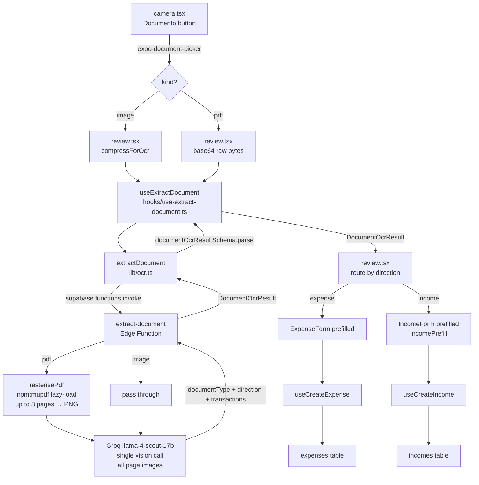
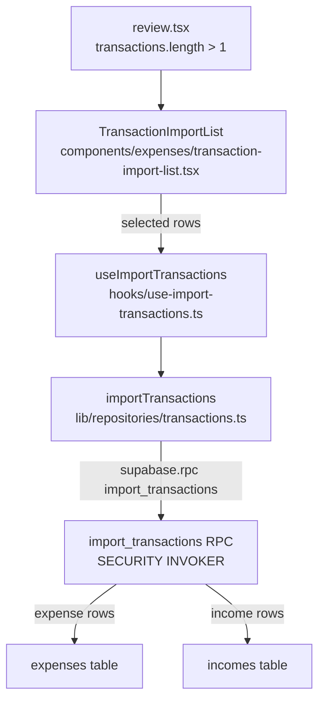

# Document capture & classification (HU-25)

The capture tab accepts PDF files and images — not just photos — and routes
them through a classifier that understands document type and transfer direction,
so a received payment lands in `incomes` instead of always creating an expense.

**Branch:** `feat/document-capture-classify`
**Release:** Entrega 4
**HU:** HU-25 (adjuntar comprobantes, ampliada a clasificación + import)
**Test baseline after this feature:** 1668 → (see AGENTS.md §9 for final count)

---

## What ships

| Capability                     | Surface                                                      | Notes                                                        |
| ------------------------------ | ------------------------------------------------------------ | ------------------------------------------------------------ |
| Document picker (PDF + images) | `app/(protected)/(tabs)/camera.tsx`                          | `expo-document-picker`, ≤ 10 MB, `kind: 'pdf' \| 'image'`    |
| PDF rasterization server-side  | `supabase/functions/extract-document/`                       | mupdf WASM via `npm:`, lazy-loaded, up to 3 pages            |
| Document classification        | `supabase/functions/extract-document/`                       | `documentType`, `direction`, `transactions[]` via Groq       |
| Direction-aware routing        | `app/(protected)/expense/review.tsx`                         | sent → ExpenseForm · received → IncomeForm · toggle override |
| `IncomePrefill` support        | `components/incomes/income-form.tsx`                         | mirrors `prefill` from ExpenseForm; reuses `matchCategory`   |
| Multi-transaction import       | `components/expenses/transaction-import-list.tsx`            | checkbox list, editable category, per-row direction toggle   |
| `import_transactions` RPC      | `supabase/migrations/20260621215215_import_transactions.sql` | SECURITY INVOKER, atomic, RLS                                |

`extract-receipt` is left intact; the new review flow uses `extract-document`.

---

## Architecture / data flow

### Single-transaction documents (receipt, transfer, screenshot)



### Multi-transaction documents (card_statement)



---

## Key files

| File                                                         | Role                                                                                                     |
| ------------------------------------------------------------ | -------------------------------------------------------------------------------------------------------- |
| `app/(protected)/(tabs)/camera.tsx`                          | Added "Documento" button; `expo-document-picker` call; type + size validation                            |
| `app/(protected)/expense/review.tsx`                         | Orchestrates compress/passthrough → OCR → route (single/multi) → save                                    |
| `lib/schemas/document.ts`                                    | `documentOcrResultSchema` (Zod) + `DocumentOcrResult` / `DocumentTransaction` types                      |
| `lib/ocr.ts`                                                 | `extractDocument()`, `mapDocumentToPrefill()`, direction helpers, reuses `matchCategory` / `mapOcrItems` |
| `hooks/use-extract-document.ts`                              | TanStack Query `useMutation` over `extractDocument`; mirrors `use-extract-receipt`                       |
| `components/incomes/income-form.tsx`                         | Extended with `IncomePrefill` prop (amount, currency, description, occurredAt, categoryHint, items)      |
| `components/expenses/transaction-import-list.tsx`            | Checkbox list: monto tabular, fecha, comercio, editable category, direction toggle, select-all           |
| `lib/repositories/transactions.ts`                           | `importTransactions(rows)` — typed wrapper around `supabase.rpc('import_transactions')`                  |
| `hooks/use-import-transactions.ts`                           | TanStack Query `useMutation`; invalidates expense + income queries on success                            |
| `supabase/functions/extract-document/index.ts`               | Deno edge function: JWT verify → PDF rasterize or pass image → Groq → validate → respond                 |
| `supabase/migrations/20260621215215_import_transactions.sql` | `import_transactions` RPC + dual-ship (see `docs/conventions/database.md`)                               |
| `types/supabase.ts`                                          | Regenerated to include `import_transactions` RPC signature                                               |

---

## `extract-document` contract

### Request (POST `/functions/v1/extract-document`)

```json
{
  "fileBase64": "<base64-encoded bytes>",
  "mimeType": "application/pdf | image/jpeg | image/png | image/webp | image/heic",
  "fileName": "comprobante.pdf"
}
```

`Authorization: Bearer <supabase_jwt>` is required. The function verifies the JWT
before calling Groq.

### Response — success (200)

```json
{
  "data": {
    "documentType": "transfer",
    "confidence": 0.91,
    "truncated": false,
    "transactions": [
      {
        "amount": 45000.0,
        "currency": "ARS",
        "occurredAt": "2026-06-20",
        "merchant": "Juan Pérez",
        "direction": "income",
        "categoryHint": "Transferencia",
        "suggestedNewCategory": null,
        "items": []
      }
    ]
  }
}
```

Field notes:

- `documentType`: `"receipt" | "transfer" | "card_statement" | "screenshot" | "unknown"`
- `direction` (per transaction): `"expense"` (sent) or `"income"` (received); defaults to `"expense"` when undetermined
- `truncated`: `true` when the PDF had more than 3 pages; transactions from pages 4+ are not returned
- `transactions`: always an array; single-document types produce length 1; `card_statement` produces N
- Any field the model could not read is `null`; `transactions` may be empty for `unknown` type
- `confidence < 0.5` triggers a low-confidence banner on the review screen (does not block save)

### Client validation

`lib/schemas/document.ts` exports `documentOcrResultSchema`. After invoking the edge function,
`extractDocument()` runs `documentOcrResultSchema.parse()` on the response. A Zod error is caught
and mapped to `OcrError('OCR_PARSE_ERROR')`.

---

## Error taxonomy

| HTTP | `error.code`        | Cause                                | Client behavior                                                   |
| ---- | ------------------- | ------------------------------------ | ----------------------------------------------------------------- |
| 401  | `UNAUTHENTICATED`   | Missing / invalid JWT                | Manual-entry fallback                                             |
| 400  | `BAD_REQUEST`       | `fileBase64` missing or empty        | Manual-entry fallback                                             |
| 422  | `PDF_CONVERT_ERROR` | mupdf failed to rasterize PDF        | "No pudimos leer el PDF, probá con una captura" + manual fallback |
| 500  | `OCR_CONFIG_ERROR`  | `GROQ_API_KEY` not set               | Manual-entry fallback                                             |
| 502  | `UPSTREAM_ERROR`    | Groq returned non-2xx                | Manual-entry fallback                                             |
| 502  | `OCR_PARSE_ERROR`   | Groq response unparseable            | Manual-entry fallback                                             |
| 504  | `OCR_TIMEOUT`       | Groq did not respond within 20 s     | **Retryable** + button                                            |
| —    | `NETWORK_ERROR`     | Device offline / FunctionsFetchError | **Retryable** + button                                            |
| 500  | `INTERNAL`          | Unhandled edge function error        | Manual-entry fallback                                             |

`PDF_CONVERT_ERROR` is new to this feature. Image-document OCR is unaffected by PDF errors.

---

## `import_transactions` RPC

```sql
-- signature
create or replace function public.import_transactions(p_rows jsonb)
returns void
language plpgsql
security invoker
```

Each row in `p_rows` carries a `direction` field (`'expense' | 'income'`). The function:

1. Iterates the array.
2. Inserts expense rows into `expenses` with `user_id = auth.uid()` (RLS enforced).
3. Inserts income rows into `incomes` with `user_id = auth.uid()` and `occurred_date` set.
4. The entire call is wrapped in a single transaction — any failure rolls everything back.

`expense` rows leave `occurred_date NULL` (consistent with manual expense creation).
`income` rows set `occurred_date` to the date value extracted by the classifier.

Migration: `supabase/migrations/20260621215215_import_transactions.sql` (dual-ship per `docs/conventions/database.md`).

---

## Review screen state machine

```
picked → extracting → classified:single → editing → saved
                    → classified:multi  → selecting → importing → saved
                    → failed            → (manual entry)
```

| State                         | Trigger                                   | UI                                                           |
| ----------------------------- | ----------------------------------------- | ------------------------------------------------------------ |
| `extracting`                  | `isLoading === true`                      | Spinner + "Analizando documento…"                            |
| `classified:single / expense` | 1 tx, `direction='expense'`               | `ExpenseForm` prefilled + doc-type badge                     |
| `classified:single / income`  | 1 tx, `direction='income'`                | `IncomeForm` prefilled + doc-type badge                      |
| `classified:multi`            | `transactions.length > 1`                 | `TransactionImportList`                                      |
| `unknown / no amount`         | `documentType='unknown'` or `amount=null` | Empty form + "No detectamos datos, completá manualmente"     |
| `low confidence`              | `confidence < 0.5`                        | Banner warning, form not blocked                             |
| `PDF_CONVERT_ERROR`           | `error.code === 'PDF_CONVERT_ERROR'`      | "No pudimos leer el PDF, probá con una captura" + empty form |
| `retryable error`             | `OCR_TIMEOUT` / `NETWORK_ERROR`           | Empty form + "Reintentar" button                             |
| `other error`                 | any other `OcrError`                      | Empty form + manual-entry notice                             |

The user can always flip direction via a toggle; the form swaps (`ExpenseForm` ↔ `IncomeForm`) preserving extracted data.

---

## Edge cases

| Edge case                               | Behavior                                                                                                               |
| --------------------------------------- | ---------------------------------------------------------------------------------------------------------------------- |
| PDF > 3 pages                           | Only first 3 pages processed; `truncated: true` in response; banner informs the user                                   |
| PDF corrupted / unreadable              | `PDF_CONVERT_ERROR` returned; user prompted to submit a screenshot instead                                             |
| `unknown` document with no transactions | Empty form + manual-entry prompt; no crash                                                                             |
| Amount ≤ 0 in extracted row             | Row can still appear in import list; user should delete or correct before importing                                    |
| Mixed ARS/USD in card statement         | Each row carries its own `currency`; `TransactionImportList` shows currency per row; import preserves per-row currency |
| User inverts direction                  | Toggle swaps form type; all already-filled fields are preserved                                                        |
| Import with 0 rows selected             | "Importar" button is disabled; no RPC call                                                                             |
| Import partial failure                  | RPC transaction rolls back; user retries the whole batch                                                               |
| Category hint not found                 | `matchCategory` returns `undefined`; category field left blank; user selects manually                                  |
| File > 10 MB                            | Validation in `camera.tsx` before navigation; error shown in Spanish, no OCR started                                   |
| mupdf npm: fails at runtime             | Caught in `rasterisePdf`; returns `PDF_CONVERT_ERROR`; image path unaffected                                           |

---

## Configuration

### Secret

```bash
supabase secrets set GROQ_API_KEY=gsk_... --project-ref miiorhmqxdqsowqxnpii
```

(Same key as `extract-receipt` — no additional secret needed.)

### Deploy

```bash
supabase functions deploy extract-document --project-ref miiorhmqxdqsowqxnpii
```

`verify_jwt: true` (default). No `supabase/config.toml` override needed.

### expo-document-picker

Added to `package.json` as `expo-document-picker` (Expo SDK 54 compatible). No additional
`app.config.ts` permission strings are needed for document picking on iOS/Android; the OS file
picker does not require a permission prompt.

---

## Out of scope

- **Original file not persisted** — `extract-document` receives base64 bytes in the request body; nothing is uploaded to Storage. The `media` bucket is still pending (see AGENTS.md §10 pending item 2).
- **PDF > 3 pages** — pages 4 and beyond are silently dropped. Full-document processing is deferred to a future phase.
- **Client-side PDF render** — requires a dev build; Expo Go does not support it. Not implemented.
- **Dedupe / reconciliation** — no check against existing `expenses`/`incomes` rows before import.
- **WhatsApp document forwarding** — separate integration, out of scope for this feature.

---

## Related

- ADR: `docs/decisions/2026-06-21-document-classification-ocr.md`
- User flow: `docs/user-flows/HU-25-adjuntar-comprobantes.md`
- Baseline OCR feature: `docs/features/receipt-scan-ocr.md`
- OCR edge function ADR: `docs/decisions/2026-05-31-ocr-groq-edge-function.md`
- Income forms (prefill extension): `docs/features/incomes.md`
