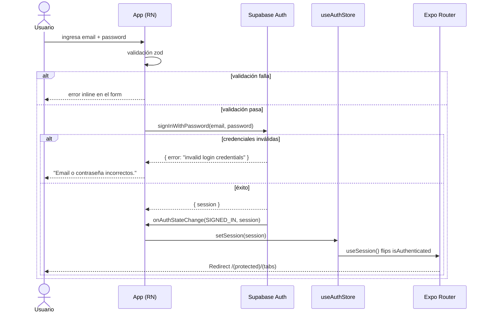

# HU-01 — Iniciar sesión

## 1. Identificación

| Campo            | Valor                                                                  |
| ---------------- | ---------------------------------------------------------------------- |
| **ID**           | HU-01                                                                  |
| **Historia**     | Iniciar sesión                                                         |
| **Persona**      | Cualquier usuario registrado (estudiante / profesional / multi-moneda) |
| **Estado**       | MVP                                                                    |
| **Relevancia**   | Alta                                                                   |
| **Release**      | Release 1                                                              |
| **Trazabilidad** | `feat(auth)` — sign-in + OTP confirmation                              |

## 2. Historia

> **Como** usuario de RADAR,
> **quiero** iniciar sesión con mi email y contraseña,
> **para** acceder a mis gastos y datos de manera segura desde cualquier dispositivo.

## 3. Pre-condiciones

- El usuario ya completó la HU-02 (registro de cuenta) y confirmó su mail
  mediante el código OTP de 6 dígitos.
- La app está abierta y muestra la pantalla de bienvenida (Splash).
- Existe conexión a internet.

## 4. Post-condiciones

- **Éxito**: la sesión queda persistida en `expo-secure-store` (Keychain
  iOS / Keystore Android). El usuario aterriza en el Home (HU-04). El
  hook `useAuthListener` propaga el `session` al store de Zustand.
- **Fallo**: el usuario permanece en el formulario con un mensaje de
  error específico en español rioplatense. No se almacena nada.

## 5. Flujo principal

1. El usuario toca **"Ya tengo cuenta"** en la pantalla Splash.
2. La app navega a `/(auth)/sign-in`.
3. El usuario ingresa su email en el campo **Email**.
4. El usuario ingresa su contraseña en el campo **Contraseña**
   (secureTextEntry activado).
5. El usuario toca **"Iniciar sesión"**.
6. El form valida con `zod`:
   - email debe ser válido (`z.string().email()`).
   - contraseña debe tener mínimo 8 caracteres.
7. Si la validación pasa, la app dispara
   `supabase.auth.signInWithPassword({ email, password })`.
8. Supabase devuelve `{ data: { session }, error: null }`.
9. `onAuthStateChange` (registrado en `useAuthListener`) recibe el evento
   `SIGNED_IN` y escribe el `session` en `useAuthStore`.
10. El grupo de rutas `(auth)/_layout.tsx` detecta `isAuthenticated=true`
    y emite un `<Redirect href="/(protected)/(tabs)" />`.
11. El usuario aterriza en el Home (HU-04).

## 6. Flujos alternativos

### 6.a — Credenciales inválidas

- Supabase devuelve `error.message` que contiene
  `invalid login credentials`.
- `mapAuthError()` traduce a `"Email o contraseña incorrectos."`
- El mensaje se renderiza en rojo (`colors.money.out`) centrado bajo los
  campos. El formulario se mantiene.

### 6.b — Email aún no confirmado

- Supabase devuelve `error.message` con `email not confirmed`.
- `mapAuthError()` traduce a
  `"Confirmá tu mail antes de iniciar sesión."`
- El usuario debe completar la confirmación OTP (HU-02 / `/verify-otp`).

### 6.c — Sin conexión

- La promesa de Supabase rechaza por red.
- El mensaje genérico
  `"No pudimos iniciar sesión. Probá de nuevo."` aparece.

### 6.d — Olvido de contraseña

- El usuario toca **"¿Olvidaste tu contraseña?"** (UI presente, lógica
  pendiente en Release 2).

## 7. Diagrama

## 8. Pantallas involucradas

| Ruta                  | Archivo                            | Rol                              |
| --------------------- | ---------------------------------- | -------------------------------- |
| `/(auth)`             | `app/(auth)/index.tsx`             | Splash con CTA "Ya tengo cuenta" |
| `/(auth)/sign-in`     | `app/(auth)/sign-in.tsx`           | Form de login                    |
| `/(auth)/_layout.tsx` | `app/(auth)/_layout.tsx`           | Gate de rutas no autenticadas    |
| `/(protected)/(tabs)` | `app/(protected)/(tabs)/index.tsx` | Destino post-login (HU-04)       |

## 9. State matrix

Cada estado describe el render que tester / diseñador debería ver.

| Estado               | Trigger                              | Visual                                                                                |
| -------------------- | ------------------------------------ | ------------------------------------------------------------------------------------- |
| **Default**          | Abrir `/(auth)/sign-in`              | Form vacío. Botón "Iniciar sesión" habilitado. Inputs `editable={true}`.              |
| **Validation error** | Submit con campos vacíos o inválidos | Mensaje inline en `colors.money.out` por campo. Form se mantiene. Botón sigue activo. |
| **Loading**          | Submit válido en vuelo               | Botón con `ActivityIndicator`. Inputs `editable={false}`. Sin overlay.                |
| **Auth error**       | Supabase rechaza credenciales / mail | Mensaje rojo centrado bajo el form. Form se mantiene. Botón vuelve a habilitarse.     |
| **Network error**    | Promesa rechaza por red              | Mensaje genérico `"No pudimos iniciar sesión. Probá de nuevo."`                       |
| **Success**          | Session válida creada                | No hay render propio — redirect a `/(protected)/(tabs)` vía route group.              |

## 10. Criterios de aceptación

- [ ] Tocar "Ya tengo cuenta" en el Splash abre `/(auth)/sign-in`.
- [ ] Campos vacíos disparan validación con mensajes en español.
- [ ] Email mal formado dispara `"Ingresá un email válido."`
- [ ] Contraseña < 8 caracteres dispara
      `"La contraseña debe tener al menos 8 caracteres."`
- [ ] Login con credenciales válidas redirige automáticamente al Home.
- [ ] Login con credenciales inválidas muestra el mensaje mapeado en
      español, sin cambiar de pantalla.
- [ ] Al cerrar y reabrir la app, la sesión persiste y se aterriza
      directo en el Home (sin volver a pedir credenciales).
- [ ] Mientras la request está en vuelo, el botón muestra
      `ActivityIndicator` y los inputs quedan `editable={false}`.

## 11. Notas técnicas

- **Lógica de form**: `react-hook-form` + `@hookform/resolvers/zod`.
- **Token storage**: `expo-secure-store` (Keychain / Keystore). NO se
  usa AsyncStorage para tokens.
- **Persistencia**: `supabase.auth` se configura con
  `persistSession: true` + `autoRefreshToken: true`
  (`lib/supabase.ts`).
- **Hook de bootstrap**: `hooks/use-auth-listener.ts` se monta en
  `app/_layout.tsx` vía `<AuthBootstrap />`.
- **Tests**: `app/(auth)/__tests__/sign-in.test.tsx` — render,
  validación, mapeo de errores, navegación a `/sign-up`.
