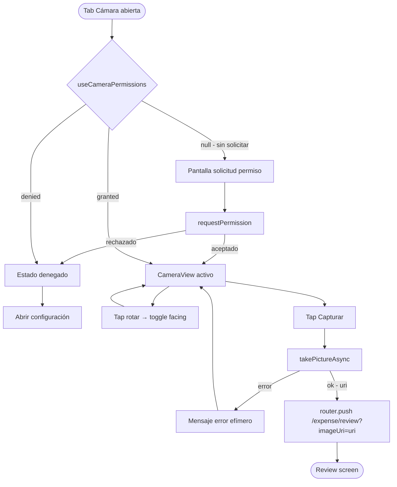

# HU-02 — Acceder a cámara

## 1. Identificación

| Campo            | Valor                                                        |
| ---------------- | ------------------------------------------------------------ |
| **ID**           | HU-02                                                        |
| **Historia**     | Acceder a cámara                                             |
| **Persona**      | Cualquier usuario autenticado                                |
| **Estado**       | MVP                                                          |
| **Relevancia**   | Media                                                        |
| **Release**      | Release 2                                                    |
| **Trazabilidad** | `feat(receipt-scan-ocr)` — camera tab + useCameraPermissions |

## 2. Historia

> **Como** usuario autenticado,
> **quiero** capturar una foto de un ticket con la cámara del dispositivo,
> **para** registrar un gasto sin tipear los datos manualmente.

## 3. Pre-condiciones

- El usuario está autenticado.
- El dispositivo tiene cámara trasera disponible.
- La app está corriendo en un entorno compatible con `expo-camera`
  (Expo Go o dev build).

## 4. Post-condiciones

- Si el usuario captura una foto: la app navega a
  `/(protected)/expense/review?imageUri=<uri>` con el URI local de la
  imagen.
- Si el usuario cancela o deniega el permiso: queda en la tab Cámara,
  sin navegación.

## 5. Flujo principal

1. El usuario abre la tab **Cámara** (`app/(protected)/(tabs)/camera.tsx`).
2. La app llama a `useCameraPermissions()` para verificar el estado del
   permiso.
3. Si el permiso ya está concedido, se renderiza `<CameraView>` en modo
   pantalla completa (cámara trasera por defecto).
4. Se muestran dos controles flotantes:
   - **Capturar** — botón circular centrado en la parte inferior.
   - **Rotar** — icono `RefreshCw` (Lucide) en la esquina inferior
     derecha, para cambiar entre cámara trasera y delantera.
5. El usuario encuadra el ticket y toca **Capturar**.
6. La app llama a `cameraRef.current.takePictureAsync({ quality: 0.8 })`.
7. Se obtiene el `uri` local de la imagen capturada.
8. La app navega a `/(protected)/expense/review` pasando el `uri` como
   parámetro de query:
   `router.push({ pathname: '/(protected)/expense/review', params: { imageUri: uri } })`.

## 6. Flujos alternativos

### 6.a — Permiso no solicitado aún

- `useCameraPermissions()` devuelve `status === null` (primera apertura).
- En lugar de `<CameraView>`, se renderiza una pantalla de permiso:
  - Texto: `"Para escanear tickets, RADAR necesita acceder a la cámara."`
  - Botón primario: `"Permitir acceso a la cámara"`.
- Al tocar el botón, se llama a `requestPermission()`.
- Si el usuario acepta: la pantalla transiciona al flujo principal §3.
- Si rechaza: ver §6.b.

### 6.b — Permiso denegado

- `useCameraPermissions()` devuelve `status === 'denied'` o `granted === false`
  tras la solicitud.
- Se renderiza el estado de error de permiso:
  - Ícono `CameraOff` (Lucide) en `colors.fg[3]`.
  - Texto principal: `"No se puede acceder a la cámara."`
  - Texto secundario: `"Habilitá el permiso desde Configuración del dispositivo."`
  - Botón secundario: `"Abrir configuración"` → llama a
    `Linking.openSettings()`.
- No hay `<CameraView>`.

### 6.c — Rotar cámara

- El usuario toca el ícono `RefreshCw`.
- `facing` alterna entre `'back'` y `'front'`.
- `<CameraView facing={facing}>` re-renderiza con la cámara seleccionada.
- El encuadre y el botón de captura no cambian.

### 6.d — Error al capturar

- `takePictureAsync` lanza una excepción (por ejemplo, recurso ocupado).
- Se muestra un mensaje flotante breve: `"No se pudo tomar la foto. Intentá nuevamente."`
- La cámara queda activa; el usuario puede reintentar.

## 7. Diagrama

## 8. Componentes / archivos

| Componente / hook          | Archivo                                          | Rol                              |
| -------------------------- | ------------------------------------------------ | -------------------------------- |
| Screen principal           | `app/(protected)/(tabs)/camera.tsx`              | Container de cámara              |
| `useCameraPermissions`     | `expo-camera` (SDK 54)                           | Verificar y solicitar permiso    |
| `<CameraView>`             | `expo-camera` (SDK 54)                           | Vista de cámara activa           |
| `cameraRef`                | `useRef<CameraView>`                             | Referencia para `takePictureAsync` |
| `<PermissionRequest>`      | `components/camera/permission-request.tsx`       | UI solicitud / denegado          |
| `router.push`              | `expo-router`                                    | Navegar a review                 |

## 9. State matrix

| Estado                    | Trigger                                     | Visual                                                                                                                              |
| ------------------------- | ------------------------------------------- | ----------------------------------------------------------------------------------------------------------------------------------- |
| **Verificando permiso**   | Montaje del screen                          | Pantalla negra mientras `useCameraPermissions` inicializa (inmediato, < 100 ms).                                                    |
| **Solicitud de permiso**  | `status === null`                           | Fondo `#0A0F1A`. Ícono `Camera` (Lucide, 48px, `--radar-400`). Texto descriptivo. Botón primario `"Permitir acceso a la cámara"`.   |
| **Permiso denegado**      | `granted === false` (tras solicitud o previo) | Fondo `#0A0F1A`. Ícono `CameraOff` (Lucide, 48px, `colors.fg[3]`). Dos líneas de texto. Botón secundario `"Abrir configuración"`.   |
| **Cámara activa**         | `granted === true`                          | `<CameraView>` fullscreen. Botón circular de captura centrado abajo. Ícono `RefreshCw` esquina inferior derecha.                    |
| **Cámara delantera**      | Tap `RefreshCw`                             | Igual que activo, `facing='front'`. Ícono `RefreshCw` sin cambio visual (toggle interno).                                           |
| **Capturando**            | Tap capturar                                | Botón de captura con `ActivityIndicator`. `CameraView` no interactiva.                                                              |
| **Error al capturar**     | `takePictureAsync` lanza                    | Mensaje efímero flotante en `colors.money.out`. Cámara vuelve a activa.                                                             |
| **Foto capturada**        | `takePictureAsync` devuelve URI             | Navegación inmediata a review; este screen deja de renderizarse.                                                                    |

## 10. Criterios de aceptación

- [ ] Al abrir la tab Cámara sin permiso previo, se muestra la pantalla
      de solicitud antes de cualquier vista de cámara.
- [ ] Al aceptar el permiso, la cámara se activa sin necesidad de
      reabrir la tab.
- [ ] Al denegar el permiso, se muestra el mensaje de denegado y el
      botón `"Abrir configuración"`.
- [ ] El ícono `RefreshCw` alterna entre cámara trasera y delantera.
- [ ] Al tocar **Capturar**, el botón muestra un indicador de carga
      mientras `takePictureAsync` está en curso.
- [ ] Tras capturar, la app navega a `/expense/review` con el
      `imageUri` correcto en los parámetros.
- [ ] Un error en `takePictureAsync` no bloquea la cámara; el usuario
      puede reintentar.

## 11. Notas técnicas

- **SDK 54**: usar `CameraView` de `expo-camera` v17, no el `Camera`
  class deprecado. La prop es `facing` (no `type`).
- **`useCameraPermissions`**: devuelve `[permission, requestPermission]`.
  `permission.granted` es el booleano definitivo.
- **`takePictureAsync`**: acepta `{ quality: 0.8 }`. Devuelve
  `{ uri, width, height, base64? }`. No pasar `base64: true` aquí;
  la base64 se genera en el review screen con `expo-image-manipulator`.
- **`facing` state**: `useState<'back' | 'front'>('back')`.
- **Permisos iOS**: cadena en español en `app.config.ts`
  (`"RADAR necesita acceder a la cámara para escanear tickets."`).
- **Tests**:
  - `app/(protected)/(tabs)/__tests__/camera.test.tsx` — estados de
    permiso (null/denied/granted), toggle facing, captura exitosa,
    captura fallida, navegación.
