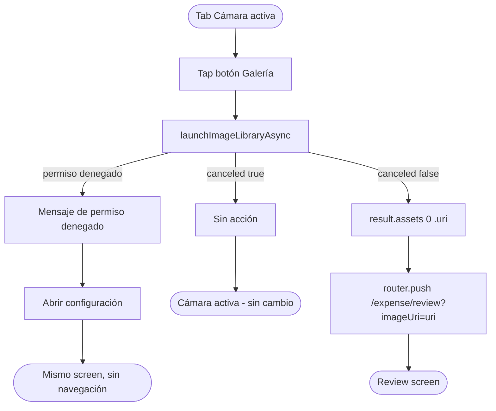

# HU-03 — Acceder a fotografías del dispositivo

## 1. Identificación

| Campo            | Valor                                                               |
| ---------------- | ------------------------------------------------------------------- |
| **ID**           | HU-03                                                               |
| **Historia**     | Acceder a fotografías del dispositivo                               |
| **Persona**      | Cualquier usuario autenticado                                       |
| **Estado**       | MVP                                                                 |
| **Relevancia**   | Media                                                               |
| **Release**      | Release 2                                                           |
| **Trazabilidad** | `feat(receipt-scan-ocr)` — gallery picker + launchImageLibraryAsync |

## 2. Historia

> **Como** usuario autenticado,
> **quiero** elegir una foto existente de mi galería,
> **para** escanear un ticket que ya fotografié sin tener que volver a
> capturarlo.

## 3. Pre-condiciones

- El usuario está autenticado.
- La tab Cámara está abierta (ver HU-02).
- El dispositivo tiene fotos almacenadas accesibles por la app (o el
  usuario puede conceder acceso a la biblioteca de fotos).

## 4. Post-condiciones

- Si el usuario selecciona una imagen: la app navega a
  `/(protected)/expense/review?imageUri=<uri>` con el URI local de la
  imagen elegida.
- Si el usuario cancela el selector o deniega el permiso: queda en la
  tab Cámara, sin navegación, sin cambios.

## 5. Flujo principal

1. El usuario está en la tab Cámara (`app/(protected)/(tabs)/camera.tsx`),
   con la cámara activa (permiso concedido).
2. El usuario toca el botón **"Galería"** (ícono `Image`, Lucide) ubicado
   en la esquina inferior izquierda de la pantalla.
3. La app llama a
   `ImagePicker.launchImageLibraryAsync({ mediaTypes: ['images'], quality: 0.8 })`.
4. El selector nativo de fotos del sistema operativo se abre.
5. El usuario navega y selecciona una foto de un ticket.
6. El selector se cierra; `result.canceled === false`.
7. Se obtiene `result.assets[0].uri`.
8. La app navega a `/(protected)/expense/review` pasando el URI:
   `router.push({ pathname: '/(protected)/expense/review', params: { imageUri: uri } })`.

## 6. Flujos alternativos

### 6.a — Usuario cancela el selector

- El usuario abre el selector y luego lo cierra sin seleccionar una foto
  (tap en "Cancelar" o gesto de cierre).
- `result.canceled === true`.
- La app no navega; el usuario vuelve a la vista de cámara activa.

### 6.b — Permiso de fotos denegado

- El sistema operativo rechaza el acceso a la biblioteca de fotos antes
  de abrir el selector (iOS "Sin acceso" / Android sin permiso
  `READ_MEDIA_IMAGES`).
- `launchImageLibraryAsync` devuelve `canceled: true` sin abrir el
  selector nativo, o el sistema muestra su propia alerta de permiso.
- La app muestra un mensaje breve:
  `"No se puede acceder a las fotos. Habilitá el permiso desde Configuración del dispositivo."`
- El usuario puede tocar `"Abrir configuración"` para ir a
  `Linking.openSettings()`.

### 6.c — Imagen HEIC (iOS)

- El archivo seleccionado es HEIC (formato nativo de iOS).
- `expo-image-picker` entrega un URI en el formato original.
- `expo-image-manipulator` en el review screen (HU-05) convierte el
  archivo a JPEG al comprimir; este screen no necesita manejar HEIC
  explícitamente.

### 6.d — Imagen de gran tamaño

- El usuario selecciona una foto de alta resolución (> 4 MB sin comprimir).
- El URI se pasa al review screen igual que cualquier otra imagen.
- La compresión que recorta el payload a < 4 MB ocurre en HU-05
  (`lib/image.ts → compressForOcr`).

## 7. Diagrama

## 8. Componentes / archivos

| Componente / hook                     | Archivo                             | Rol                                      |
| ------------------------------------- | ----------------------------------- | ---------------------------------------- |
| Screen principal                      | `app/(protected)/(tabs)/camera.tsx` | Container; aloja botón Galería           |
| `ImagePicker.launchImageLibraryAsync` | `expo-image-picker` (SDK 54)        | Abre selector nativo de fotos            |
| Botón **Galería**                     | Inline en `camera.tsx`              | Trigger del picker; ícono `Image` Lucide |
| `router.push`                         | `expo-router`                       | Navegar a review con URI                 |

## 9. State matrix

| Estado                        | Trigger                               | Visual                                                                                                                   |
| ----------------------------- | ------------------------------------- | ------------------------------------------------------------------------------------------------------------------------ |
| **Cámara activa con galería** | `granted === true` (HU-02 completada) | Igual a HU-02 activo + botón `Image` (Lucide) esquina inferior izquierda, fondo `rgba(0,0,0,0.5)`, borde radius `999px`. |
| **Selector abierto**          | Tap botón Galería                     | Modal nativo del SO sobre la app; la tab Cámara queda detrás.                                                            |
| **Cancelado**                 | Usuario cierra selector sin elegir    | Selector se cierra; cámara vuelve a visible. Sin cambio de estado interno.                                               |
| **Permiso denegado**          | SO rechaza acceso a fotos             | Mensaje inline en pantalla con ícono `ImageOff` (Lucide, `colors.fg[3]`) y botón `"Abrir configuración"`.                |
| **Foto seleccionada**         | `result.canceled === false`           | Navegación inmediata a review; este screen deja de renderizarse hasta que el usuario vuelva.                             |

## 10. Criterios de aceptación

- [ ] El botón **Galería** es visible y tappable mientras la cámara
      está activa.
- [ ] Al tocar **Galería**, se abre el selector nativo de fotos del
      sistema operativo.
- [ ] Si el usuario cancela el selector, la app permanece en la tab
      Cámara sin ningún cambio.
- [ ] Al seleccionar una foto, la app navega a `/expense/review` con el
      `imageUri` de esa foto en los parámetros.
- [ ] Si el permiso de fotos está denegado, se muestra un mensaje
      claro y el botón `"Abrir configuración"`.
- [ ] Fotos HEIC no generan error en este screen; la conversión
      ocurre aguas abajo en HU-05.

## 11. Notas técnicas

- **SDK 54 API**: `launchImageLibraryAsync({ mediaTypes: ['images'] })`
  (array syntax). La forma deprecada `MediaTypeOptions.Images` no debe
  usarse (rompe en SDK 54).
- **`quality: 0.8`** en el picker es orientativo para iOS; Android puede
  ignorarlo. La compresión definitiva está en `lib/image.ts`.
- **Permisos iOS**: `NSPhotoLibraryUsageDescription` en `app.config.ts`
  en español: `"RADAR necesita acceder a tus fotos para escanear tickets."`.
- **Permisos Android**: `READ_MEDIA_IMAGES` (Android 13+) /
  `READ_EXTERNAL_STORAGE` (< Android 13). `expo-image-picker` gestiona
  la diferencia internamente.
- **Tests**:
  - `app/(protected)/(tabs)/__tests__/camera.test.tsx` — mock de
    `launchImageLibraryAsync` para casos: cancelado, foto seleccionada,
    permiso denegado; verificar navegación / no-navegación.
