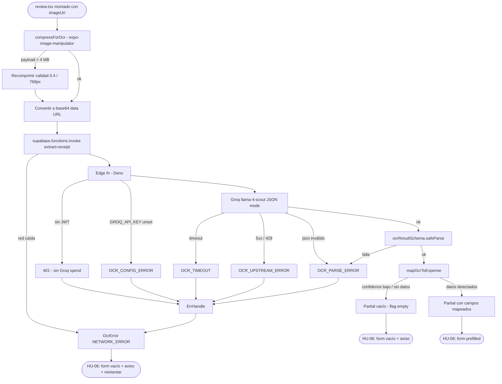

# HU-05 — Extraer datos OCR

## 1. Identificación

| Campo            | Valor                                                               |
| ---------------- | ------------------------------------------------------------------- |
| **ID**           | HU-05                                                               |
| **Historia**     | Extraer datos OCR                                                   |
| **Persona**      | Cualquier usuario autenticado                                       |
| **Estado**       | MVP                                                                 |
| **Relevancia**   | Alta                                                                |
| **Release**      | Release 2                                                           |
| **Trazabilidad** | `feat(receipt-scan-ocr)` — edge fn `extract-receipt` + `lib/ocr.ts` |

## 2. Historia

> **Como** usuario autenticado,
> **quiero** que la app lea automáticamente los datos del ticket
> (monto, fecha, comercio),
> **para** no cargarlos a mano y reducir el tiempo de registro.

## 3. Pre-condiciones

- El usuario está autenticado (JWT válido en el cliente).
- La app tiene un `imageUri` local de la imagen del ticket (proveniente
  de HU-02 o HU-03).
- El review screen `app/(protected)/expense/review.tsx` está montado.
- La edge function `extract-receipt` está desplegada en el proyecto
  Supabase `miiorhmqxdqsowqxnpii`.
- El secret `GROQ_API_KEY` está configurado en los secrets de Supabase
  (nunca en el cliente).

## 4. Post-condiciones

- **Éxito**: el hook `useExtractReceipt` devuelve un
  `Partial<CreateExpenseInput>` con los campos detectados mapeados.
  El review screen hidrata `<ExpenseForm initial={...}>` con esos
  valores.
- **Cualquier fallo**: el hook devuelve `null` o un error tipado. El
  review screen muestra el formulario vacío editable con el aviso
  `"No se detectaron datos. Completá manualmente."` o
  `"No se pudo analizar el ticket. Ingresá los datos manualmente."`.
  En ningún caso la app crashea.

## 5. Flujo principal

1. El review screen se monta con el parámetro `imageUri` recibido.
2. Inmediatamente se dispara `useExtractReceipt(imageUri)`:
   a. `lib/image.ts → compressForOcr(imageUri)` comprime la imagen con
   `expo-image-manipulator`:
   - Resize al mayor lado ≤ 1024 px (mantiene aspect ratio).
   - Output JPEG, calidad `0.6`.
   - Resultado siempre en formato JPEG (convierte HEIC).
     b. El resultado de la compresión se convierte a base64 data URL.
     c. Si el payload supera 4 MB, se reintenta con calidad `0.4`; si
     sigue superando, se reintenta con mayor lado ≤ 768 px.
3. `lib/ocr.ts → extractReceipt({ imageBase64, mimeType: 'image/jpeg' })`
   invoca `supabase.functions.invoke('extract-receipt', { body: { imageBase64, mimeType } })`.
4. La edge function (Deno) ejecuta:
   a. Verifica el JWT del llamador (`Authorization: Bearer <token>`).
   Si no hay token válido, responde `401` sin llamar a Groq.
   b. Arma un mensaje OpenAI-compatible con:
   - `role: 'user'`, `content` con parte de tipo `image_url`
     (`data:image/jpeg;base64,<...>`) y parte de texto con el
     prompt de extracción estricto.
     c. Llama a Groq:
   - Endpoint: `https://api.groq.com/openai/v1/chat/completions`
   - Modelo: `meta-llama/llama-4-scout-17b-16e-instruct`
   - `response_format: { type: 'json_object' }`.
   - Timeout: 10 s.
     d. Parsea la respuesta con `ocrResultSchema` (zod):
   ```
   {
     amount: number | null,
     currency: 'ARS' | 'USD' | null,
     occurredAt: string | null,  // ISO 8601
     merchant: string | null,
     categoryHint: string | null,
     confidence: number           // 0..1
   }
   ```
   e. Responde `200` con el objeto validado.
5. `lib/ocr.ts` recibe la respuesta y ejecuta `mapOcrToExpense`:
   - `amount`: si detectado, formatea con `parseAmount` (normaliza
     `12.500,50` → `12500.5`).
   - `currency`: si nulo, default `'ARS'`.
   - `occurredAt`: si detectado y parseable, lo usa; si fecha en
     futuro o inválida, default `new Date().toISOString()`.
   - `merchant`: mapea a `description`.
   - `categoryHint`: `matchCategory(hint, categories)` intenta
     encontrar la categoría sembrada más cercana por nombre
     normalizado; si no hay match, devuelve `undefined`.
   - Campos con `confidence < 0.6` se marcan con
     `lowConfidence: true` en el resultado mapeado.
6. `useExtractReceipt` devuelve `{ data: Partial<CreateExpenseInput> & { lowConfidenceFields: string[] }, isLoading, error }`.
7. El review screen hidrata `<ExpenseForm initial={data}>` (ver HU-06).

## 6. Flujos alternativos

### 6.a — Groq API caída / error 5xx / rate-limited

- La edge function recibe un status >= 500 o 429 de Groq.
- Responde al cliente con un error tipado `{ code: 'OCR_UPSTREAM_ERROR', message: '...' }`.
- `lib/ocr.ts` captura el error y lanza `OcrError('UPSTREAM_ERROR')`.
- `useExtractReceipt` expone `error.code === 'UPSTREAM_ERROR'`.
- El review screen muestra formulario vacío editable +
  `"No se pudo analizar el ticket. Ingresá los datos manualmente."`

### 6.b — Timeout de OCR

- La llamada a Groq supera los 10 s (AbortController en edge fn).
- La edge function responde con error tipado `{ code: 'OCR_TIMEOUT' }`.
- El review screen muestra formulario vacío editable +
  `"No se pudo analizar el ticket. Ingresá los datos manualmente."`
  - botón `"Reintentar"` que vuelve a disparar la mutación con el
    mismo `imageUri`.

### 6.c — `GROQ_API_KEY` no configurado

- La edge function detecta que `Deno.env.get('GROQ_API_KEY')` es `undefined`.
- Responde `{ code: 'OCR_CONFIG_ERROR' }` sin llamar al API externo.
- El review screen trata este caso igual que §6.a.

### 6.d — JSON malformado de Groq

- `ocrResultSchema.safeParse(groqResponse)` falla.
- La edge function responde `{ code: 'OCR_PARSE_ERROR' }`.
- Degradación a formulario manual, sin crash.

### 6.e — No se detecta ticket / confianza baja

- Groq devuelve el JSON válido pero `amount === null` y
  `confidence < 0.4` (imagen borrosa, no es un ticket, etc.).
- La edge function responde `200` con el objeto tal cual.
- `mapOcrToExpense` devuelve un objeto vacío o parcial.
- El review screen muestra formulario vacío editable +
  `"No se detectaron datos. Completá manualmente."`

### 6.f — Llamada no autenticada

- El cliente envía la petición sin JWT (sesión expirada o bug).
- La edge function retorna `401` sin gastar créditos de Groq.
- `supabase.functions.invoke` expone el error 401.
- `useExtractReceipt` lo trata como error genérico → fallback manual.

### 6.g — Caída de red durante OCR

- `supabase.functions.invoke` lanza error de red antes de recibir
  respuesta.
- `useExtractReceipt` expone `error.code === 'NETWORK_ERROR'`.
- Review screen: formulario vacío + aviso + botón `"Reintentar"`.

## 7. Diagrama



## 8. Componentes / archivos

| Componente / archivo | Ruta                                          | Rol                                                   |
| -------------------- | --------------------------------------------- | ----------------------------------------------------- |
| Edge function        | `supabase/functions/extract-receipt/index.ts` | JWT verify + Groq call + zod validate                 |
| `ocrResultSchema`    | `lib/schemas/ocr.ts`                          | Zod schema de respuesta de la edge fn                 |
| `compressForOcr`     | `lib/image.ts`                                | Compresión JPEG ≤ 1024px, q 0.6, < 4 MB               |
| `extractReceipt`     | `lib/ocr.ts`                                  | `supabase.functions.invoke` + parse + throw tipado    |
| `mapOcrToExpense`    | `lib/ocr.ts`                                  | Mapea `OcrResult` → `Partial<CreateExpenseInput>`     |
| `matchCategory`      | `lib/ocr.ts`                                  | Normaliza `categoryHint` y busca en categorías        |
| `useExtractReceipt`  | `hooks/use-extract-receipt.ts`                | TanStack Query `useMutation` sobre `extractReceipt`   |
| Review screen        | `app/(protected)/expense/review.tsx`          | Dispara `useExtractReceipt`, muestra loading / result |

## 9. State matrix

| Estado                    | Trigger                                                            | Visual en review screen                                                                                                                              |
| ------------------------- | ------------------------------------------------------------------ | ---------------------------------------------------------------------------------------------------------------------------------------------------- |
| **Loading OCR**           | `isLoading === true`                                               | Pantalla con spinner centrado + texto `"Analizando ticket…"` en `colors.fg[2]`. No se muestra form.                                                  |
| **OCR exitoso con datos** | `data` con al menos `amount` detectado                             | `<ExpenseForm initial={data}>` con campos prefilled. Campos con `lowConfidence` marcados (borde `colors.alert`, ícono `AlertCircle` inline pequeño). |
| **Sin datos detectados**  | `data` vacío / confidence bajo                                     | `<ExpenseForm initial={{}}>` vacío editable + banner informativo `"No se detectaron datos. Completá manualmente."` en `colors.fg[3]`.                |
| **Error con retry**       | `error.code === 'OCR_TIMEOUT'` o `NETWORK_ERROR`                   | Form vacío editable + banner `"No se pudo analizar el ticket. Ingresá los datos manualmente."` + botón `"Reintentar"` secundario.                    |
| **Error sin retry**       | `error.code === 'UPSTREAM_ERROR'` / `PARSE_ERROR` / `CONFIG_ERROR` | Form vacío editable + banner `"No se pudo analizar el ticket. Ingresá los datos manualmente."` Sin botón de retry (el servicio está caído).          |

## 10. Criterios de aceptación

- [ ] La imagen se comprime a < 4 MB antes de enviarse a la edge function.
- [ ] Archivos HEIC se convierten a JPEG durante la compresión.
- [ ] La edge function rechaza llamadas sin JWT válido con `401`.
- [ ] `GROQ_API_KEY` nunca se expone al cliente (sólo en secrets de Supabase).
- [ ] Un fallo de Groq (any: 5xx, timeout, JSON inválido, key faltante)
      resulta en formulario manual editable, sin crash.
- [ ] Cuando se detectan datos, `amount` está normalizado (formato
      es-AR → número de punto flotante).
- [ ] Cuando `currency` es nula, el form usa `ARS` por defecto.
- [ ] Cuando la fecha es inválida o futura, el form usa la fecha actual.
- [ ] Campos con confianza < 0.6 se marcan visualmente en el review screen.
- [ ] El mensaje de error es en español formal:
      `"No se pudo analizar el ticket. Ingresá los datos manualmente."`
- [ ] El mensaje de sin datos es: `"No se detectaron datos. Completá manualmente."`

## 11. Notas técnicas

- **Groq modelo**: `meta-llama/llama-4-scout-17b-16e-instruct` (ID exacto;
  verificar disponibilidad en `api.groq.com`).
- **`response_format`**: `{ type: 'json_object' }` (OpenAI-compatible mode);
  el prompt debe incluir instrucción explícita de devolver JSON.
- **AbortController timeout**: 10 000 ms en la edge function. El cliente
  no debería necesitar su propio timeout porque la edge fn termina antes.
- **Compresión fallback**: si aún > 4 MB tras los dos intentos, enviar igual
  y dejar que la edge fn rechace si el modelo no lo soporta; degradar a manual.
- **`matchCategory`**: comparación case-insensitive, sin tildes, contra los
  `name` normalizados de `public.categories`. Retorna `category_id | undefined`.
- **`lowConfidenceFields`**: array de nombres de campo (`'amount'`,
  `'currency'`, `'occurredAt'`) cuya confianza por campo es < 0.6 (si Groq
  los devuelve por separado) o todos si `confidence < 0.6` global.
- **Tests**:
  - `supabase/functions/extract-receipt/__tests__/index.test.ts` —
    JWT rechazado, GROQ_API_KEY unset, Groq 5xx, Groq timeout, JSON
    inválido, respuesta válida.
  - `lib/__tests__/ocr.test.ts` — `mapOcrToExpense` con varios inputs
    (amount es-AR, currency nula, fecha futura, categoryHint sin match).
  - `lib/__tests__/image.test.ts` — `compressForOcr` bajo y sobre 4 MB.
  - `hooks/__tests__/use-extract-receipt.test.tsx` — loading, success,
    error states.
