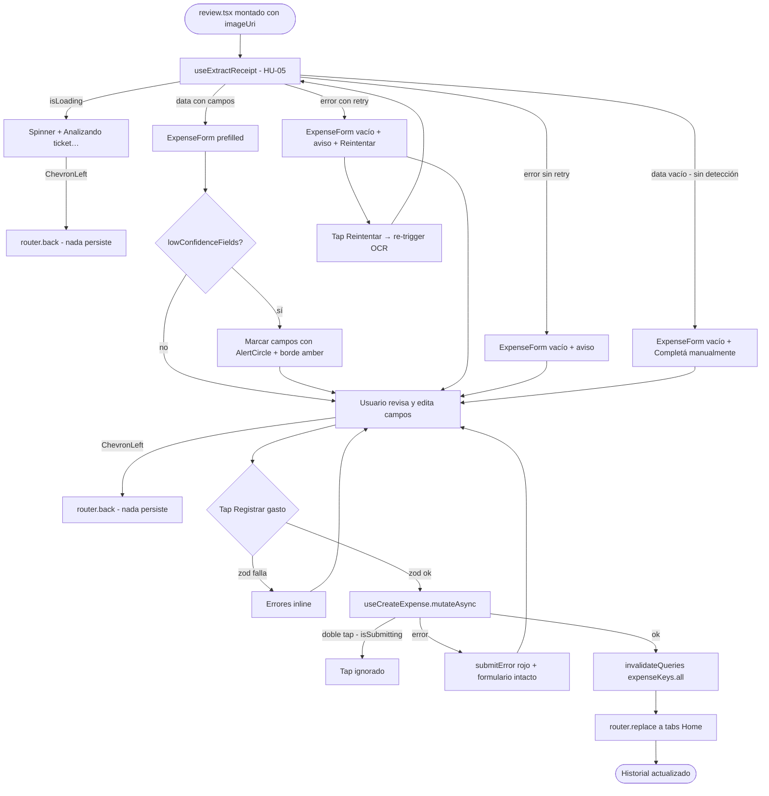

# HU-06 — Validar datos detectados

## 1. Identificación

| Campo            | Valor                                                             |
| ---------------- | ----------------------------------------------------------------- |
| **ID**           | HU-06                                                             |
| **Historia**     | Validar datos detectados                                          |
| **Persona**      | Cualquier usuario autenticado                                     |
| **Estado**       | MVP                                                               |
| **Relevancia**   | Media                                                             |
| **Release**      | Release 2                                                         |
| **Trazabilidad** | `feat(receipt-scan-ocr)` — review screen + `useCreateExpense`     |

## 2. Historia

> **Como** usuario autenticado,
> **quiero** revisar y corregir los datos detectados del ticket antes
> de guardar,
> **para** asegurar que el gasto quede correctamente registrado.

## 3. Pre-condiciones

- El usuario está autenticado.
- La app recibió un `imageUri` válido desde la tab Cámara (HU-02 o HU-03).
- La edge function `extract-receipt` está desplegada (HU-05) o bien el
  OCR falló y el fallback manual está disponible.

## 4. Post-condiciones

- Si el usuario completa y confirma: nuevo row en `public.expenses` vía
  `useCreateExpense`. `router.replace` navega al Historial / Home.
- Si el usuario vuelve atrás: nada se persiste; la imagen y los datos
  detectados se descartan.

## 5. Flujo principal

1. El review screen `app/(protected)/expense/review.tsx` se monta con
   `imageUri` como parámetro de query.
2. `useExtractReceipt(imageUri)` se dispara inmediatamente (HU-05).
3. Mientras el OCR está en curso, la pantalla muestra:
   - Spinner centrado.
   - Texto `"Analizando ticket…"` en `colors.fg[2]`.
   - Header con `ChevronLeft` para volver (no cancela OCR; ver §6.c).
4. Cuando el OCR finaliza con datos:
   - Se renderiza `<ExpenseForm initial={prefilled}>` con los valores
     detectados.
   - Campos con `lowConfidenceFields` reciben marcado visual:
     borde en `colors.alert` (`#F59E0B`) e ícono `AlertCircle` (Lucide,
     14px, inline) junto al label del campo.
   - El botón de submit muestra **"Registrar gasto"**.
5. El usuario revisa los campos prefilled y corrige los que sean
   incorrectos (monto, moneda, categoría, descripción, fecha).
   - Los valores del OCR son sugerencias; el usuario puede cambiar
     cualquier campo libremente.
6. El usuario toca **"Registrar gasto"**.
7. `react-hook-form` valida con `createExpenseSchema` (zod).
   - Si falla, muestra errores inline en español (mismos que HU-12 §8.a).
8. Si valida, `useCreateExpense.mutateAsync(input)` inserta el row en
   `public.expenses`.
9. En éxito:
   - `invalidateQueries(expenseKeys.all)` refresca listas.
   - `router.replace('/(protected)/(tabs)')` navega al Home / Historial
     (no al stack de cámara, para limpiar el historial de navegación).

## 6. Flujos alternativos

### 6.a — OCR falló (cualquier error de HU-05)

- `useExtractReceipt` expone `error` distinto de `null`.
- Se renderiza `<ExpenseForm initial={{}}>` vacío y editable.
- Banner informativo bajo el header:
  `"No se pudo analizar el ticket. Ingresá los datos manualmente."`
  (fondo `colors.surface[1]`, borde izquierdo `colors.money.out`).
- Si el error es `OCR_TIMEOUT` o `NETWORK_ERROR`, se muestra además
  un botón secundario **"Reintentar"** que invoca nuevamente
  `useExtractReceipt(imageUri)`.

### 6.b — OCR sin datos detectados (confidence bajo)

- `data` vacío o todos los campos `null`.
- Se renderiza `<ExpenseForm initial={{}}>` vacío y editable.
- Banner informativo:
  `"No se detectaron datos. Completá manualmente."`
  (misma estética que §6.a, sin botón de reintentar).

### 6.c — Usuario vuelve atrás durante OCR

- El usuario toca `ChevronLeft` mientras `isLoading === true`.
- `router.back()` retorna a la tab Cámara.
- La mutación de OCR en vuelo se cancela (el hook se desmonta; la
  edge function puede completarse pero su resultado se ignora).
- Nada se persiste.

### 6.d — Usuario vuelve atrás con form editado

- El usuario toca `ChevronLeft` con campos modificados.
- `router.back()` retorna a la tab Cámara sin confirmación.
- Los cambios del form se descartan (no hay persistencia local).

### 6.e — Error al guardar el gasto

- `useCreateExpense.mutateAsync` falla (RLS, red, sesión inválida).
- Se muestra `submitError` rojo bajo el form:
  `"No se pudo guardar el gasto. Intentá nuevamente."`
- El form conserva los datos; el usuario puede corregir y reintentar.

### 6.f — Doble tap en "Registrar gasto"

- `isSubmitting === true` durante la mutación.
- El botón tiene `disabled={isSubmitting}` y muestra `ActivityIndicator`.
- El segundo tap no genera una segunda llamada a `useCreateExpense`.

## 7. Diagrama

## 8. Componentes / archivos

| Componente / archivo         | Ruta                                              | Rol                                                        |
| ---------------------------- | ------------------------------------------------- | ---------------------------------------------------------- |
| Review screen                | `app/(protected)/expense/review.tsx`              | Container principal: OCR → form → save                     |
| `<ExpenseForm>`              | `components/expenses/expense-form.tsx`            | Form compartido; acepta `initial` + `lowConfidenceFields`  |
| `useExtractReceipt`          | `hooks/use-extract-receipt.ts`                    | Dispara OCR (HU-05)                                        |
| `useCreateExpense`           | `hooks/use-create-expense.ts`                     | Inserta row en `public.expenses`                           |
| `createExpenseSchema`        | `lib/schemas/expense.ts`                          | Validación zod compartida con HU-13                        |
| `<LowConfidenceBadge>`       | `components/expenses/low-confidence-badge.tsx`    | Ícono `AlertCircle` + borde amber en campos dudosos        |
| `router.replace`             | `expo-router`                                     | Navega a Home tras guardar (limpia historial de navegación) |

## 9. State matrix

| Estado                          | Trigger                                                   | Visual                                                                                                                                                                  |
| ------------------------------- | --------------------------------------------------------- | ----------------------------------------------------------------------------------------------------------------------------------------------------------------------- |
| **OCR en curso**                | `isLoading === true`                                      | Header `ChevronLeft` + `"Revisar ticket"`. Body: spinner `ActivityIndicator` grande centrado + `"Analizando ticket…"` en `colors.fg[2]`. Sin form.                       |
| **OCR exitoso con datos**       | `data` con campos detectados                              | `<ExpenseForm>` prefilled. Campos de baja confianza: borde `#F59E0B` + ícono `AlertCircle` (14px) junto al label. Botón primario `"Registrar gasto"` habilitado.         |
| **Sin datos OCR**               | `data` vacío / confidence bajo global                     | `<ExpenseForm>` vacío. Banner: `"No se detectaron datos. Completá manualmente."` en `colors.surface[1]` con borde izquierdo `colors.fg[3]`. Botón primario habilitado.   |
| **Error OCR sin retry**         | `error.code ∈ { UPSTREAM_ERROR, PARSE_ERROR, CONFIG_ERROR }` | `<ExpenseForm>` vacío. Banner: `"No se pudo analizar el ticket. Ingresá los datos manualmente."` Borde izquierdo `colors.money.out`. Sin botón de reintentar.         |
| **Error OCR con retry**         | `error.code ∈ { OCR_TIMEOUT, NETWORK_ERROR }`             | Igual a error sin retry + botón secundario `"Reintentar"` bajo el banner.                                                                                               |
| **Validación fallida**          | Submit con datos inválidos                                | Errores inline por campo en `colors.money.out`. Botón `"Registrar gasto"` permanece habilitado.                                                                         |
| **Guardando**                   | `useCreateExpense` en vuelo                               | Botón con `ActivityIndicator`. Inputs `editable={false}`. `isSubmitting === true` (bloquea doble tap).                                                                   |
| **Error al guardar**            | Mutación falla                                            | `submitError` rojo centrado bajo el form: `"No se pudo guardar el gasto. Intentá nuevamente."` Form intacto, botón vuelve a habilitarse.                                 |
| **Guardado exitoso**            | Row creado en `public.expenses`                           | `router.replace` al Home; este screen no renderiza más. Historial y totales se refrescan por invalidación.                                                               |

## 10. Criterios de aceptación

- [ ] Durante el OCR se muestra el spinner y el texto `"Analizando ticket…"`.
- [ ] Los campos detectados aparecen prefillados en el formulario.
- [ ] Los campos con baja confianza están marcados con borde ámbar e
      ícono `AlertCircle`.
- [ ] El usuario puede editar cualquier campo prefillado antes de guardar.
- [ ] Si el OCR falla, el formulario se presenta vacío y editable, sin crash.
- [ ] Fallo de OCR muestra:
      `"No se pudo analizar el ticket. Ingresá los datos manualmente."`
- [ ] Sin datos detectados muestra:
      `"No se detectaron datos. Completá manualmente."`
- [ ] Timeout y error de red muestran el botón **"Reintentar"**.
- [ ] Al tocar **"Registrar gasto"**, el botón muestra spinner mientras la
      mutación está en vuelo.
- [ ] El doble tap en **"Registrar gasto"** no genera un segundo insert.
- [ ] Tras guardar exitosamente, `router.replace` lleva al Home / Historial
      (no al screen de cámara).
- [ ] Volver atrás en cualquier estado no persiste nada.

## 11. Notas técnicas

- **`router.replace` vs `router.back`**: se usa `replace` para limpiar el
  stack de navegación de cámara → review. Si se usara `back`, el usuario
  podría volver al review screen con la imagen ya procesada.
- **`initial` prop en `<ExpenseForm>`**: ampliar la prop para aceptar
  `Partial<CreateExpenseInput>` (ya acepta el objeto completo en HU-13;
  asegurarse de que todos los campos sean opcionales).
- **`lowConfidenceFields`**: array de `keyof CreateExpenseInput` (e.g.
  `['amount', 'currency']`). `<ExpenseForm>` recibe el array y aplica
  la clase de marcado al wrapper del campo correspondiente.
- **`occurred_at` con date picker**: Release 2 incluye el campo de fecha
  en `<ExpenseForm>` (pendiente §10 de AGENTS.md). El OCR prefillará
  `occurredAt` si se detecta; sino, default = ahora.
- **Limpieza de `imageUri`**: el URI local del picker / cámara es temporal.
  No se persiste en DB ni en Storage en esta fase (el bucket `media` no
  existe aún).
- **Tests**:
  - `app/(protected)/expense/__tests__/review.test.tsx` — OCR loading,
    OCR success (prefilled + low confidence), OCR failure (empty form +
    banners), reintentar, submit happy path, submit error, double tap
    guard, volver atrás en loading, volver atrás con form editado.
