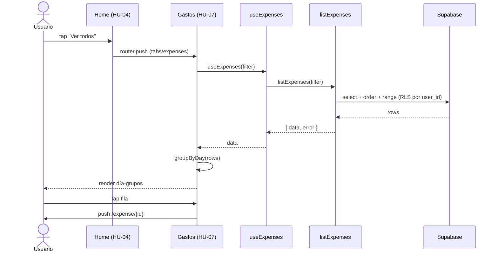

# HU-07 — Sección historial de gastos

## 1. Identificación

| Campo            | Valor                                            |
| ---------------- | ------------------------------------------------ |
| **ID**           | HU-07                                            |
| **Historia**     | Sección historial de gastos                      |
| **Persona**      | Cualquier usuario autenticado                    |
| **Estado**       | MVP                                              |
| **Relevancia**   | Alta                                             |
| **Release**      | Release 1                                        |
| **Trazabilidad** | `feat(expenses)` — list screen + grouping by day |

## 2. Historia

> **Como** usuario autenticado de RADAR,
> **quiero** ver mi historial completo de gastos agrupado por día y con
> los totales por moneda,
> **para** entender en qué se me fue la plata y poder buscar movimientos
> puntuales.

## 3. Pre-condiciones

- El usuario está autenticado.
- Tap en la pestaña **"Gastos"** del menú inferior o en
  **"Ver todos"** dentro de "Últimos gastos" del Home.

## 4. Post-condiciones

- El usuario ve una lista cronológica descendente agrupada por día con
  encabezados `"Hoy"` / `"Ayer"` / fecha localizada `es-AR`.
- El usuario ve los totales por moneda del período actual.
- El usuario puede tocar cualquier fila para editar (HU-12).

## 5. Flujo principal

1. El usuario toca el tab **"Gastos"** (icono `Receipt`) o
   `"Ver todos"` desde el Home.
2. La app renderiza `(tabs)/expenses.tsx`:
   - Header con título **"Gastos"** y botón primario
     **"Nuevo"** (`Plus` icon, salta a HU-13).
   - **Totals strip**: card horizontal con dos columnas
     `Total ARS` / `Total USD`. Cada una muestra monto + recuento.
   - **FilterBar** (HU-09).
   - **FlatList** con secciones por día.
3. La app dispara `useExpenses(filter)` y `useExpenseTotals({})`.
4. Mientras cargan, la FlatList queda vacía; al recibir datos:
   - El reducer `groupByDay(rows)` mete un header por cada día único
     antes de las filas correspondientes.
   - Los encabezados de día usan `formatDayLabel(iso)`: hoy → `"Hoy"`,
     ayer → `"Ayer"`, otros → `"DD de mes de YYYY"` con `Intl`.
   - Cada fila renderiza `<ExpenseRow>` con icono + descripción +
     categoría + monto formateado (`formatMoney`).
5. El usuario puede:
   - **Pull-to-refresh** → `expensesQuery.refetch()` +
     `totalsQuery.refetch()`.
   - **Tap en una fila** → `router.push('/(protected)/expense/{id}')`.
   - **Tap en "Nuevo"** → `router.push('/(protected)/expense/new')`.
   - **Aplicar filtros** → ver HU-09.

## 6. Flujos alternativos

### 6.a — Lista vacía

- `useExpenses` devuelve `[]`.
- Se renderiza el `ListEmptyComponent` con icono `Inbox`, título
  `"Sin gastos por acá"`, copy
  `"Registrá tu primer gasto y empezá a mover el radar."` y botón
  primario **"Registrar gasto"** que abre HU-13.

### 6.b — Filtros activos con resultado vacío

- Mismo `ListEmptyComponent` pero la copy no induce a registrar (el
  usuario ya tiene gastos; simplemente no hay coincidencias).
- _Implementación actual_: ambos casos comparten copy. Aceptable para
  Release 1; se diferenciará en Release 2.

### 6.c — Error de red

- TanStack Query reintenta según política por defecto.
- Si persiste, el usuario ve la lista vacía. (Toast de error: Release 2.)

## 7. Diagrama

## 8. Pantallas involucradas

| Ruta                           | Archivo                               | Rol               |
| ------------------------------ | ------------------------------------- | ----------------- |
| `/(protected)/(tabs)/expenses` | `app/(protected)/(tabs)/expenses.tsx` | Historial         |
| `/(protected)/expense/new`     | `app/(protected)/expense/new.tsx`     | Botón "Nuevo"     |
| `/(protected)/expense/[id]`    | `app/(protected)/expense/[id].tsx`    | Detalle / edición |

## 9. Criterios de aceptación

- [ ] El tab "Gastos" está visible en la tab bar inferior con icono
      Receipt.
- [ ] Al abrir el tab, se muestran totales por moneda en una card
      header.
- [ ] La lista está ordenada por `occurred_at` descendente.
- [ ] Las filas de un mismo día agrupan bajo un encabezado:
      `"Hoy"`, `"Ayer"` o `"DD de mes de YYYY"`.
- [ ] Pull-to-refresh refresca tanto la lista como los totales.
- [ ] El recuento al pie de cada total dice
      `"N gastos"` / `"1 gasto"` (singular / plural).
- [ ] Tap en una fila abre la pantalla de edición correspondiente.
- [ ] Empty state con CTA "Registrar gasto" visible cuando no hay
      gastos.
- [ ] La lista paginal con `limit: 100` por defecto; los filtros se
      aplican server-side vía `listExpenses(filter)`.

## 10. Notas técnicas

- **Archivo**: `app/(protected)/(tabs)/expenses.tsx`.
- **Helpers**: `isoDay`, `formatDayLabel`, `groupByDay`.
- **Performance**: `useDeferredValue(filters.search)` evita disparar
  requests por cada keystroke.
- **Componentes**: `<ExpenseRow>`, `<FilterBar>`.
- **Hooks**: `useCategories`, `useExpenses`, `useExpenseTotals`.
- **RLS**: el usuario sólo ve sus propios rows
  (`auth.uid() = user_id`).
- **Tests**: lógica de `groupByDay` cubierta indirectamente por los
  tests de `useExpenses` y `FilterBar`.
