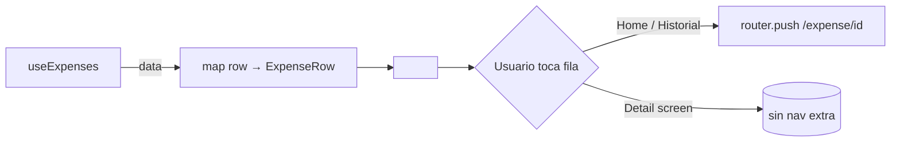

# HU-08 — Mostrar gastos

## 1. Identificación

| Campo            | Valor                                                     |
| ---------------- | --------------------------------------------------------- |
| **ID**           | HU-08                                                     |
| **Historia**     | Mostrar gastos                                            |
| **Persona**      | Cualquier usuario autenticado                             |
| **Estado**       | MVP                                                       |
| **Relevancia**   | Alto                                                      |
| **Release**      | Release 1                                                 |
| **Trazabilidad** | `feat(expenses)` — `<ExpenseRow>` + Home "Últimos gastos" |

## 2. Historia

> **Como** usuario autenticado,
> **quiero** ver cada gasto representado con su descripción, categoría,
> monto y fecha,
> **para** identificar de un vistazo qué pagué, cuándo y a qué rubro
> pertenece.

## 3. Pre-condiciones

- El usuario está autenticado.
- La query `useExpenses(...)` resolvió con al menos un row, o el caller
  está en una superficie que recorta a los últimos N (Home).

## 4. Post-condiciones

- Cada gasto se renderiza con un layout consistente (icon + texto + monto)
  en tres superficies: Home (últimos 4), Historial (lista completa,
  HU-07) y Detail (HU-10).
- El componente acepta tap → navega a `/(protected)/expense/{id}` para
  HU-10.

## 5. Flujo principal

1. La superficie consumidora obtiene los rows vía:
   - **Home (`(tabs)/index.tsx`)**: `useExpenses({ limit: 4 })`.
   - **Historial (`(tabs)/expenses.tsx`)**: `useExpenses(filter)` con
     `limit: 100`.
2. Cada row se pasa a `<ExpenseRow expense={...} />` (en Historial)
   o se mapea a la estructura `ExpenseRow` interna del Home.
3. `<ExpenseRow>` deriva los valores visuales:
   - **Icono** — `e.category?.icon` como nombre de `lucide-react-native`
     (fallback `'CircleDashed'`).
   - **Color del icono** — `e.category?.color` (hex de la paleta DS) o
     `colors.fg[3]` si no hay categoría.
   - **Fondo del círculo** — color del icono con alpha 0x1F (≈12%).
   - **Nombre** — `e.description?.trim()` si existe; si no, el nombre de
     la categoría; si tampoco, `"Gasto"`.
   - **Meta** — `"{Categoría} · {relativeTime(occurred_at)}"`.
   - **Monto** — `formatMoney(Number(e.amount), e.currency)` con
     `tabular-nums` y prefijo de moneda (`$` / `US$`).
4. La fila respeta el tap target mínimo (≥ 44 px). El divider de 1px
   `colors.line[1]` separa filas excepto la última.

## 6. Flujos alternativos

### 6.a — Gasto sin descripción

- `e.description` `null` o vacío post-trim → el nombre muestra la
  categoría (`"Comida"`, `"Transporte"`, etc.).

### 6.b — Gasto sin categoría

- `e.category_id` `null` (por `on delete set null` del FK) → icono
  `CircleDashed` en `colors.fg[3]`. Meta arranca con `"Sin categoría"`.

### 6.c — Monto cargado como string desde Postgres

- `numeric(14,2)` round-trippea a string en JSON. El componente lo
  castea con `Number(...)` antes de pasarlo a `formatMoney`. Sin
  pérdida para los rangos típicos (< 9e15).

### 6.d — Loading / refresh

- En Historial, mientras `useExpenses` está `isLoading`, la FlatList
  muestra el `<Loader label="Cargando gastos" />` en el slot
  `ListEmptyComponent`. No se renderiza ningún `<ExpenseRow>`.

## 7. Diagrama

## 8. Componentes / archivos

| Componente          | Archivo                               | Rol                         |
| ------------------- | ------------------------------------- | --------------------------- |
| `<ExpenseRow>`      | `components/expenses/expense-row.tsx` | Render canónico de una fila |
| Home últimos gastos | `app/(protected)/(tabs)/index.tsx`    | Consumidor con limit 4      |
| Historial           | `app/(protected)/(tabs)/expenses.tsx` | Consumidor con FlatList     |
| `formatMoney`       | `lib/format/money.ts`                 | Formateo `tabular-nums`     |
| `relativeTime`      | `app/(protected)/(tabs)/index.tsx`    | Helper de tiempo relativo   |

## 9. State matrix

| Estado              | Trigger                                | Visual                                                                                                           |
| ------------------- | -------------------------------------- | ---------------------------------------------------------------------------------------------------------------- |
| **Default**         | Row con todos los campos               | Icono coloreado + descripción + meta `"Categoría · hace 3h"` + monto a la derecha con prefijo de moneda.         |
| **Sin descripción** | `description` `null` / vacío post-trim | Nombre = `category.name`. Meta sigue igual.                                                                      |
| **Sin categoría**   | `category_id` `null`                   | Icono `CircleDashed` en `colors.fg[3]`. Meta empieza con `"Sin categoría"`.                                      |
| **USD**             | `currency = 'USD'`                     | Monto con prefijo `US$`. Tono `out` rojo igual que ARS (signo semántico, no positivo).                           |
| **Press**           | Usuario apoya el dedo                  | `Pressable` aplica el highlight nativo de la plataforma. Sin animación de scale propia (delegada al consumidor). |
| **Última fila**     | Último item de la lista                | Sin divider inferior — el divider de 1px se omite cuando `isLast` es true.                                       |
| **Inline en Home**  | Wrapped por `(tabs)/index.tsx`         | Misma anatomía pero envuelta por `<Card variant="base" padding={4}>` y limitada a 4 filas + CTA "Ver todos".     |

## 10. Criterios de aceptación

- [ ] Cada fila muestra icono coloreado, nombre, meta y monto en una sola
      línea de información.
- [ ] El icono del círculo y su fondo derivan del color de la categoría
      (sin hardcode).
- [ ] El monto usa `font-variant: tabular-nums` para alinearse
      verticalmente en la lista.
- [ ] Gastos sin descripción muestran el nombre de la categoría.
- [ ] Gastos sin categoría caen al fallback `CircleDashed` + `"Sin
categoría"`.
- [ ] El componente es navegable: tap → push al detail (HU-10).
- [ ] Las primeras 4 filas en el Home y N filas en el Historial usan el
      mismo layout visual.
- [ ] El divider se omite en la última fila para evitar la línea
      colgante.

## 11. Notas técnicas

- **Casting de `amount`**: `Number(e.amount)` es seguro hasta
  ~9 quadrillón; suficiente para ARS post-hiperinflación.
- **Iconografía**: el icono se pasa como **nombre** (string) desde
  `categories.icon`; el componente hace lookup en
  `lucide-react-native`. Si el nombre no resuelve, retorna `null` y el
  círculo queda vacío (caso defensivo, no esperado).
- **Tests**:
  - `components/expenses/__tests__/expense-row.test.tsx` — render con
    todas las variantes de input (con / sin descripción, con / sin
    categoría, ARS / USD).
  - `app/(protected)/(tabs)/__tests__/index.test.tsx` — verifica que la
    Home limita a 4 y muestra la copy correcta para el empty state.
