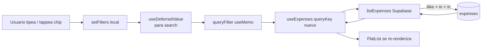

# HU-09 — Filtrar gastos

## 1. Identificación

| Campo            | Valor                                               |
| ---------------- | --------------------------------------------------- |
| **ID**           | HU-09                                               |
| **Historia**     | Filtrar gastos                                      |
| **Persona**      | Cualquier usuario autenticado con historial cargado |
| **Estado**       | MVP                                                 |
| **Relevancia**   | Baja                                                |
| **Release**      | Release 1                                           |
| **Trazabilidad** | `feat(expenses)` — FilterBar + repo filter wiring   |

## 2. Historia

> **Como** usuario con historial de gastos,
> **quiero** filtrar por descripción, moneda y categoría,
> **para** ubicar rápido un gasto puntual o un patrón de gasto.

## 3. Pre-condiciones

- El usuario está en `/(protected)/(tabs)/expenses` (HU-07).
- Existen gastos cargados (puede no haber resultados para una
  combinación de filtros, ver 6.a).

## 4. Post-condiciones

- La lista se actualiza con los gastos que cumplen todos los filtros
  activos (lógica `AND`).
- Los totales del header **no** se recalculan con los filtros aplicados
  (los totals se mantienen del mes completo). Esto es deliberado para
  Release 1 — ver 10.

## 5. Flujo principal

### 5.a — Búsqueda por descripción

1. El usuario toca el input **"Buscar por descripción"** (icono lupa).
2. Tipea texto (ej. `"pizza"`).
3. `useState` actualiza `filters.search` en cada keystroke.
4. `useDeferredValue` retrasa la propagación al query.
5. `useExpenses` dispara una nueva query con
   `filter.search = "pizza"` cuando se estabiliza.
6. `listExpenses` aplica `ilike('description', '%pizza%')` server-side.
7. La lista se actualiza con los resultados.
8. El usuario puede tocar el botón **X** (`X` icon) para limpiar el
   campo y restaurar la lista completa.

### 5.b — Filtrar por moneda

1. El usuario toca el chip **ARS** o **USD** debajo del search.
2. El chip seleccionado muestra borde y tinte (azul brand para ARS,
   verde `money.in` para USD).
3. `filters.currencies` se actualiza vía `toggleCurrency`.
4. `listExpenses` aplica `in('currency', filter.currencies)`.
5. Se pueden activar ambos chips simultáneamente (`OR` por moneda).

### 5.c — Filtrar por categoría

1. El usuario hace scroll horizontal en la barra de chips de categorías.
2. Toca uno o varios chips (`Comida`, `Transporte`, etc.).
3. Cada chip seleccionado muestra borde y tinte con el `color` de la
   categoría.
4. `listExpenses` aplica `in('category_id', filter.categoryIds)`.

### 5.d — Combinación de filtros

- Los tres filtros operan en `AND`. Por ejemplo, `search="pizza"` +
  `currencies=["ARS"]` + `categoryIds=["comida"]` devuelve sólo gastos
  que cumplan los tres simultáneamente.

## 6. Flujos alternativos

### 6.a — Sin resultados

- `listExpenses` devuelve `[]`.
- Se renderiza el empty state con CTA "Registrar gasto" (compartido con
  HU-07).

### 6.b — Limpiar todos los filtros

- _Release 1_: el usuario debe limpiar cada filtro individualmente
  (tap nuevamente al chip activo, X en search).
- _Release 2_: agregar botón "Limpiar filtros".

### 6.c — Pull-to-refresh con filtros activos

- Mantiene los filtros y revalida la query.

## 7. Diagrama

## 8. Pantallas / componentes involucrados

| Componente             | Archivo                               | Rol                 |
| ---------------------- | ------------------------------------- | ------------------- |
| `<FilterBar>`          | `components/expenses/filter-bar.tsx`  | UI de filtros       |
| `expenses` tab         | `app/(protected)/(tabs)/expenses.tsx` | Hospeda los filtros |
| `useExpenses(filter)`  | `hooks/use-expenses.ts`               | Query reactiva      |
| `listExpenses(filter)` | `lib/repositories/expenses.ts`        | Capa Supabase       |

## 9. Criterios de aceptación

- [ ] El input de búsqueda muestra el icono lupa y placeholder
      `"Buscar por descripción"`.
- [ ] Tipear texto re-ejecuta la query cuando el valor se estabiliza
      (sin tirar una request por keystroke).
- [ ] Tap en el botón **X** limpia el texto y la lista se restaura.
- [ ] Los chips ARS / USD reflejan estado seleccionado con borde
      grueso (2px) y fondo tintado.
- [ ] USD activo se muestra en color verde (`money.in`), ARS en azul
      brand[400].
- [ ] Los chips de categoría hacen scroll horizontal sin recortar.
- [ ] La combinación de filtros opera en `AND` (todos deben cumplirse).
- [ ] Empty state aparece cuando no hay coincidencias.

## 10. Notas técnicas

- **Debounce de búsqueda**: usamos `useDeferredValue` (React 19+) en
  lugar de `setTimeout`. Es declarativo y se cancela solo cuando el
  usuario vuelve a tipear.
- **Filtro a nivel server**: todos los filtros viajan al query Supabase
  (`ilike`, `in`). No filtramos en cliente.
- **Trigram index** sobre `description` está en el roadmap; por ahora
  `ilike` con `%pattern%` es aceptable hasta ~10k rows por usuario.
- **Totales del header NO reflejan filtros**: decisión deliberada para
  no confundir "total del mes" con "total de la búsqueda". En Release 2
  podemos sumar un segundo número "Total filtrado" o reemplazar uno por
  otro vía toggle.
- **Tests**:
  `components/expenses/__tests__/filter-bar.test.tsx` —
  search type, toggle currency, toggle category, clear search.
