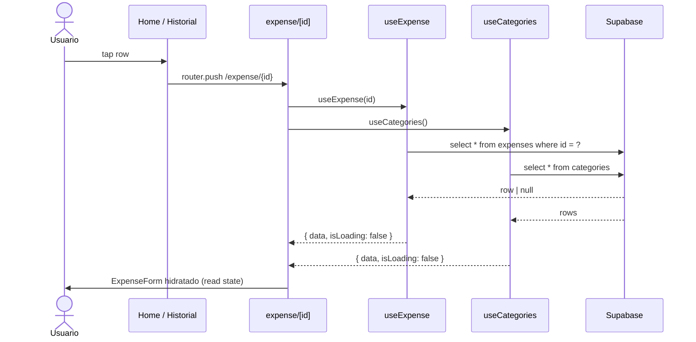

# HU-10 — Conocer gasto registrado

## 1. Identificación

| Campo            | Valor                                                       |
| ---------------- | ----------------------------------------------------------- |
| **ID**           | HU-10                                                       |
| **Historia**     | Conocer gasto registrado                                    |
| **Persona**      | Cualquier usuario autenticado                               |
| **Estado**       | MVP                                                         |
| **Relevancia**   | Alto                                                        |
| **Release**      | Release 1                                                   |
| **Trazabilidad** | `feat(expenses)` — detail route `/expense/[id]` (read path) |

## 2. Historia

> **Como** usuario autenticado,
> **quiero** abrir un gasto desde el Home o el Historial para ver todos
> sus datos en pantalla completa,
> **para** confirmar qué cargué (monto, moneda, fecha, categoría,
> descripción) antes de editar, eliminar o seguir navegando.

## 3. Pre-condiciones

- El usuario está autenticado.
- Existe un `expense_id` válido visible en la lista (Home o Historial).
- RLS le otorga lectura sobre el row
  (`auth.uid() = expenses.user_id`).

## 4. Post-condiciones

- El usuario ve los valores actuales del gasto en un form pre-cargado.
- Desde el mismo screen puede pasar a HU-11 (editar) o eliminar
  (HU-12 §7), o volver atrás con la flecha del header.

## 5. Flujo principal

1. El usuario toca una fila de `<ExpenseRow>` (HU-08) en el Home o el
   Historial.
2. `router.push('/(protected)/expense/{id}')` navega a la ruta dinámica.
3. `app/(protected)/expense/[id].tsx` extrae `id` con
   `useLocalSearchParams<{ id?: string }>()` y dispara:
   - `useExpense(id)` → lee el row con `getExpense(id)`.
   - `useCategories()` → lista para repoblar el picker.
4. Mientras alguna query está `isLoading`:
   - Header con flecha `ChevronLeft` y título `"Editar gasto"`.
   - Body: `<Loader label="Cargando" />`.
5. Cuando ambas queries resuelven:
   - El header agrega el icono `Trash2` a la derecha (botón eliminar).
   - El form se hidrata con `<ExpenseForm initial={expense} />`.
6. El usuario lee la información en el form (sin tocar). En este punto:
   - El monto se muestra con `JetBrains Mono` 32px + `tabular-nums`.
   - La moneda activa está marcada en el `<CurrencyToggle>`.
   - La categoría aparece con borde 2px en `cat.color`.
   - La descripción (si existe) está poblada en el input.
7. Acciones disponibles desde acá:
   - **Volver** → tap `ChevronLeft` → `router.back()`.
   - **Editar** → modificar campos y tap `"Guardar cambios"` (HU-11).
   - **Eliminar** → tap `Trash2` del header **o** el botón destructivo
     al pie (HU-12 §7).

## 6. Flujos alternativos / errores

### 6.a — `id` ausente o malformado

- `useLocalSearchParams` devuelve `params.id` `undefined`. El screen
  inicializa `id = ''`.
- `useExpense('')` con `enabled = false` no dispara la red; `data`
  queda `undefined`.
- Tras el loader se ramifica a "no encontrado": body con
  `"No se encontró el gasto solicitado."`.

### 6.b — El row no existe / RLS rechaza

- `getExpense(id)` devuelve `data = null` (PostgREST 406 / 404).
- Mismo branch que 6.a → `"No se encontró el gasto solicitado."`.

### 6.c — Categorías cargan pero el gasto falla

- `categoriesQuery.data` definido, `expenseQuery.data` `null` post-load.
- Branch "no encontrado".

### 6.d — Red caída

- Cualquiera de las dos queries en `error` → el screen muestra el
  estado `isLoading: false, data: undefined` y cae al branch
  "no encontrado". La copy es la misma — el detalle del error queda
  en `console` para debugging.

## 7. Diagrama

## 8. Pantallas involucradas

| Ruta                        | Archivo                                | Rol                              |
| --------------------------- | -------------------------------------- | -------------------------------- |
| `/(protected)/expense/[id]` | `app/(protected)/expense/[id].tsx`     | Container detail                 |
| `<ExpenseForm>`             | `components/expenses/expense-form.tsx` | Mismo form que HU-13 (create)    |
| `<Loader>`                  | `components/ui/loader.tsx`             | Spinner `Loader2` mientras carga |
| `<Icon name="ChevronLeft">` | `components/ui/icon.tsx`               | Botón volver                     |
| `<Icon name="Trash2">`      | `components/ui/icon.tsx`               | Botón eliminar (header)          |

## 9. State matrix

| Estado              | Trigger                                                | Visual                                                                                                                                  |
| ------------------- | ------------------------------------------------------ | --------------------------------------------------------------------------------------------------------------------------------------- |
| **Loading**         | `isLoading = true` para `useExpense` o `useCategories` | Header con `ChevronLeft` + título `"Editar gasto"`. Body: `<Loader label="Cargando" />`. Trash icon **NO** se renderiza todavía.        |
| **Not found**       | `isLoading = false` y `expense == null`                | Header sin trash icon. Body con `"No se encontró el gasto solicitado."` en `colors.fg[3]`. Sin form. Botón destructivo NO se renderiza. |
| **Read (default)**  | Ambas queries resuelven con datos                      | Header con flecha + título + trash. Form hidratado con valores actuales. Submit dice `"Guardar cambios"`. Botón destructivo al pie.     |
| **USD / ARS**       | `currency` del row                                     | El `<CurrencyToggle>` marca la moneda correcta y el prefijo del monto se ajusta (`$` / `US$`).                                          |
| **Sin descripción** | `description` `null`                                   | Input descripción vacío. Sin error.                                                                                                     |
| **Sin categoría**   | `category_id` `null`                                   | Ningún chip seleccionado en el `<CategoryPicker>` (el form queda inválido hasta seleccionar una).                                       |
| **Back navigation** | Tap `ChevronLeft`                                      | `router.back()` inmediato.                                                                                                              |

## 10. Criterios de aceptación

- [ ] La pantalla se abre desde una fila del Home o del Historial.
- [ ] Mientras carga, se muestra el `<Loader>` de DS (no plain text).
- [ ] El monto se renderiza con `JetBrains Mono` + `tabular-nums`.
- [ ] La moneda activa coincide con el row.
- [ ] La categoría seleccionada coincide con el row.
- [ ] La descripción se hidrata en el input si existe.
- [ ] El icono `Trash2` aparece sólo cuando el row está cargado.
- [ ] Si el `id` no resuelve a un row, se muestra la copy "No se
      encontró el gasto solicitado." y el botón destructivo NO está.
- [ ] El tap en `ChevronLeft` vuelve al origen sin guardar nada.

## 11. Notas técnicas

- **Cache**: `useExpense(id)` comparte cache con la mutación de update
  vía `setQueryData(expenseKeys.detail(id), updatedRow)` (ver HU-11),
  así que al editar el screen muestra los nuevos valores antes de
  navegar.
- **RLS**: tanto el `select` como las mutaciones se validan con
  `(select auth.uid()) = user_id`. Un usuario que pegue un `id` ajeno
  manualmente recibe el mismo branch de "no encontrado".
- **Iconografía**: el header usa la flecha de Lucide al estilo iOS;
  está aceptado renderear el mismo icono en Android porque la app es
  dark-first y la consistencia visual gana sobre la convención
  platform-specific.
- **Tests**:
  - `app/(protected)/expense/__tests__/edit.test.tsx` — render con row
    hidratado.
  - Indirectamente cubierto por `hooks/__tests__/use-expenses.test.tsx`
    al validar `useExpense` con cache + invalidación.
