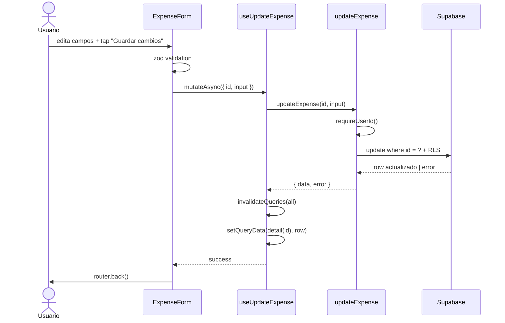

# HU-11 — Editar gasto

## 1. Identificación

| Campo            | Valor                                                            |
| ---------------- | ---------------------------------------------------------------- |
| **ID**           | HU-11                                                            |
| **Historia**     | Editar gasto                                                     |
| **Persona**      | Cualquier usuario autenticado                                    |
| **Estado**       | MVP                                                              |
| **Relevancia**   | Bajo                                                             |
| **Release**      | Release 1                                                        |
| **Trazabilidad** | `feat(expenses)` — update mutation + cache-set en `expense/[id]` |

## 2. Historia

> **Como** usuario autenticado,
> **quiero** modificar el monto, la moneda, la categoría o la descripción
> de un gasto que ya cargué,
> **para** corregir errores de tipeo o reasignaciones de rubro sin tener
> que eliminar el gasto y crearlo desde cero.

## 3. Pre-condiciones

- El usuario está autenticado.
- Llegó a `/(protected)/expense/[id]` desde HU-10 (lista de
  gastos → tap fila) con un row válido.
- RLS le otorga `update` sobre la fila
  (`auth.uid() = expenses.user_id`).

## 4. Post-condiciones

- El row en `public.expenses` queda con los nuevos valores.
- El trigger `expenses_set_updated_at` refresca `updated_at = now()`.
- TanStack Query refresca el cache de `expenseKeys.all` (lista + totales)
  y mete el row actualizado en `expenseKeys.detail(id)` para no pedir
  un round-trip extra al volver al detail.
- El usuario vuelve al origen (Home o Historial) y ve los cambios
  reflejados sin reload manual.

## 5. Flujo principal

1. El usuario está en `/(protected)/expense/{id}` con el form hidratado
   por HU-10.
2. Modifica uno o varios campos:
   - **Monto** — re-tipea valor en el `<AmountInput>`.
   - **Moneda** — toca el otro chip del `<CurrencyToggle>`; el prefijo
     del monto se ajusta (`$` / `US$`).
   - **Categoría** — toca otro chip; el seleccionado anterior pierde el
     borde de 2px.
   - **Descripción** — edita el texto (máx 240 chars).
3. Toca **"Guardar cambios"**.
4. `react-hook-form` corre `handleSubmit`:
   - Valida con `createExpenseSchema` (zod) — mismas reglas que HU-13.
   - Si falla, muestra errores inline; el botón sigue habilitado.
5. Si valida, `useUpdateExpense.mutateAsync({ id, input })` corre:
   - `updateExpense(id, input)` construye un `patch` con sólo los
     campos definidos (skip de `undefined`).
   - `from('expenses').update(patch).eq('id', id).select('*, category:categories(*)').single()`.
   - RLS valida ownership server-side.
6. Mientras la mutación está pendiente:
   - El botón muestra el `<Loader>` (spinner Lucide).
   - Inputs quedan `editable={false}`.
7. En éxito:
   - `invalidateQueries(expenseKeys.all)` refresca lista + totales.
   - `setQueryData(expenseKeys.detail(id), updatedRow)` actualiza el
     cache local con la fila fresca.
   - `router.back()` retorna al Home o Historial.
8. El consumidor (Home o Historial) re-renderiza con los datos nuevos
   sin refetch explícito porque la invalidación ya disparó el refresh.

## 6. Flujos alternativos / errores

### 6.a — Cambiar moneda sin tocar el monto

- El form queda válido. El backend persiste el nuevo `currency` y el
  mismo `amount`. En la lista se ve el cambio de prefijo (`$` →
  `US$`).

### 6.b — Borrar la descripción

- Input descripción se vacía → al submit el patch envía
  `description: null` (post-trim). El backend lo acepta porque la
  columna es nullable.

### 6.c — Validación zod falla

- Mismos mensajes que HU-13:
  - `"El monto tiene que ser mayor a cero."`
  - `"Monto demasiado grande."`
  - `"Categoría inválida."`
  - `"Máximo 240 caracteres."`
- El botón sigue habilitado para reintentar.

### 6.d — RLS rechaza (caso imposible vía UI normal)

- Si alguien manipula la sesión y dispara un update sobre un
  `id` ajeno, Supabase responde con `42501` /
  `"new row violates row-level security policy"`.
- El mapeo del repo devuelve
  `"No se pudo actualizar el gasto. Intentá nuevamente."` en el
  `submitError` del form.

### 6.e — Sesión inválida

- `requireUserId()` lanza `"No hay sesión activa. Iniciá sesión."`
- Se muestra como `submitError`.

### 6.f — Conflicto con categoría borrada

- La categoría seleccionada en cache pero borrada en backend (raro porque
  el catálogo es global) → el FK `on delete set null` deja el row con
  `category_id = null`. El render fallback es `"Sin categoría"`.

### 6.g — Cancelar / volver sin guardar

- Tap en `ChevronLeft` del header → `router.back()` inmediato. Los
  cambios del form se descartan sin confirmación. Esto es deliberado:
  el flujo es corto y el formulario no representa esfuerzo importante.

## 7. Diagrama

## 8. Pantallas involucradas

| Ruta                        | Archivo                                | Rol                                |
| --------------------------- | -------------------------------------- | ---------------------------------- |
| `/(protected)/expense/[id]` | `app/(protected)/expense/[id].tsx`     | Container con update + delete      |
| `<ExpenseForm>`             | `components/expenses/expense-form.tsx` | Form compartido con HU-13          |
| `<Loader>`                  | `components/ui/loader.tsx`             | Spinner en el botón mientras pende |

## 9. State matrix

| Estado               | Trigger                      | Visual                                                                                                                                |
| -------------------- | ---------------------------- | ------------------------------------------------------------------------------------------------------------------------------------- |
| **Default**          | Detail cargado (HU-10)       | Form hidratado. Botón primario `"Guardar cambios"` habilitado. Trash icon en header.                                                  |
| **Dirty**            | Usuario modifica algún campo | Sin marker visual de "dirty" (DS no expone uno). Los nuevos valores reemplazan los originales en pantalla. Botón sigue habilitado.    |
| **Validation error** | Submit con datos inválidos   | Errores inline por campo en `colors.money.out`. El form se mantiene con los datos. Botón habilitado para reintentar.                  |
| **Mutation pending** | `mutateAsync` en vuelo       | Botón `"Guardar cambios"` con `<Loader>`. Inputs `editable={false}`. Botón destructivo del pie sigue habilitado pero ignora el input. |
| **Mutation error**   | RLS / red / 5xx              | `submitError` en rojo centrado bajo el form. Botón vuelve a habilitarse. Datos del form quedan intactos.                              |
| **Mutation success** | Row actualizado              | `router.back()`. Sin render propio. Lista + totales se refrescan automáticamente.                                                     |
| **Cancel**           | Tap `ChevronLeft`            | `router.back()` inmediato. Cambios descartados sin confirmación.                                                                      |

## 10. Criterios de aceptación

- [ ] Modificar monto + tap `"Guardar cambios"` persiste el nuevo valor
      en Supabase.
- [ ] Cambiar de ARS a USD persiste la nueva moneda y actualiza el
      prefijo en lista.
- [ ] Cambiar de categoría persiste el nuevo `category_id` y el icono
      de la fila refleja el nuevo color.
- [ ] Borrar la descripción persiste `null` en `description`.
- [ ] Al guardar, el botón muestra el `<Loader>`; los inputs quedan no
      editables.
- [ ] Tras éxito, el Home y el Historial reflejan los cambios sin
      reload manual.
- [ ] RLS impide editar gastos de otros usuarios.
- [ ] Si la red falla, se muestra el mensaje en español sin perder los
      datos del form.
- [ ] Tap en la flecha del header descarta los cambios sin
      confirmación.

## 11. Notas técnicas

- **`updated_at`** — manejado por trigger DB `expenses_set_updated_at`,
  no por el cliente.
- **Patch parcial** — el repo descarta keys `undefined` antes del
  `.update()`. Esto evita sobrescribir columnas que el form no tocó
  (ej.: `occurred_at`).
- **Cache strategy** — `invalidateQueries(expenseKeys.all)` +
  `setQueryData(expenseKeys.detail(id), row)` son complementarios:
  - El invalidate refetchea totales + lista en background.
  - El `setQueryData` provee el dato fresco al detail screen mientras
    los queries dependientes se reactualizan.
- **Schemas** — `updateExpenseSchema = createExpenseSchema.partial()`;
  reutiliza las mismas validaciones que HU-13 sin duplicar reglas.
- **Tests**:
  - `lib/repositories/__tests__/expenses.test.ts` — update con
    `patch` selectivo.
  - `hooks/__tests__/use-expenses.test.tsx` — `setQueryData` después de
    una update exitosa.
  - `app/(protected)/expense/__tests__/edit.test.tsx` — hidrata,
    modifica, confirma submit.
