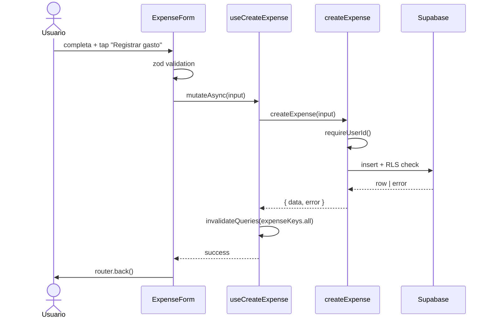
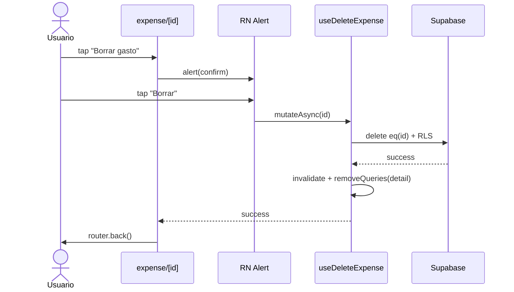

# HU-12 — Guardar gasto

## 1. Identificación

| Campo            | Valor                                                    |
| ---------------- | -------------------------------------------------------- |
| **ID**           | HU-12                                                    |
| **Historia**     | Guardar gasto                                            |
| **Persona**      | Cualquier usuario autenticado                            |
| **Estado**       | MVP                                                      |
| **Relevancia**   | Alta                                                     |
| **Release**      | Release 1                                                |
| **Trazabilidad** | `feat(expenses)` — create + update + delete via TanStack |

## 2. Historia

> **Como** usuario autenticado,
> **quiero** crear, editar y borrar gastos,
> **para** mantener mi historial fiel a lo que realmente gasté.

## 3. Pre-condiciones

- El usuario está autenticado.
- Tiene acceso a la pantalla de Nuevo gasto (HU-13) o a la edición desde
  el Home / Historial.

## 4. Post-condiciones

- **Crear**: nuevo row en `public.expenses` con `user_id = auth.uid()`.
  TanStack Query invalida `expenseKeys.all`. El usuario vuelve a la
  pantalla anterior.
- **Editar**: el row existente queda actualizado, `updated_at` se
  refresca por trigger DB. El detail-cache se actualiza en memoria.
- **Borrar**: el row se elimina; el detail-cache se purga.

## 5. Flujo principal — Crear

1. El usuario completa el form en `/(protected)/expense/new` (HU-13).
2. Toca **"Registrar gasto"**.
3. `react-hook-form` ejecuta `handleSubmit`:
   - Valida con `createExpenseSchema` (zod).
   - Si falla, muestra errores inline en español.
4. Si valida, `useCreateExpense.mutateAsync(input)` corre:
   - `createExpense(input)` en el repo.
   - `requireUserId()` obtiene `auth.uid()` del cliente.
   - Insert en Supabase: `from('expenses').insert({...}).select('*, category:categories(*)').single()`.
   - RLS valida `(select auth.uid()) = user_id`.
5. Si Supabase devuelve fila:
   - `onSuccess` invalida `expenseKeys.all` → el Home y Historial se
     refrescan automáticamente.
   - El screen ejecuta `router.back()`.
6. Si falla, `submitError` se setea con el mensaje mapeado.

## 6. Flujo principal — Editar

1. El usuario abre `/(protected)/expense/{id}` desde:
   - Tap en una fila del Home.
   - Tap en una fila del Historial.
2. `useExpense(id)` carga el row vía `getExpense(id)`.
3. `<ExpenseForm initial={...} />` hidrata el form con los valores.
4. El usuario modifica campos (amount / currency / categoría /
   descripción).
5. Toca **"Guardar cambios"**.
6. `useUpdateExpense.mutateAsync({ id, input })` corre:
   - Construye un patch con sólo los campos definidos
     (`if (x !== undefined) patch.x = x`).
   - Update en Supabase con `eq('id', id)`.
   - RLS valida ownership.
7. En éxito:
   - Invalida `expenseKeys.all`.
   - `setQueryData(expenseKeys.detail(id), updatedRow)` actualiza el
     cache local sin roundtrip extra.
   - `router.back()`.

## 7. Flujo principal — Borrar

1. El usuario está en `/(protected)/expense/{id}`.
2. Toca el icono **🗑** (`Trash2`) del header **o** el botón
   destructivo al pie.
3. La app muestra un `Alert` nativo:
   `"¿Seguro que querés borrar este gasto?"` con botones
   **Cancelar** / **Borrar** (destructivo).
4. Si toca **Cancelar**, no pasa nada.
5. Si toca **Borrar**:
   - `useDeleteExpense.mutateAsync(id)` → `deleteExpense(id)` →
     `from('expenses').delete().eq('id', id)`.
   - RLS valida ownership.
6. En éxito:
   - Invalida `expenseKeys.all`.
   - `removeQueries(expenseKeys.detail(id))` purga el cache.
   - `router.back()`.

## 8. Flujos alternativos / errores

### 8.a — Validación zod falla

- Mensajes en español por campo. El botón sigue activo (la validación
  se reintenta).

### 8.b — RLS rechaza

- Supabase devuelve error con `42501` u `"new row violates row-level
security policy"`. El mapeo genérico muestra:
  - Create: `"No pudimos guardar el gasto. Probá de nuevo."`
  - Update: `"No pudimos actualizar el gasto. Probá de nuevo."`
  - Delete: `"No pudimos borrar el gasto. Probá de nuevo."`

### 8.c — Sesión inválida (sin user)

- `requireUserId()` lanza
  `"No hay sesión activa. Iniciá sesión."`
- El form lo muestra como `submitError`.

### 8.d — Conflicto de FK con categoría borrada

- `category_id` con `on delete set null` → la fila queda con
  `category_id = null`. La UI muestra `"Sin categoría"`.

## 9. Diagramas

### Crear

### Borrar

## 10. Pantallas involucradas

| Ruta                        | Archivo                                | Rol             |
| --------------------------- | -------------------------------------- | --------------- |
| `/(protected)/expense/new`  | `app/(protected)/expense/new.tsx`      | Crear (HU-13)   |
| `/(protected)/expense/[id]` | `app/(protected)/expense/[id].tsx`     | Editar / borrar |
| `<ExpenseForm>`             | `components/expenses/expense-form.tsx` | Form compartido |

## 11. Criterios de aceptación

- [ ] Crear un gasto con datos válidos lo persiste en Supabase y vuelve
      a la pantalla anterior.
- [ ] Tras crear, el Home y el Historial reflejan el nuevo gasto sin
      reload manual.
- [ ] Editar un gasto actualiza la fila en DB y refleja los cambios en
      lista y totales.
- [ ] Borrar un gasto requiere confirmación nativa antes de ejecutar.
- [ ] Tras borrar, la fila desaparece de la lista en el siguiente
      render sin refetch manual.
- [ ] RLS impide CRUD sobre gastos de otros usuarios (test manual: un
      segundo usuario no debería poder editar/borrar un gasto ajeno).
- [ ] Sin sesión, las mutaciones fallan con mensaje claro en español.
- [ ] Mensajes de error son empáticos
      (`"No pudimos guardar el gasto. Probá de nuevo."`), no técnicos.

## 12. Notas técnicas

- **Hooks**: `useCreateExpense`, `useUpdateExpense`, `useDeleteExpense`.
- **Cache strategy**:
  - Create/Update/Delete invalidan `expenseKeys.all` (incluye list,
    detail, totals).
  - Update además mete el row actualizado en `expenseKeys.detail(id)`.
  - Delete remueve `expenseKeys.detail(id)`.
- **Schemas**: `createExpenseSchema`, `updateExpenseSchema =
createExpenseSchema.partial()`.
- **RLS**: cuatro policies sobre `public.expenses`
  (select/insert/update/delete con `auth.uid() = user_id`).
- **Trigger DB**: `expenses_set_updated_at` mantiene
  `updated_at = now()` en cada UPDATE.
- **Tests**:
  - `lib/repositories/__tests__/expenses.test.ts` —
    create/update/delete con mock chainable de Supabase.
  - `hooks/__tests__/use-expenses.test.tsx` — invalidación, errores,
    cache updates.
  - `app/(protected)/expense/__tests__/new.test.tsx` — flow happy path
    - error.
  - `app/(protected)/expense/__tests__/edit.test.tsx` — hidrata,
    edita, confirma + borra.
