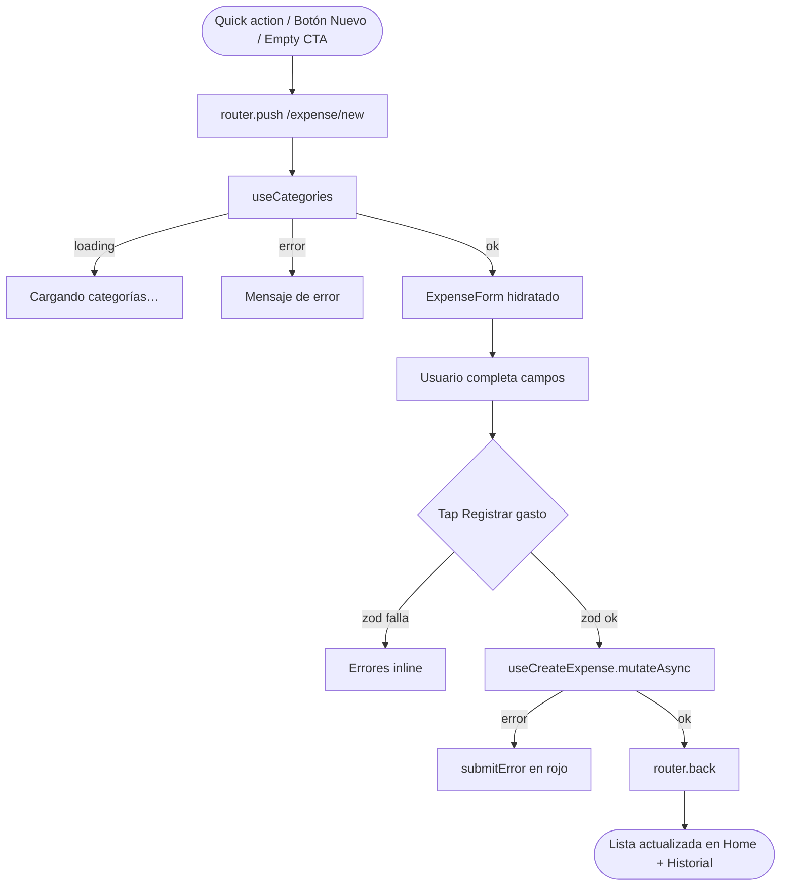

# HU-13 — Sección registro nuevo

## 1. Identificación

| Campo            | Valor                                                   |
| ---------------- | ------------------------------------------------------- |
| **ID**           | HU-13                                                   |
| **Historia**     | Sección registro nuevo (de gasto)                       |
| **Persona**      | Cualquier usuario autenticado                           |
| **Estado**       | MVP                                                     |
| **Relevancia**   | Alta                                                    |
| **Release**      | Release 1                                               |
| **Trazabilidad** | `feat(expenses)` — new-expense screen + form primitives |

## 2. Historia

> **Como** usuario autenticado,
> **quiero** una pantalla dedicada para registrar un gasto en pocos
> segundos,
> **para** capturar lo que gasté antes de olvidarlo.

## 3. Pre-condiciones

- El usuario está autenticado.
- Existe al menos una categoría en `public.categories` (la migración
  semilla inserta 9).

## 4. Post-condiciones

- Si el usuario completa y envía: nuevo row en `public.expenses` y
  retorno al lugar de origen.
- Si descarta: nada cambia.

## 5. Flujo principal

1. El usuario abre la pantalla de **Nuevo gasto** desde:
   - Quick action **"Agregar"** del Home.
   - Botón **"Nuevo"** del Historial.
   - Empty state CTA **"Registrar gasto"**.
2. La app navega a `/(protected)/expense/new`.
3. `useCategories()` dispara la query (cache 1h staleTime).
4. Mientras cargan las categorías, se muestra
   `"Cargando categorías…"`.
5. Cuando llegan, se renderiza `<ExpenseForm>` con:
   - **Monto** — `<AmountInput>` con prefijo dinámico
     (`$` para ARS, `US$` para USD), `JetBrains Mono` 32px,
     `tabular-nums`. Acepta dígitos / `.` / `,`. Convierte con
     `parseAmount`.
   - **Moneda** — `<CurrencyToggle>` segmentado ARS (brand azul) /
     USD (verde `money.in`).
   - **Categoría** — `<CategoryPicker>` con scroll horizontal de chips;
     cada chip usa su `icon` y `color`.
   - **Descripción** (opcional) — input con label y máximo 240
     caracteres.
   - **Submit** — `<Button variant="primary" size="lg" fullWidth>`
     con texto **"Registrar gasto"**.
6. El usuario completa los campos:
   - Si tipea `12.500,50`, `parseAmount` devuelve `12500.5`.
   - Si toca **USD**, el prefijo del monto cambia a `US$`.
   - Si toca una categoría, se marca con borde 2px en el color de la
     categoría.
7. Toca **"Registrar gasto"**.
8. `zod` valida (ver HU-12). Si falla, muestra errores inline.
9. Si valida, `useCreateExpense.mutateAsync(input)` corre.
10. En éxito, `router.back()` retorna al Home / Historial.

## 6. Flujos alternativos

### 6.a — Cancelar / volver atrás

- Tap en el icono `ChevronLeft` del header → `router.back()`.
- No se persiste nada; los cambios del form se descartan.

### 6.b — Error al cargar categorías

- `categoriesQuery.error` distinto de `null`.
- En lugar del form, se muestra:
  `"No pudimos cargar las categorías. Probá de nuevo."`

### 6.c — Validación fallida

- Monto `<= 0` → `"El monto tiene que ser mayor a cero."`
- Monto > `1.000.000.000` → `"Monto demasiado grande."`
- Moneda fuera de `ARS|USD` (imposible vía UI) →
  `"Elegí ARS o USD."`
- Categoría no seleccionada → `"Categoría inválida."`
- Descripción > 240 chars → `"Máximo 240 caracteres."`

### 6.d — Error de Supabase

- Ver HU-12 §8.b. Mensaje
  `"No pudimos guardar el gasto. Probá de nuevo."` en rojo bajo el
  form.

## 7. Diagrama

## 8. Componentes / archivos

| Componente                | Archivo                                   | Rol                   |
| ------------------------- | ----------------------------------------- | --------------------- |
| Screen                    | `app/(protected)/expense/new.tsx`         | Container             |
| `<ExpenseForm>`           | `components/expenses/expense-form.tsx`    | Form completo         |
| `<AmountInput>`           | `components/expenses/amount-input.tsx`    | Input monto monospace |
| `<CurrencyToggle>`        | `components/expenses/currency-toggle.tsx` | Segment ARS / USD     |
| `<CategoryPicker>`        | `components/expenses/category-picker.tsx` | Chips horizontales    |
| `createExpenseSchema`     | `lib/schemas/expense.ts`                  | Validación zod        |
| `formatMoney/parseAmount` | `lib/format/money.ts`                     | Helpers de moneda     |

## 9. State matrix

| Estado                  | Trigger                        | Visual                                                                                                                    |
| ----------------------- | ------------------------------ | ------------------------------------------------------------------------------------------------------------------------- |
| **Loading categories**  | Primera carga                  | Header con `ChevronLeft` + `"Nuevo gasto"`. Body con `"Cargando categorías…"` en `colors.fg[3]`.                          |
| **Categories error**    | `useCategories` rechaza        | Body con `"No pudimos cargar las categorías. Probá de nuevo."` en `colors.money.out`.                                     |
| **Default ARS**         | Categorías cargadas            | Form completo. Prefijo `$`. Chip ARS seleccionado (azul `brand[400]`). USD inactivo. Categoría sin seleccionar.           |
| **Currency USD active** | Tap chip USD                   | Prefijo del monto cambia a `US$`. Chip USD activo (verde `money.in`). ARS pasa a inactivo. Monto y descripción persisten. |
| **Category selected**   | Tap chip de categoría          | Chip con borde 2px en `cat.color`. Sólo un chip seleccionado a la vez (single-select).                                    |
| **Validation error**    | Submit con datos inválidos     | Errores inline por campo. Botón `"Registrar gasto"` permanece habilitado.                                                 |
| **Saving**              | `useCreateExpense.mutateAsync` | Botón con `ActivityIndicator`. Inputs `editable={false}`. AmountInput también deshabilitado.                              |
| **Submit error**        | Repo devuelve error            | `submitError` rojo centrado bajo el form. Form se mantiene con los datos.                                                 |
| **Success**             | Row creado                     | `router.back()`. Sin render propio. Home + Historial muestran el nuevo gasto al refrescarse.                              |
| **Cancel**              | Tap `ChevronLeft` del header   | `router.back()` inmediato. Datos del form se descartan (sin confirmación).                                                |

## 10. Criterios de aceptación

- [ ] La pantalla se abre desde tres puntos: quick action del Home,
      botón "Nuevo" del Historial, empty state CTA.
- [ ] El icono `ChevronLeft` vuelve sin guardar.
- [ ] El monto se renderiza con `JetBrains Mono` y `tabular-nums`.
- [ ] El prefijo del monto refleja la moneda seleccionada (`$` /
      `US$`).
- [ ] Cambiar moneda no resetea el resto del form.
- [ ] Los chips de categoría muestran icono + color propio.
- [ ] Sólo se puede seleccionar **una** categoría a la vez.
- [ ] Al tocar **Registrar gasto**, el botón muestra spinner mientras
      la mutación está en vuelo.
- [ ] Errores de validación aparecen en español rioplatense, en rojo
      `money.out`.
- [ ] Tras éxito, el Home y el Historial se actualizan sin reload
      manual.

## 11. Notas técnicas

- **occurred_at** queda implícito (`new Date().toISOString()` server-side
  default). Date picker pendiente para Release 2.
- **Persistencia del form**: no se persiste en local storage; si el
  usuario vuelve atrás pierde los datos. Considerado aceptable para
  Release 1 (no es un flujo largo).
- **Decimal-pad**: `keyboardType="decimal-pad"` + `inputMode="decimal"`
  rinden el teclado numérico apropiado en iOS y Android.
- **Limpieza de input**: el regex `/[^0-9.,]/g` rechaza letras a nivel
  UI; `parseAmount` luego normaliza.
- **Tests**:
  - `app/(protected)/expense/__tests__/new.test.tsx` — render,
    listado de categorías, submit con monto parseado, error mapping.
  - `lib/format/__tests__/money.test.ts` — `parseAmount` /
    `formatMoney`.
