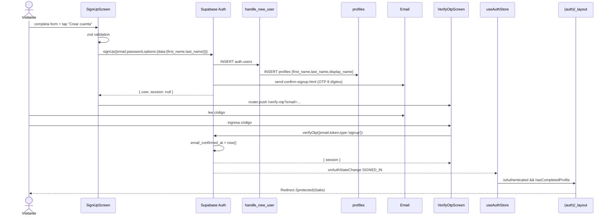

# HU-14 — Registrar cuenta

## 1. Identificación

| Campo            | Valor                                                                 |
| ---------------- | --------------------------------------------------------------------- |
| **ID**           | HU-14                                                                 |
| **Historia**     | Registrar cuenta                                                      |
| **Persona**      | Usuario nuevo sin cuenta previa en RADAR                              |
| **Estado**       | MVP                                                                   |
| **Relevancia**   | Alto                                                                  |
| **Release**      | Release 1                                                             |
| **Trazabilidad** | `feat(auth)` + `feat(user-name-capture)` — sign-up + OTP + onboarding |

## 2. Historia

> **Como** visitante de RADAR,
> **quiero** crear una cuenta personal en un sólo flujo (nombre, correo,
> contraseña, verificación por código),
> **para** empezar a registrar mis gastos con mi identidad real desde la
> primera sesión.

## 3. Pre-condiciones

- El visitante no tiene sesión activa.
- Tiene acceso a un correo electrónico válido para recibir el código de
  verificación.

## 4. Post-condiciones

- Una fila nueva en `auth.users` con `email`, `password` (hashed) y
  `raw_user_meta_data = { first_name, last_name }`.
- Una fila nueva en `public.profiles` creada por el trigger
  `handle_new_user()` con `first_name`, `last_name` y `display_name`
  computado.
- Sesión activa en el cliente. El auth listener actualiza
  `useAuthStore`. El gate de `(protected)/_layout.tsx` deja pasar al
  usuario a `(tabs)/` (porque ya completó el perfil en el form de
  registro — no necesita pasar por `(onboarding)/profile-setup`).

## 5. Flujo principal

1. El visitante abre la app sin sesión. El gate de `(auth)/_layout.tsx`
   permite entrar al stack.
2. En la pantalla de sign-in, toca **"Crear cuenta"** (link al pie) y
   navega a `/(auth)/sign-up`.
3. Completa los 5 campos del form `<SignUpScreen>`:
   - **Nombre** — voseo formal. `autoComplete="given-name"`.
   - **Apellido** — `autoComplete="family-name"`.
   - **Correo electrónico** — placeholder `nombre@ejemplo.com`.
   - **Contraseña** — secure-text, min 8 chars.
   - **Confirmar contraseña** — debe coincidir.
4. Toca **"Crear cuenta"**.
5. `react-hook-form` corre `handleSubmit`:
   - Valida con un schema compuesto:
     - `nameSchema` (compartido en `lib/schemas/profile.ts`):
       `trim → min 2 → max 40 → regex /^[A-Za-zÀ-ÿñÑ\s'-]+$/u`.
     - `email().email()`, `password.min(8)`, `confirm.min(8)`.
     - `.refine(p === c)` para password match.
   - Si falla, muestra errores inline en español; el botón sigue
     habilitado.
6. Si valida, dispara:

   ```ts
   supabase.auth.signUp({
     email: data.email,
     password: data.password,
     options: {
       data: {
         first_name: data.firstName,
         last_name: data.lastName,
       },
     },
   });
   ```

7. Supabase Auth:
   - Crea el row en `auth.users` con `email_confirmed_at = null`.
   - Persiste `{ first_name, last_name }` en `raw_user_meta_data`.
   - El trigger `handle_new_user()` corre INSERT en `public.profiles`
     con los tres campos.
   - Envía el correo de confirmación con el template
     `confirm-signup.html` que saluda
     `"Hola {{ .Data.first_name }},"` y muestra un código OTP de 8
     dígitos.
8. El cliente recibe `{ user, session: null, error: null }` (sin sesión
   porque falta confirmar el correo).
9. El screen ejecuta `router.push('/(auth)/verify-otp', { params: { email } })`.
10. El usuario abre su correo, copia el código de 8 dígitos y lo escribe
    en `<VerifyOtpScreen>`.
11. Al completar el último dígito, auto-submit dispara:

    ```ts
    supabase.auth.verifyOtp({
      email,
      token: code,
      type: 'signup',
    });
    ```

12. Supabase confirma el correo:
    - Setea `email_confirmed_at = now()` en `auth.users`.
    - Crea la sesión y emite el JWT.
13. `onAuthStateChange` dispara `SIGNED_IN`; el listener actualiza
    `useAuthStore` con `{ session, user }`.
14. El gate de `(auth)/_layout.tsx` detecta `isAuthenticated = true` y
    `hasCompletedProfile(user) = true` (porque ambos nombres están en
    metadata) → `<Redirect href="/(protected)/(tabs)" />`.
15. El usuario aterriza en el Home con `"Hola, {first_name}"` y el
    avatar de iniciales sobre color hash.

## 6. Flujos alternativos / errores

### 6.a — Correo ya registrado

- Supabase retorna `"User already registered"`.
- `mapAuthError` lo traduce a
  `"Ya existe una cuenta con ese correo electrónico."`.
- El usuario puede volver a sign-in tocando el link `"Iniciar sesión"`.

### 6.b — Validación zod falla

- **Nombre / apellido vacío o < 2 chars** → `"Mínimo 2 caracteres."`
- **Caracteres no permitidos (números, emojis, símbolos)** →
  `"Solo letras, espacios, guiones o apóstrofes."`
- **Email mal formado** → `"Ingresá un correo electrónico válido."`
- **Password < 8** → `"La contraseña debe tener al menos 8 caracteres."`
- **Confirmación no coincide** → `"Las contraseñas no coinciden."`

### 6.c — Falla la red en `signUp`

- `mapAuthError` genérico devuelve
  `"No se pudo crear la cuenta. Intentá nuevamente."`.

### 6.d — Usuario abandona el OTP screen sin verificar

- La fila en `auth.users` queda con `email_confirmed_at = null`.
- Si vuelve más tarde y trata de hacer sign-in con su contraseña,
  Supabase responde `"Email not confirmed"`. El sign-in screen
  detecta esa rama y muestra un CTA **"Reenviar código y verificar"**
  que dispara `supabase.auth.resend({ type: 'signup', email })` +
  navega a `/(auth)/verify-otp`. Ahí completa el flujo.

### 6.e — Código OTP inválido o expirado

- Mensaje: `"El código es inválido o expiró. Solicitá uno nuevo."`
- El botón **"Reenviar código"** dispara
  `supabase.auth.resend({ type: 'signup', email })` con cooldown de
  60s para evitar spam al sistema de mails.

### 6.f — Demasiados intentos de OTP

- Mensaje: `"Demasiados intentos. Aguardá unos minutos e intentá
nuevamente."`.

### 6.g — Cuenta legacy sin nombre (raro, pre-feature)

- Usuario creado antes del rollout de `feat/user-name-capture`. Su
  metadata no tiene `first_name`. Al iniciar sesión, el gate detecta
  `hasCompletedProfile = false` y lo manda a
  `/(auth)/profile-setup`. Completa los dos campos y queda como
  cualquier usuario nuevo. Ver `docs/decisions/2026-05-17-user-profile-fields.md`.

## 7. Diagrama



## 8. Pantallas involucradas

| Ruta                          | Archivo                              | Rol                                               |
| ----------------------------- | ------------------------------------ | ------------------------------------------------- |
| `/(auth)/sign-up`             | `app/(auth)/sign-up.tsx`             | Form de registro con captura de nombre + apellido |
| `/(auth)/verify-otp`          | `app/(auth)/verify-otp.tsx`          | OTP de 8 dígitos con resend + cooldown            |
| `/(auth)/sign-in`             | `app/(auth)/sign-in.tsx`             | Recuperación si el usuario quedó sin confirmar    |
| `/(onboarding)/profile-setup` | `app/(onboarding)/profile-setup.tsx` | Fallback para legacy users sin nombre en metadata |
| `<AuthBootstrap />`           | `components/auth-bootstrap.tsx`      | Mounts `useAuthListener` en root                  |
| `<Loader>`                    | `components/ui/loader.tsx`           | Spinner en los botones primary mientras pende     |

## 9. State matrix

| Estado                              | Trigger                                              | Visual                                                                                                                                                                         |
| ----------------------------------- | ---------------------------------------------------- | ------------------------------------------------------------------------------------------------------------------------------------------------------------------------------ |
| **Sign-up default**                 | Abrir `/(auth)/sign-up`                              | LogoMark + H1 `"Crear tu cuenta"` + subtitle `"Comenzá a gestionar tus finanzas."`. 5 inputs vacíos. Botón primary `"Crear cuenta"` habilitado.                                |
| **Validation error**                | Submit con datos inválidos                           | Error rojo bajo cada input afectado. Form se mantiene con los valores tipeados. Botón sigue habilitado.                                                                        |
| **Sign-up pending**                 | `signUp` en vuelo                                    | Botón `"Crear cuenta"` con `<Loader>` (spinner). Inputs `editable={false}`.                                                                                                    |
| **Email ya registrado**             | Supabase rechaza con `"User already registered"`     | Texto rojo bajo el form: `"Ya existe una cuenta con ese correo electrónico."`. Botón vuelve a habilitarse.                                                                     |
| **Sign-up success**                 | `signUp` resuelve sin error                          | `router.push('/(auth)/verify-otp')` con email en params. Sin render propio.                                                                                                    |
| **Verify-OTP default**              | Llegada al screen                                    | LogoMark + H1 `"Confirmar tu cuenta"`. Body explica el código + email destino. 8 celdas vacías para el código. Botón `"Verificar código"` deshabilitado hasta tener 8 dígitos. |
| **Verify-OTP typing**               | Usuario escribe dígitos                              | Cada celda se llena con el dígito; la celda activa muestra borde 2px en `brand[400]`.                                                                                          |
| **Auto-submit**                     | 8º dígito tipeado                                    | Botón pasa a estado pending con `<Loader>`. Inputs `editable={false}`.                                                                                                         |
| **Token inválido / expirado**       | `verifyOtp` falla                                    | Celdas con borde 2px rojo. Mensaje: `"El código es inválido o expiró. Solicitá uno nuevo."`. Botón `"Reenviar código"` habilitado.                                             |
| **Rate-limited resend**             | Cooldown 60s o `"too many"`                          | Botón `"Reenviar código"` deshabilitado; copy `"Reenviar en {N}s"`.                                                                                                            |
| **Resend success**                  | `supabase.auth.resend` ok                            | Mensaje verde: `"Se envió un nuevo código."`. Cooldown 60s arranca.                                                                                                            |
| **Verify success**                  | `verifyOtp` resuelve con `session`                   | Sin render propio. `onAuthStateChange SIGNED_IN` → store rehidrata → gate redirige a `/(protected)/(tabs)`.                                                                    |
| **Legacy onboarding redirect**      | `hasCompletedProfile(user) = false` post-sign-in     | `<Redirect href="/(onboarding)/profile-setup" />` automático. El usuario completa nombre + apellido y vuelve al flujo normal.                                                  |
| **Sign-in con email no confirmado** | `signInWithPassword` retorna `"Email not confirmed"` | Copy `"El correo electrónico aún no fue confirmado."` + botón secundario `"Reenviar código y verificar"` que dispara resend + navega a verify-otp.                             |

## 10. Criterios de aceptación

- [ ] El form de sign-up captura nombre + apellido + email + password +
      confirmación, todos requeridos.
- [ ] `nameSchema` rechaza dígitos, emojis y símbolos no permitidos.
- [ ] El correo de confirmación llega con el saludo
      `"Hola {first_name},"` y un código OTP de 8 dígitos.
- [ ] El OTP se autocompleta y verifica al tipear el 8º dígito.
- [ ] Tras verify-otp exitoso, el usuario aterriza en `(tabs)/` con
      `"Hola, {first_name}"` en el header y el avatar de iniciales.
- [ ] El usuario nuevo NO pasa por `/(onboarding)/profile-setup`
      (porque ya completó nombre + apellido en el sign-up).
- [ ] Si abandona el verify-otp, al volver e intentar sign-in con
      contraseña recibe el CTA `"Reenviar código y verificar"`.
- [ ] Errores de Supabase se traducen a copy en español sin jerga
      técnica.
- [ ] El trigger `handle_new_user` crea el row en `public.profiles`
      con `first_name`, `last_name` y `display_name` computado.

## 11. Notas técnicas

- **Schemas compartidos** — `nameSchema` y `profileUpdateSchema` en
  `lib/schemas/profile.ts` se reusan en sign-up, profile-setup
  (onboarding) y edit-name (Perfil). Una sola definición de reglas y
  microcopy.
- **Storage canónico** — los nombres viven en
  `auth.users.raw_user_meta_data` (fuente del JWT) y se sincronizan a
  `public.profiles.first_name` / `.last_name` por el par de triggers
  `handle_new_user` y `handle_user_metadata_update`. El cliente nunca
  escribe directo a `profiles`.
- **Gate de onboarding** — `hasCompletedProfile(user)` en
  `lib/profile/completion.ts` lee del metadata sincrónicamente. Sin
  round-trip extra al `profiles`.
- **Email template** — `docs/auth/email-templates/confirm-signup.html`.
  El template no se aplica por código; se pega manualmente en
  Supabase Dashboard → Authentication → Email Templates → Confirm
  signup. Documentado en el README de la carpeta.
- **OTP length** — 8 dígitos por configuración del proyecto Supabase
  (Auth → Providers → Email → "Email OTP Length"). Si se baja a 6,
  ajustar `OTP_LENGTH` en `verify-otp.tsx`.
- **Tests**:
  - `app/(auth)/__tests__/sign-up.test.tsx` — validación, payload
    `options.data`, navegación a verify-otp.
  - `app/(auth)/__tests__/verify-otp.test.tsx` — render, verify,
    resend, error mapping.
  - `app/(auth)/__tests__/sign-in.test.tsx` — recuperación con email
    no confirmado, resend + push a verify-otp.
  - `app/(onboarding)/__tests__/profile-setup.test.tsx` — fallback
    para legacy users sin metadata.
  - `lib/profile/__tests__/completion.test.ts` — predicate semantics.
- **ADR** — decisiones de storage + validación + onboarding gate
  documentadas en `docs/decisions/2026-05-17-user-profile-fields.md`.
- **Feature doc** — overview consolidado en
  `docs/features/user-name-capture.md`.
