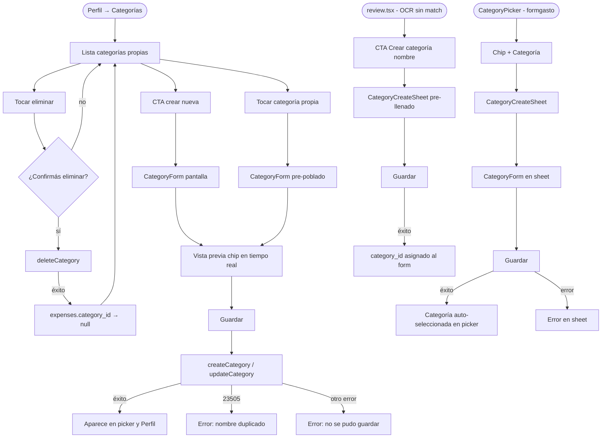

# HU-16 — Categorías personalizadas

## 1. Identificación

| Campo            | Valor                                                                                             |
| ---------------- | ------------------------------------------------------------------------------------------------- |
| **ID**           | HU-16                                                                                             |
| **Historia**     | Categorías personalizadas                                                                         |
| **Persona**      | Cualquier usuario autenticado — primario: El joven profesional / El independiente multi-moneda    |
| **Estado**       | MVP                                                                                               |
| **Relevancia**   | Baja                                                                                              |
| **Complejidad**  | Baja                                                                                              |
| **Release**      | Entrega 3                                                                                         |
| **Trazabilidad** | `feat/custom-categories` — migración `20260607224119`, `category-form.tsx`, `category-picker.tsx` |

---

## 2. Historia

> **Como** usuario,
> **quiero** crear categorías con nombre, ícono y color propios,
> **para** clasificar gastos que no encajan en las categorías de sistema.

---

## 3. Pre-condiciones

- El usuario está autenticado (JWT válido).
- La tabla `categories` fue alterada con `user_id` nullable y las 4 políticas RLS
  de HU-16 están activas (migración `20260607224119`).
- Las categorías de sistema (9 filas con `user_id null`) existen y son legibles.

---

## 4. Post-condiciones

- **Crear exitoso**: nueva fila en `categories` con `user_id = auth.uid()`,
  `sort_order = 100`, slug derivado del nombre. La categoría aparece en el picker
  y en la pantalla Perfil → Categorías.
- **Editar exitoso**: nombre/ícono/color actualizados; slug regenerado si cambió
  el nombre.
- **Borrar exitoso**: fila eliminada; todos los gastos que la referenciaban quedan
  con `category_id null`.
- **Cualquier fallo de persistencia**: error presentado al usuario; ningún cambio
  persiste.

---

## 5. Flujo principal — crear categoría desde Perfil

1. El usuario navega a **Perfil → Categorías**.
2. La pantalla lista las categorías propias del usuario (puede estar vacía inicialmente).
3. El usuario presiona el CTA de crear nueva categoría.
4. Se abre la pantalla de formulario (`category-form.tsx`) con campos vacíos:
   - **Nombre** (texto, requerido, 1–40 caracteres).
   - **Ícono** (selector curado, ~24 opciones Lucide; selección requerida).
   - **Color** (selector curado, ~8 colores de la paleta DS; selección requerida).
   - Vista previa en tiempo real de un chip con el ícono y color elegidos.
5. El usuario completa los campos. El chip de vista previa se actualiza en tiempo
   real a medida que elige ícono, color y escribe el nombre.
6. El usuario presiona **Guardar**.
7. `createCategory()` en el repositorio inserta la fila con `user_id = auth.uid()`,
   slug generado por `normalizeName(name)`, `sort_order = 100`.
8. La categoría aparece en la pantalla Perfil → Categorías y en el picker de gastos
   (sección "Mis categorías", debajo de las de sistema).

---

## 6. Flujos alternativos

### 6.a — Crear categoría inline desde el picker de gastos

- El usuario está en el formulario de alta o edición de un gasto.
- En el campo categoría, el picker muestra un chip **"+ Categoría"** al comienzo
  de la fila de opciones del usuario.
- El usuario toca **"+ Categoría"**. Se abre `CategoryCreateSheet` (bottom sheet)
  con el formulario de categoría.
- El usuario completa nombre/ícono/color y presiona **Guardar**.
- Al confirmar, la nueva categoría queda **auto-seleccionada** en el campo
  categoría del formulario de gasto. El sheet se cierra.
- El usuario continúa el alta del gasto con la nueva categoría ya elegida.

### 6.b — OCR sugiere categoría nueva

- El usuario escanea un ticket en `review.tsx` (ver HU-05).
- La edge function no encuentra ninguna de las categorías del usuario (sistema +
  custom) que encaje con el contenido del ticket.
- La edge function retorna `suggestedNewCategory = "<nombre sugerido>"`.
- `mapOcrToPrefill()` detecta que `category_id === null` y hay sugerencia; setea
  `prefill.suggestedCategoryName`.
- La pantalla `review.tsx` muestra un CTA:
  **"Crear categoría '<nombre sugerido>'"**
- El usuario toca el CTA. Se abre `CategoryCreateSheet` con el nombre pre-llenado
  con la sugerencia de la IA.
- El usuario puede modificar el nombre/ícono/color y luego presionar **Guardar**.
- Al confirmar, la nueva categoría queda asignada al campo `category_id` del
  formulario. El CTA de sugerencia desaparece.

### 6.c — Editar categoría existente desde Perfil

- El usuario navega a **Perfil → Categorías**.
- Toca una categoría propia para editarla. (Las de sistema no muestran acción de edición.)
- Se abre la pantalla de formulario pre-poblada con los valores actuales.
- El usuario modifica nombre y/o ícono y/o color.
- Presiona **Guardar**. `updateCategory()` persiste los cambios.
- La lista se actualiza; el picker también refleja el cambio.

### 6.d — Eliminar categoría desde Perfil

- El usuario toca la acción de eliminar en una categoría propia de la lista en Perfil.
- Aparece el diálogo de confirmación:
  `¿Confirmás que querés eliminar esta categoría?`
- El usuario confirma. `deleteCategory()` elimina la fila.
- Los gastos que tenían esa categoría quedan con `category_id null` (sin categoría).
- La categoría desaparece del picker y de la pantalla Perfil → Categorías.

### 6.e — Nombre duplicado

- El usuario intenta crear o editar a un nombre que ya usa (mismo slug).
- Postgres retorna error `23505`. El repositorio lo captura y devuelve
  "Ya tenés una categoría con ese nombre."
- El formulario muestra el mensaje debajo del campo Nombre. No se cierra el sheet
  ni la pantalla.

### 6.f — Crear inline sin conexión

- El usuario toca **"+ Categoría"** o el CTA de sugerencia de OCR estando offline.
- Al confirmar el formulario, la llamada falla por red.
- El sheet muestra: "No se pudo guardar la categoría. Intentá nuevamente." Sin cierre.
- La categoría no se crea; el picker no cambia.

### 6.g — Falla genérica de persistencia

- La inserción, actualización o eliminación falla por un error de DB o de red.
- El repositorio retorna `{ data: null, error }`.
- El formulario o la pantalla muestran: "No se pudo guardar la categoría. Intentá
  nuevamente."

---

## 7. Diagrama

---

## 8. Pantallas involucradas

| Pantalla                                          | Rol en HU-16                                                        |
| ------------------------------------------------- | ------------------------------------------------------------------- |
| `app/(protected)/profile/categories.tsx`          | Lista categorías propias; acciones editar / eliminar                |
| `app/(protected)/profile/category-form.tsx`       | Formulario crear + editar categoría (pantalla completa)             |
| `components/categories/category-form.tsx`         | Formulario reutilizable con vista previa; usado en sheet y pantalla |
| `components/categories/category-create-sheet.tsx` | Bottom sheet para crear inline desde el picker o desde review       |
| `components/expenses/category-picker.tsx`         | Picker con chip "+ Categoría" y sección "Mis categorías"            |
| `app/(protected)/expense/review.tsx`              | CTA de sugerencia OCR → `CategoryCreateSheet`                       |

---

## 9. State matrix

| Estado                              | Trigger                                                     | Visual                                                                                      |
| ----------------------------------- | ----------------------------------------------------------- | ------------------------------------------------------------------------------------------- |
| **Lista vacía (Perfil)**            | Usuario sin categorías propias                              | "No hay categorías personalizadas." y CTA para crear.                                       |
| **Lista con categorías**            | Al menos una categoría propia                               | Filas con chip (ícono + color + nombre) y acciones editar / eliminar.                       |
| **Formulario vacío**                | CTA crear desde Perfil o chip "+ Categoría"                 | Campos vacíos; botón Guardar deshabilitado hasta que nombre + ícono + color estén elegidos. |
| **Formulario con preview**          | Usuario completa nombre/ícono/color                         | Chip de vista previa actualizado en tiempo real con el ícono, color y nombre elegidos.      |
| **Error nombre duplicado**          | `createCategory` / `updateCategory` retorna 23505           | Borde rojo en campo Nombre; "Ya tenés una categoría con ese nombre." debajo.                |
| **Error genérico**                  | Fallo de red u otro error de DB                             | "No se pudo guardar la categoría. Intentá nuevamente." — formulario no cierra.              |
| **CTA sugerencia OCR**              | `suggestedCategoryName` en prefill + `category_id === null` | Chip CTA visible en `review.tsx`: "Crear categoría '<nombre>'".                             |
| **CTA sugerencia OCR — post-crear** | Categoría creada desde el CTA de review                     | CTA desaparece; picker muestra la nueva categoría seleccionada.                             |
| **Diálogo confirmación eliminar**   | Acción eliminar sobre categoría propia                      | Modal con "¿Confirmás que querés eliminar esta categoría?" y botones Confirmar / Cancelar.  |

---

## 10. Criterios de aceptación

- [ ] `createCategorySchema` rechaza nombre vacío, nombre > 40 caracteres, ícono
      fuera del set curado y color fuera de la paleta DS.
- [ ] `createCategory` asigna `user_id = auth.uid()`, genera slug via
      `normalizeName(name)` y establece `sort_order = 100`.
- [ ] Error Postgres `23505` en create / update es mapeado a
      "Ya tenés una categoría con ese nombre." — sin crash.
- [ ] Un usuario no puede ver las categorías custom de otro usuario
      (RLS `categories_select_visible`).
- [ ] Un usuario no puede insertar una categoría con `user_id null` ni con el
      `user_id` de otro usuario (RLS `categories_insert_own`).
- [ ] Un usuario no puede editar ni eliminar categorías de sistema ni de otro usuario
      (RLS `categories_update_own` / `categories_delete_own`).
- [ ] Eliminar una categoría custom deja `category_id null` en sus gastos
      vinculados (FK `on delete set null`).
- [ ] El chip "+ Categoría" en el picker abre `CategoryCreateSheet` y la nueva
      categoría queda auto-seleccionada al confirmar.
- [ ] La pantalla Perfil → Categorías lista, edita y borra categorías propias con
      confirmación en el borrado.
- [ ] La edge function retorna `suggestedNewCategory` (≤40 chars) cuando ninguna
      categoría de la lista recibida aplica al ticket.
- [ ] La edge function retorna `suggestedNewCategory: null` cuando una categoría
      de la lista es seleccionada.
- [ ] `mapOcrToPrefill` setea `suggestedCategoryName` sólo cuando `category_id === null`.
- [ ] La pantalla `review.tsx` muestra el CTA de sugerencia sólo cuando
      `suggestedCategoryName` está presente.
- [ ] El CTA de sugerencia desaparece luego de crear la categoría sugerida y
      asignarla al formulario.
- [ ] El fallback de la edge function (sin `categories` param) usa los 9 nombres
      de sistema sin errores.
- [ ] Todo el microcopy de categorías está en español rioplatense formal y sin emoji.

---

## 11. Notas técnicas

- **Tabla**: `public.categories` — columnas originales + `user_id uuid` (nullable,
  FK `auth.users` on delete cascade) + `updated_at timestamptz` (trigger
  `categories_set_updated_at` reutilizando `set_updated_at()`).
- **Ownership**: `user_id IS NULL` = sistema (global, read-only para usuarios).
  `user_id = auth.uid()` = propio (CRUD bajo RLS).
- **Slug**: generado por `normalizeName(name)` en el repositorio (normaliza tildes,
  minúsculas, guiones). Único por alcance: `categories_slug_system_unique`
  (sistema, global) + `categories_slug_user_unique` (por usuario). La constraint
  global anterior `categories_slug_key` fue dropeada en la migración.
- **RLS**: cuatro políticas. SELECT = sistema ∪ propio. INSERT/UPDATE/DELETE =
  sólo propio, usando `(select auth.uid()) = user_id` (subquery cacheada).
- **Sin RPC**: CRUD de tabla única, sin procedimientos almacenados.
- **`on delete set null`**: FK `expenses.category_id` ya era `on delete set null`
  antes de HU-16; no cambia.
- **OCR edge function v3**: parámetro `categories: string[]` opcional; fallback a
  9 nombres de sistema. `suggestedNewCategory` truncado a ≤40 chars en la fn.
- **`mapOcrToPrefill`**: match = `category_id` seteado, sugerencia descartada.
  No-match = `suggestedCategoryName` seteado, `category_id null`.
- **Ícono conocido inválido** (pre-existente, no introducido por HU-16): la fila
  de sistema "Hogar" usa `icon = 'Home'`; `lucide-react-native` v1 exporta `House`,
  no `Home`. El ícono renderiza en blanco. Pendiente de corrección.
- **Migraciones**: `supabase/migrations/20260607224119_custom_categories.sql` —
  aplicada al remoto vía MCP `apply_migration`.
- **Tests**: baseline subió de 472 a 572 con esta feature.
  - `lib/repositories/__tests__/categories.test.ts` — CRUD, 23505, RLS assertions.
  - `lib/__tests__/ocr.test.ts` — `mapOcrToPrefill` con sugerencia / sin sugerencia.
  - `components/categories/__tests__/category-form.test.tsx` — validaciones, preview.
  - `components/expenses/__tests__/category-picker.test.tsx` — chip "+ Categoría",
    auto-selección.
  - `app/(protected)/expense/__tests__/review.test.tsx` — CTA sugerencia OCR.
