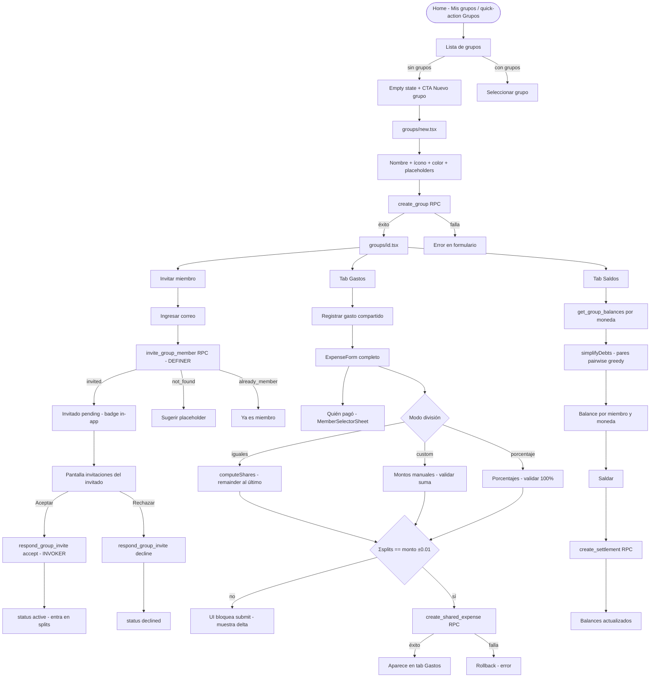

# HU-17 — Gastos compartidos

## 1. Identificación

| Campo            | Valor                                                                                                                                                                                                                   |
| ---------------- | ----------------------------------------------------------------------------------------------------------------------------------------------------------------------------------------------------------------------- |
| **ID**           | HU-17                                                                                                                                                                                                                   |
| **Historia**     | Gastos compartidos                                                                                                                                                                                                      |
| **Persona**      | El estudiante (comparte depto, divide alquiler/super con roommates) · El joven profesional (salidas/viajes con amigos)                                                                                                  |
| **Estado**       | MVP                                                                                                                                                                                                                     |
| **Relevancia**   | Alta                                                                                                                                                                                                                    |
| **Complejidad**  | Media                                                                                                                                                                                                                   |
| **Release**      | Entrega 3                                                                                                                                                                                                               |
| **Trazabilidad** | `feat/shared-expenses` — migraciones `20260608012650`, `20260608013250`, `20260608013859`; `lib/split-math.ts`, `lib/group-balance.ts`, `lib/repositories/groups.ts`, `components/groups/*`, `app/(protected)/groups/*` |

---

## 2. Historia

> **Como** usuario que divide gastos con otras personas,
> **quiero** crear grupos, registrar gastos compartidos y ver quién le debe a quién,
> **para** reemplazar el caos de WhatsApp con visibilidad real de deudas y saldos.

---

## 3. Pre-condiciones

- El usuario está autenticado (JWT válido).
- Las tablas `groups`, `group_members`, `expense_splits` y `group_settlements` existen
  con RLS habilitado.
- La función helper `is_group_member(group_id, user_id)` SECURITY DEFINER está
  desplegada (REVOKE de anon/authenticated/public) — rompe la recursión RLS.
- Los RPCs transaccionales `create_group`, `add_group_member`, `invite_group_member`,
  `respond_group_invite`, `create_shared_expense`, `create_settlement` y
  `get_group_balances` están definidos.
- La tabla `expenses` tiene las columnas `group_id` y `paid_by_member_id` (nullable).
- La política `expenses_select_own_or_group` permite a los miembros `active` leer
  los gastos del grupo (insert/update/delete siguen siendo del creador).

---

## 4. Post-condiciones

- **Grupo creado exitosamente**: nueva fila en `groups`; el creador queda registrado en
  `group_members` con `role='owner'`, `status='active'`, `joined_at=now()`. Los
  placeholders se insertan como `active` sin `user_id`.
- **Miembro registrado invitado**: fila en `group_members` con `status='pending'`. El
  invitado ve la invitación in-app y puede aceptar o rechazar. Solo al aceptar pasa a
  `active` y comienza a participar en splits y balances.
- **Gasto compartido registrado**: fila en `expenses` con `group_id` y
  `paid_by_member_id`; N filas en `expense_splits` (una por miembro con `share_amount`);
  opcionalmente N filas en `expense_items`. La transacción es atómica.
- **Saldo registrado**: fila en `group_settlements`. Los balances calculados por
  `get_group_balances` reflejan el pago.
- **Cualquier fallo de persistencia**: la transacción revierte completamente; no quedan
  filas huérfanas.

---

## 5. Flujo principal

Escenario: el estudiante divide el alquiler mensual con sus tres roommates.

1. El usuario navega a **Home → quick-action "Grupos"** o a la sección **"Mis grupos"**.
2. Presiona **"Nuevo grupo"** (CTA de empty state o botón en la lista).
3. La pantalla `groups/new.tsx` muestra el formulario de grupo:
   - **Nombre** (texto, requerido, 1–60 caracteres).
   - **Ícono** (selector Lucide curado, mismo set que categorías).
   - **Color** (selector paleta DS).
   - **Miembros** — sección de placeholders: el usuario escribe nombres sin cuenta
     (roommates no registrados en RADAR).
4. El usuario completa el nombre "Depto 2026", elige ícono y color, agrega los nombres
   "Jonathan" y "Iñaki" como placeholders.
5. Presiona **"Crear grupo"**. `create_group` RPC inserta el grupo, el owner como
   `active` y los dos placeholders como `active` sin `user_id`.
6. La app navega a la pantalla de detalle del grupo `groups/[id].tsx`, que muestra:
   - Header con nombre, ícono y color del grupo.
   - Lista de miembros (avatares iniciales + nombres).
   - Tab **Gastos** (vacío inicialmente).
   - Tab **Saldos** (vacío).
7. El usuario toca **"Invitar miembro"** para agregar a un cuarto roommate registrado.
   Ingresa el correo electrónico exacto. `invite_group_member` RPC hace el lookup en
   `auth.users` (SECURITY DEFINER) y crea la fila `pending`.
8. El invitado ve el badge de invitaciones pendientes en Home (o en Perfil). Abre la
   pantalla de invitaciones, lee los detalles del grupo y presiona **"Aceptar"**.
   `respond_group_invite(p_accept=true)` actualiza `status='active'` y `joined_at=now()`.
9. Ahora hay cuatro miembros `active`. El usuario navega al tab **Gastos** del grupo
   y presiona **"Registrar gasto compartido"**.
10. Se abre `groups/expense.tsx`, que monta el `ExpenseForm` completo (monto, moneda,
    categoría, fecha, ítems/OCR) extendido con:
    - **¿Quién pagó?** — selector de miembro (`MemberSelectorSheet`).
    - **División** — `SplitEditor` con tres modos:
      - **Partes iguales**: `computeShares(amount, members)` divide con el remainder al
        último miembro.
      - **Montos custom**: el usuario asigna cada `share_amount` manualmente; UI valida
        Σ == monto.
      - **Porcentaje**: el usuario asigna porcentajes; UI valida Σ == 100% antes de
        convertir a montos.
11. El usuario selecciona "Jonathan" como quien pagó, elige "Partes iguales" y presiona
    **"Registrar gasto"**.
12. `create_shared_expense` RPC valida: caller `active`, `paid_by_member_id` pertenece
    al grupo, Σsplits ≠ amount (tolerancia 0.01) → rechaza; si pasa → inserta `expenses`
    - `expense_items` + `expense_splits` atómicamente.
13. El gasto aparece en el tab Gastos del grupo. El tab **Saldos** muestra los balances
    netos por miembro y moneda: Jonathan "te deben $ X,XX ARS", los demás "debés $ X,XX ARS".
14. Un miembro toca el balance, ve el desglose "quién le debe a quién" generado por
    `simplifyDebts` (greedy pairwise) y presiona **"Saldar"**. Se abre el flujo de
    saldo: monto pre-llenado, confirmación. `create_settlement` RPC registra el
    `group_settlement`. Los balances se actualizan.

---

## 6. Flujos alternativos

### 6.a — Invitación a correo inexistente

- El usuario ingresa un correo que no corresponde a ninguna cuenta en RADAR.
- `invite_group_member` retorna `{status: 'not_found'}`.
- La UI muestra: "No se encontró una cuenta con ese correo. Podés agregar a esta
  persona como participante sin cuenta."
- Ofrece CTA para agregar como placeholder (nombre).

### 6.b — Invitación a miembro ya existente

- El correo ingresado ya tiene una fila `active` o `pending` en el grupo.
- `invite_group_member` retorna `{status: 'already_member'}`.
- La UI muestra: "Esta persona ya es miembro del grupo."
- No se crea fila duplicada (unique index `(group_id, user_id) WHERE user_id IS NOT NULL`).

### 6.c — Reinvitar a un miembro que rechazó

- El invitado rechazó con `status='declined'`. El owner lo invita de nuevo con el mismo correo.
- `invite_group_member` detecta la fila `declined` y la actualiza a `pending` (re-invite).
- Retorna `{status: 'invited', member_id: ...}`.
- El invitado vuelve a recibir la invitación in-app.

### 6.d — Invitado `pending` intenta ver gastos del grupo

- B fue invitado pero no aceptó. Consulta `expenses` o `expense_splits` del grupo.
- RLS usa `status='active'`; B no ve nada.
- B sí ve su propia fila `group_members` (para poder aceptar/rechazar).

### 6.e — Otro usuario responde una invitación ajena

- C llama a `respond_group_invite(p_member_id)` donde la fila pertenece a B.
- El RPC filtra `user_id = auth.uid() AND status='pending'`; no hace nada.
- Lanza excepción `'invite not found or not pending'`.

### 6.f — Tercero ajeno intenta ver el grupo

- C sin ninguna membresía consulta `groups`, `expenses` o `expense_splits` del grupo.
- `is_group_member(group_id, C.uid)` retorna false → RLS niega → resultado vacío.

### 6.g — Σsplits ≠ monto del gasto

- El usuario entra montos custom que suman distinto al total del gasto.
- La UI bloquea el botón "Registrar gasto" y muestra el delta en rojo mientras la
  diferencia supere $0,01.
- Si el cliente igualmente envía el request, `create_shared_expense` rechaza con
  `'splits must sum to amount'`.

### 6.h — División igual con remainder (no divisible exactamente)

- $100 / 3 miembros → `computeShares` asigna 33.34 / 33.33 / 33.33 (remainder al
  último). Σ == 100.00 exacto.

### 6.i — Porcentajes que no suman 100

- El usuario ingresa porcentajes que suman 90 o 110.
- `SplitEditor` muestra el total acumulado en rojo y deshabilita el submit.

### 6.j — División en gasto con un solo miembro activo

- El grupo fue recién creado; solo existe el owner como `active`.
- Split trivial: 100% al owner. Balance neto 0.
- La UI puede mostrar: "Agregá miembros para dividir el gasto." (informativo, no bloqueante).

### 6.k — Balances en ARS y USD en el mismo grupo

- El grupo tiene gastos en ARS y en USD.
- `get_group_balances` retorna filas separadas por `(member_id, currency)`.
- La UI muestra dos filas de balance por miembro cuando aplica; nunca convierte ni mezcla monedas.

### 6.l — Borrar grupo con gastos existentes

- El owner borra el grupo.
- CASCADE: `group_members`, `expense_splits`, `group_settlements` se borran.
- `expenses.group_id` → `ON DELETE SET NULL` — el gasto sobrevive como gasto personal del creador.
- La UI pide confirmación: "¿Confirmás que querés eliminar este grupo? Los gastos registrados quedarán como gastos personales."

### 6.m — Falla de persistencia en `create_shared_expense`

- Un constraint DB o error de red interrumpe la transacción.
- Rollback completo: ni el `expenses` ni los splits/items quedan en la DB.
- El formulario muestra: "No se pudo registrar el gasto. Intentá nuevamente."

---

## 7. Diagrama

---

## 8. Pantallas involucradas

| Pantalla                                      | Rol en HU-17                                                         |
| --------------------------------------------- | -------------------------------------------------------------------- |
| `app/(protected)/groups/_layout.tsx`          | Stack navigator del módulo de grupos                                 |
| `app/(protected)/groups/index.tsx`            | Lista de grupos del usuario + empty state                            |
| `app/(protected)/groups/new.tsx`              | Formulario crear grupo (nombre, ícono, color, placeholders)          |
| `app/(protected)/groups/[id].tsx`             | Detalle del grupo: tabs Gastos / Saldos, lista de miembros, invitar  |
| `app/(protected)/groups/expense.tsx`          | Formulario gasto compartido (ExpenseForm + quién pagó + SplitEditor) |
| `components/groups/group-form.tsx`            | Formulario reutilizable de grupo con vista previa                    |
| `components/groups/group-card.tsx`            | Card de grupo en la lista (ícono, color, nombre, balance resumido)   |
| `components/groups/member-avatars-row.tsx`    | Fila de avatares con iniciales + colores por hash                    |
| `components/groups/split-editor.tsx`          | Editor de división: iguales / custom / porcentaje                    |
| `components/groups/balance-row.tsx`           | Fila de balance (verde "te deben" / rojo "debés" / neutro)           |
| `components/groups/member-selector-sheet.tsx` | Bottom sheet para seleccionar "quién pagó"                           |
| `lib/split-math.ts`                           | `computeShares`, `simplifyDebts` — lógica de división y neteo        |
| `lib/group-balance.ts`                        | `getGroupBalances` — agrega resultados de `get_group_balances` RPC   |

---

## 9. State matrix

| Estado                                       | Trigger                                                                  | Visual                                                                                            |
| -------------------------------------------- | ------------------------------------------------------------------------ | ------------------------------------------------------------------------------------------------- |
| **Lista de grupos vacía**                    | Usuario sin grupos                                                       | Empty state: "No hay grupos." + CTA "Nuevo grupo".                                                |
| **Lista de grupos con invitaciones**         | Al menos una fila `group_members` con `status='pending'` para el usuario | Badge numérico sobre el ícono de grupos o en Home.                                                |
| **Formulario de grupo — inválido**           | Nombre vacío o > 60 caracteres                                           | Campo Nombre con borde rojo; botón "Crear grupo" deshabilitado.                                   |
| **Miembro placeholder**                      | Fila `group_members` con `user_id null`                                  | Avatar con iniciales del `display_name`; sin estado de invitación.                                |
| **Miembro pending**                          | Fila `group_members` con `status='pending'`                              | Avatar con indicador de reloj / pending; no participa en splits ni balances.                      |
| **Miembro active**                           | Fila `group_members` con `status='active'`                               | Avatar normal; participa en splits y balances.                                                    |
| **Miembro declined**                         | Fila `group_members` con `status='declined'`                             | Avatar con indicador de rechazo; no participa.                                                    |
| **SplitEditor — iguales válido**             | `computeShares` produce Σ == monto                                       | Montos pre-llenados por miembro; botón habilitado.                                                |
| **SplitEditor — custom inválido**            | Σ montos ingresados ≠ monto del gasto                                    | Contador de diferencia en rojo; botón "Registrar gasto" deshabilitado.                            |
| **SplitEditor — porcentaje inválido**        | Σ porcentajes ≠ 100                                                      | Contador de porcentaje en rojo; botón deshabilitado.                                              |
| **Tab Saldos — sin gastos**                  | Grupo sin gastos compartidos registrados                                 | "No hay gastos registrados en este grupo."                                                        |
| **Tab Saldos — balance positivo (te deben)** | `net > 0` en `get_group_balances` para el miembro                        | Monto en verde con etiqueta "te deben".                                                           |
| **Tab Saldos — balance negativo (debés)**    | `net < 0` en `get_group_balances` para el miembro                        | Monto en rojo con etiqueta "debés".                                                               |
| **Tab Saldos — al día**                      | `net == 0` para el miembro                                               | Etiqueta neutra "Al día".                                                                         |
| **Tab Saldos — multi-moneda**                | Gastos en ARS y USD en el mismo grupo                                    | Dos filas de balance por miembro: una ARS, una USD. Sin conversión.                               |
| **Invitación recibida (inbox)**              | Usuario tiene filas `pending` como invitado                              | Pantalla/sección de invitaciones con nombre del grupo, quien invitó, CTAs "Aceptar" / "Rechazar". |
| **Error de red / DB en create_group**        | RPC falla                                                                | "No se pudo crear el grupo. Intentá nuevamente." — formulario no cierra.                          |
| **Error en create_shared_expense**           | Σsplits ≠ monto o constraint DB                                          | "No se pudo registrar el gasto. Intentá nuevamente." — rollback completo.                         |

---

## 10. Criterios de aceptación

- [ ] `computeShares` divide en partes iguales con remainder al último miembro; Σ == total exacto.
- [ ] `computeShares` acepta `share_amount = 0` para un miembro (no debe nada por ese gasto).
- [ ] `simplifyDebts` produce pares pairwise correctos, neta deudas, separa por moneda.
- [ ] `create_group` deja al caller con `role='owner'`, `status='active'`, `joined_at` seteado.
- [ ] `create_group` inserta placeholders como `status='active'`, `user_id null`.
- [ ] `add_group_member` agrega un placeholder a un grupo existente; RLS lo permite solo si el caller es `active` o `created_by`.
- [ ] `invite_group_member` retorna `{status:'not_found'}` si el correo no existe; no crea fila.
- [ ] `invite_group_member` retorna `{status:'already_member'}` si ya hay fila `active`/`pending`; no duplica.
- [ ] `invite_group_member` actualiza `declined` → `pending` en una re-invitación; retorna `{status:'invited'}`.
- [ ] `respond_group_invite(accept=true)` actualiza `status='active'` y `joined_at`; solo lo hace el invitado (filtra `user_id = auth.uid()`).
- [ ] `respond_group_invite` con `p_member_id` de otro usuario no hace nada (lanza excepción).
- [ ] RLS: un usuario `pending` no ve gastos ni splits del grupo; sí ve su propia fila `group_members`.
- [ ] RLS: un usuario ajeno al grupo no ve nada de `groups`, `expenses`, `expense_splits`, `group_settlements` del mismo.
- [ ] `create_shared_expense` rechaza si el caller no es `active` en el grupo.
- [ ] `create_shared_expense` rechaza si `paid_by_member_id` no pertenece al grupo.
- [ ] `create_shared_expense` rechaza si Σsplits difiere del monto en más de $0,01.
- [ ] `create_shared_expense` rechaza si algún `member_id` de splits no pertenece al grupo.
- [ ] `create_shared_expense` es atómica: un error en items o splits revierte el gasto completo.
- [ ] `get_group_balances` calcula net = paid - share + settle_out - settle_in, por (member_id, currency).
- [ ] `create_settlement` rechaza si `from_member_id == to_member_id`, si monto <= 0, o si currency no es ARS/USD.
- [ ] UI: crear grupo, agregar placeholder, invitar por correo, ver pending, aceptar invitación, registrar gasto compartido (los tres modos de split), ver balances, saldar.
- [ ] Al borrar el grupo: cascade borra members/splits/settlements; `expenses.group_id` → null (el gasto sobrevive como personal).
- [ ] Todo el microcopy está en español rioplatense formal y sin emoji.
- [ ] Gates verdes (format + lint + typecheck + 834 tests).

---

## 11. Notas técnicas

### Tablas

- **`groups`**: `id`, `name` (1–60), `icon`, `color`, `created_by` (FK `auth.users`), `created_at`, `updated_at` (trigger `groups_set_updated_at` reutiliza `set_updated_at()`).
- **`group_members`**: `id`, `group_id` (FK cascade), `user_id` nullable (FK `auth.users`), `display_name`, `role` (`owner`/`member`), `status` (`active`/`pending`/`declined`), `invited_by`, `created_at`, `joined_at`. Unique index parcial `(group_id, user_id) WHERE user_id IS NOT NULL`.
- **`expense_splits`**: `id`, `expense_id` (FK cascade), `group_id` (FK cascade), `member_id` (FK cascade), `share_amount numeric(14,2) >= 0`, `created_at`.
- **`group_settlements`**: `id`, `group_id` (FK cascade), `from_member_id` (FK cascade), `to_member_id` (FK cascade), `amount numeric(14,2) > 0`, `currency` (`ARS`/`USD`), `created_by` (FK `auth.users`), `settled_at`.
- **`expenses`** ahora tiene: `group_id uuid` nullable (FK `groups` ON DELETE SET NULL), `paid_by_member_id uuid` nullable (FK `group_members` ON DELETE SET NULL).

### RLS y helper

- `is_group_member(p_group_id, p_user_id)` — SECURITY DEFINER, REVOKE de `anon`, `public`, `authenticated`. Centraliza el chequeo `status='active'`; se usa desde RLS policies de `groups`, `group_members`, `expense_splits`, `group_settlements` y `expenses`. Sin esta función DEFINER existiría recursión RLS infinita (una policy de `group_members` llamaría a otra policy de `group_members`).
- RLS de `expenses` SELECT extendida: `user_id = auth.uid() OR (group_id IS NOT NULL AND is_group_member(group_id, auth.uid()))`. INSERT/UPDATE/DELETE siguen siendo owner-only.

### RPCs

| RPC                     | Security    | Descripción                                                                                                                                                                                                                                                   |
| ----------------------- | ----------- | ------------------------------------------------------------------------------------------------------------------------------------------------------------------------------------------------------------------------------------------------------------- |
| `create_group`          | INVOKER     | Crea grupo + owner + placeholders en una transacción.                                                                                                                                                                                                         |
| `add_group_member`      | INVOKER     | Agrega placeholder a un grupo existente. RLS valida caller.                                                                                                                                                                                                   |
| `invite_group_member`   | **DEFINER** | Lookup de `auth.users` por correo (imposible con INVOKER). Tiene su propia guarda `is_group_member`. REVOKE de anon/public; authenticated puede llamarla. El lint `authenticated_security_definer_function_executable` es **intencional** (ver §7 AGENTS.md). |
| `respond_group_invite`  | INVOKER     | Acepta o rechaza la propia invitación; filtra `user_id = auth.uid()`.                                                                                                                                                                                         |
| `create_shared_expense` | INVOKER     | Valida membership + paid_by + Σsplits; inserta expense + items + splits atómicamente.                                                                                                                                                                         |
| `create_settlement`     | INVOKER     | Valida membership + from/to del grupo; inserta `group_settlements`.                                                                                                                                                                                           |
| `get_group_balances`    | INVOKER     | CTE agregada: paid - share + settle_out - settle_in por (member_id, currency). Non-members reciben vacío vía RLS.                                                                                                                                             |

### Split math (TypeScript)

- `computeShares(amount: number, members: string[], mode: 'equal' | 'custom' | 'percent', values?: number[]): Share[]` — modo `equal`: división entera en centavos + remainder al último. Modo `percent`: convierte a montos con el mismo patrón de remainder. Modo `custom`: pasa los valores directamente.
- `simplifyDebts(balances: Balance[]): Debt[]` — algoritmo greedy pairwise: ordena por `net` desc/asc, empareja el más acreedor con el más deudor, registra el pago parcial o total. Separa por moneda. Produce la lista mínima de transferencias para saldar.

### Balances

- Net por miembro y moneda: `paid - share + settle_out - settle_in`.
- `net > 0` → "te deben" (verde). `net < 0` → "debés" (rojo). `net == 0` → "al día" (neutro).
- Balances ARS y USD nunca se mezclan ni convierten (no hay fuente FX definida aún).

### Ícono de grupos

- Ícono por defecto: `Users` (Lucide). Set curado reutiliza `CATEGORY_ICONS` de `lib/category-options.ts`.
- Color por defecto: `#0077B6` (brand primary). Paleta reutiliza `CATEGORY_COLORS`.

### Rutas

- Grupos no tiene tab propio — se accede desde el quick-action "Grupos" y la sección "Mis grupos" del Home. Se mantiene el tab bar en 4 ítems.

### Migraciones

| Archivo                                                                       | Contenido                                                |
| ----------------------------------------------------------------------------- | -------------------------------------------------------- |
| `supabase/migrations/20260608012650_shared_expenses_schema.sql`               | Tablas + columnas en expenses + `is_group_member` + RLS  |
| `supabase/migrations/20260608013250_revoke_is_group_member_authenticated.sql` | REVOKE adicional de `authenticated` en `is_group_member` |
| `supabase/migrations/20260608013859_shared_expenses_rpcs.sql`                 | Los 7 RPCs de grupos y gastos compartidos                |

### Tests

- `lib/__tests__/split-math.test.ts` — `computeShares`: iguales, remainder, custom, percent, un solo miembro, share=0. `simplifyDebts`: pares correctos, neteo, multi-moneda.
- `lib/__tests__/group-balance.test.ts` — cálculo neto con paid/share/settle_in/settle_out.
- `lib/repositories/__tests__/groups.test.ts` — CRUD grupos, invite RPC mocks.
- `components/groups/__tests__/split-editor.test.tsx` — validaciones de los tres modos.
- `app/(protected)/groups/__tests__/` — pantallas index, new, [id], expense.
- Baseline: **834 tests, 64 suites**.
