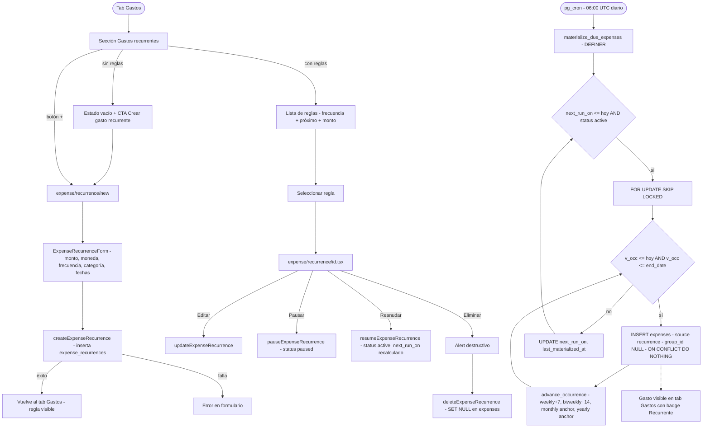

# HU-19 — Gastos recurrentes

## 1. Identificación

| Campo            | Valor                                                                                                                                                                                                                                                                                                                                         |
| ---------------- | --------------------------------------------------------------------------------------------------------------------------------------------------------------------------------------------------------------------------------------------------------------------------------------------------------------------------------------------- |
| **ID**           | HU-19                                                                                                                                                                                                                                                                                                                                         |
| **Historia**     | Gastos recurrentes                                                                                                                                                                                                                                                                                                                            |
| **Persona**      | El estudiante (alquiler mensual, cuota del gym) · El joven profesional (suscripciones, servicios) · El independiente multi-moneda (servicios en USD recurrentes)                                                                                                                                                                              |
| **Estado**       | MVP                                                                                                                                                                                                                                                                                                                                           |
| **Relevancia**   | Alta                                                                                                                                                                                                                                                                                                                                          |
| **Complejidad**  | Media                                                                                                                                                                                                                                                                                                                                         |
| **Release**      | Entrega 3                                                                                                                                                                                                                                                                                                                                     |
| **Trazabilidad** | `feat/recurring-expenses` — migraciones `20260608164523`, `20260608165308`, `20260608165317`; `lib/income-recurrence.ts` (reutilizado), `lib/schemas/expense-recurrence.ts`, `lib/repositories/expenses.ts`, `components/expenses/expense-recurrence-form.tsx`, `app/(protected)/(tabs)/expenses.tsx`, `app/(protected)/expense/recurrence/*` |

---

## 2. Historia

> **Como** usuario con gastos periódicos (alquiler, suscripciones, servicios),
> **quiero** definir una regla de gasto recurrente una vez,
> **para** que mis gastos se registren automáticamente sin intervención manual.

---

## 3. Pre-condiciones

- El usuario está autenticado (JWT válido).
- La tabla `expense_recurrences` existe con RLS habilitado.
- Las columnas `source`, `recurrence_id`, `occurred_date` existen en `expenses`
  (migración `20260608164523`).
- La función `materialize_due_expenses()` SECURITY DEFINER está desplegada (REVOKE de
  todos los roles de cliente — Pattern 1).
- La función `advance_occurrence()` IMMUTABLE está desplegada (migración `20260608144434`,
  reutilizada desde HU-20).
- El job de pg_cron `'materialize-due-expenses'` está activo (`'0 6 * * *'`).
- El índice de idempotencia
  `UNIQUE (recurrence_id, occurred_date) WHERE recurrence_id IS NOT NULL`
  existe en `expenses`.

---

## 4. Post-condiciones

- **Regla creada exitosamente**: nueva fila en `expense_recurrences` con `status='active'`,
  `next_run_on` apuntando a la primera ocurrencia futura (nunca en el pasado).
- **Ocurrencias materializadas**: el job de pg_cron inserta una fila en `expenses` por cada
  fecha de ocurrencia vencida (`next_run_on <= current_date`), con `source='recurrence'`,
  `occurred_date` seteado, `group_id=NULL`, `paid_by_member_id=NULL`. El índice único
  garantiza que ejecuciones duplicadas no insertan nada.
- **Regla pausada**: `status='paused'`; el materializer la excluye — no se generan nuevas
  ocurrencias.
- **Regla retomada**: `status='active'`, `next_run_on` actualizado; el materializer retoma
  desde esa fecha.
- **Regla eliminada**: la fila en `expense_recurrences` se borra; las filas en `expenses`
  con ese `recurrence_id` sobreviven con `recurrence_id=null` (FK `ON DELETE SET NULL`).
- **Cualquier fallo de persistencia**: la transacción revierte; no quedan filas huérfanas.

---

## 5. Flujo principal

Escenario: el estudiante configura su alquiler mensual.

1. El usuario navega al tab **Gastos** (primer tab).
2. Ve la sección **"Gastos recurrentes"** con el estado vacío: "Crear gasto recurrente".
3. Presiona el `+` junto al título de la sección (o el CTA del estado vacío).
   Navega a `expense/recurrence/new`.
4. El `ExpenseRecurrenceForm` muestra:
   - **Monto** (campo numérico, JetBrains Mono, placeholder `0,00`; requerido, > 0).
   - **Moneda** (ARS / USD, selector).
   - **Frecuencia** (selector en línea: Semanal / Quincenal / Mensual / Anual).
   - **Categoría** (selector de categorías con `kind='expense'`; abre `CategorySelectorSheet`).
   - **Descripción** (texto opcional, ≤ 240 caracteres).
   - **Fecha de inicio** (date picker; por defecto hoy).
   - **Sin fecha de fin** (toggle; activo por defecto — regla indefinida).
   - **Fecha de fin** (visible solo si el toggle "Sin fecha de fin" está desactivado).
5. El usuario completa: `$ 180.000 ARS`, frecuencia "Mensual", categoría "Hogar",
   descripción "Alquiler", fecha de inicio 2026-06-10.
6. El usuario presiona **"Crear gasto recurrente"**. Se llama `createExpenseRecurrence(input, userId, today)` que inserta en `expense_recurrences` con
   `next_run_on = firstFutureOccurrence(start, frequency, today)`.
7. La app navega de vuelta al tab Gastos. La sección "Gastos recurrentes" muestra la nueva
   regla: "Alquiler · Mensual · Próximo: 10 de junio de 2026 · $ 180.000 ARS".
8. Al llegar el día 2026-06-10 (o antes de las 06:00 UTC), el job de pg_cron ejecuta
   `materialize_due_expenses()`. Este detecta la regla
   (`next_run_on = 2026-06-10 <= current_date`), inserta la fila en `expenses` con
   `source='recurrence'`, `occurred_date = 2026-06-10`, y avanza `next_run_on` a
   `2026-07-10`.
9. El usuario abre el tab Gastos: ve el gasto "Alquiler" en la lista del día 2026-06-10
   con `$ 180.000 ARS` en rojo y el badge "Recurrente".

---

## 6. Flujos alternativos

### 6.a — Gasto recurrente con fecha de fin

- El usuario desactiva el toggle "Sin fecha de fin" en `ExpenseRecurrenceForm`.
- Aparece el date picker de fecha de fin (p.ej. 2026-12-10).
- `end_date >= start_date` validado en el cliente (zod) y el servidor (DB constraint).
- El materializer inserta ocurrencias solo mientras `v_occ <= end_date`. La última
  ocurrencia se materializa y `next_run_on` avanza más allá de `end_date`; el materializer
  deja de seleccionar la regla en futuras corridas.
- La regla permanece `active` en la tabla (no se auto-archiva); el usuario puede editarla
  para extender el `end_date`.

### 6.b — Pausar y reanudar una regla

- El usuario toca la fila de la regla en la sección "Gastos recurrentes".
- En la pantalla `expense/recurrence/[id]`, toca **"Pausar"**. `pauseExpenseRecurrence(id)`
  actualiza `status='paused'`.
- La regla desaparece de la sección de reglas activas del tab.
- El materializer ignora reglas `paused` → no se generan ocurrencias mientras está pausada.
- El usuario navega a `expense/recurrence/[id]` y toca **"Reanudar"**.
  `resumeExpenseRecurrence(id)` actualiza `status='active'` y
  `next_run_on = firstFutureOccurrence(start, frequency, today)`.
  El materializer retoma desde esa fecha en la próxima corrida.

### 6.c — Editar una regla existente

- El usuario toca la fila de la regla y en `expense/recurrence/[id]` toca el formulario.
- Puede cambiar monto, moneda, categoría, descripción, frecuencia, start_date, end_date.
- `updateExpenseRecurrence(id, patch)` persiste los cambios. El servidor recalcula
  `next_run_on` según la nueva configuración.
- Las ocurrencias ya materializadas no se modifican (historial estable).

### 6.d — Eliminar una regla

- El usuario abre la regla y toca **"Eliminar gasto recurrente"**.
- Confirmación destructiva (Alert): "¿Confirmás que querés eliminar este gasto recurrente?
  Los gastos ya registrados se conservan."
- `deleteExpenseRecurrence(id)` borra la fila en `expense_recurrences`.
- Las filas en `expenses` con ese `recurrence_id` sobreviven con `recurrence_id=null`
  (FK `ON DELETE SET NULL`). El badge "Recurrente" desaparece en la próxima carga
  (el campo `source` sigue en `'recurrence'` pero el vínculo a la regla se pierde).

### 6.e — App inactiva por varios días (catch-up)

- El usuario no abre la app por 7 días. Tiene una regla semanal.
- El job de pg_cron ejecutó cada día. En cada corrida: si `next_run_on <= current_date`, el
  loop interno de `materialize_due_expenses` itera hacia adelante hasta cubrir todos los
  días vencidos.
- Resultado: todas las ocurrencias semanales faltantes quedan materializadas sin
  intervención del usuario.

### 6.f — Ejecución duplicada del job (re-run cron)

- El job se ejecuta dos veces en el mismo día (p.ej. reintento por timeout).
- El índice `UNIQUE (recurrence_id, occurred_date) WHERE recurrence_id IS NOT NULL` hace
  que el segundo `INSERT` entre en conflicto; `ON CONFLICT DO NOTHING` lo descarta.
- Resultado: cero filas duplicadas.

### 6.g — Frecuencia mensual en el 31 de un mes corto

- Regla mensual `start_date = 2026-01-31`.
- `advance_occurrence` para febrero: `least(31, 28)` → 2026-02-28.
- Para marzo: `least(31, 31)` → 2026-03-31 (vuelve al día 31 original).
- El ancla referencia `day_of_month` (o `day(start_date)`), no el día de la última
  ocurrencia clampeada.

### 6.h — Frecuencia anual con Feb 29 (año bisiesto → no bisiesto)

- Regla anual `start_date = 2024-02-29`.
- Ocurrencia 2025: `make_date(2025, 2, 29)` clampeado a `make_date(2025, 2, 28)`.
- Ocurrencia 2028 (año bisiesto): `make_date(2028, 2, 29)` → válido, sin clamp.

### 6.i — Formulario con monto inválido

- El usuario deja el campo monto en cero o vacío.
- Zod valida `amount > 0`; el botón "Crear gasto recurrente" queda deshabilitado.
- El campo monto muestra borde rojo.

### 6.j — Gasto recurrente en USD

- El usuario selecciona moneda `USD`.
- La regla se crea con `currency='USD'`.
- Las ocurrencias materializadas aparecen en la lista con `US$` como prefijo.
- `get_personal_totals` acumula el monto en el bucket USD (nunca mezclado con ARS).

---

## 7. Diagrama

---

## 8. Pantallas involucradas

| Pantalla / Componente                             | Rol en HU-19                                                              |
| ------------------------------------------------- | ------------------------------------------------------------------------- |
| `app/(protected)/(tabs)/expenses.tsx`             | Sección "Gastos recurrentes" + lista filtrable de gastos con badge        |
| `app/(protected)/expense/recurrence/new.tsx`      | Crear nueva regla de recurrencia                                          |
| `app/(protected)/expense/recurrence/[id].tsx`     | Editar / pausar / reanudar / eliminar regla                               |
| `components/expenses/expense-recurrence-form.tsx` | Formulario de regla: monto, moneda, frecuencia, categoría, fechas         |
| `components/expenses/expense-row.tsx`             | Badge "Recurrente" para `source='recurrence'`                             |
| `lib/income-recurrence.ts`                        | `firstFutureOccurrence`, `dayOfMonthFrom` — reutilizados desde HU-20      |
| `lib/schemas/expense-recurrence.ts`               | Zod schemas; re-exporta `FREQUENCIES`/`Frequency` desde income-recurrence |
| `lib/repositories/expenses.ts`                    | CRUD de `expense_recurrences`; `pause/resumeExpenseRecurrence`            |
| `hooks/use-expenses.ts`                           | `useExpenseRecurrences`, `useCreateExpenseRecurrence`, etc.               |

---

## 9. State matrix

| Estado                               | Trigger                          | Visual                                                             |
| ------------------------------------ | -------------------------------- | ------------------------------------------------------------------ |
| **Sección recurrentes vacía**        | Sin reglas activas               | Estado vacío + CTA "Crear gasto recurrente".                       |
| **Regla activa**                     | `status='active'`                | Fila con frecuencia label + "Próximo: <fecha>" + monto en rojo.    |
| **Regla pausada**                    | `status='paused'`                | No visible en la sección (accesible vía `[id]`).                   |
| **Gasto materializado en la lista**  | `source='recurrence'`            | Badge "Recurrente" junto a la descripción del gasto.               |
| **Formulario — monto inválido**      | `amount <= 0` o vacío            | Campo con borde rojo; botón deshabilitado.                         |
| **Formulario — fecha fin < inicio**  | `end_date < start_date`          | Error de validación en campo fecha fin; botón deshabilitado.       |
| **Formulario — fecha de fin oculta** | Toggle "Sin fecha de fin" activo | Campo fecha de fin no renderizado.                                 |
| **Confirmación de eliminación**      | Usuario toca "Eliminar"          | Alert destructivo con advertencia sobre conservación de historial. |
| **Error de persistencia**            | RPC falla                        | "No se pudo crear el gasto recurrente. Intentá nuevamente."        |

---

## 10. Criterios de aceptación

- [ ] `createExpenseRecurrence` inserta fila con `status='active'`, `next_run_on` en el futuro (≥ hoy).
- [ ] `materialize_due_expenses` inserta una fila en `expenses` por cada fecha vencida desde
      `next_run_on` hasta `current_date` (inclusive), con `source='recurrence'`,
      `group_id=NULL`, `paid_by_member_id=NULL`.
- [ ] Ejecución duplicada del job no genera filas duplicadas (`ON CONFLICT DO NOTHING`).
- [ ] Reglas `paused` son omitidas por el materializer.
- [ ] `advance_occurrence` con `frequency='monthly'` ancla al `day_of_month` en cada
      llamada; no deriva de un día previamente clampeado.
- [ ] `advance_occurrence` con `frequency='yearly'` clampea Feb-29 → Feb-28 en años no
      bisiestos.
- [ ] Eliminar una regla deja las filas `expenses` intactas con `recurrence_id = null`.
- [ ] El loop de catch-up cubre todos los días vencidos si el job no se ejecutó por varios días.
- [ ] El safety guard (`exit inner_loop when v_next is null or v_next <= v_occ`) evita
      loops infinitos.
- [ ] Las ocurrencias materializadas tienen `group_id = NULL` y `paid_by_member_id = NULL`.
- [ ] La sección "Gastos recurrentes" en el tab muestra todas las reglas `active`;
      excluye las pausadas y eliminadas.
- [ ] El badge "Recurrente" aparece en la fila del gasto cuando `source='recurrence'`.
- [ ] El formulario `ExpenseRecurrenceForm` valida monto > 0, descripción ≤ 240 chars,
      end_date ≥ start_date.
- [ ] El campo fecha de fin solo aparece cuando el toggle "Sin fecha de fin" está desactivado.
- [ ] `pauseExpenseRecurrence` / `resumeExpenseRecurrence` actualizan `status` y (en
      resume) `next_run_on` al primer futuro.
- [ ] Gates verdes (format + lint + typecheck + 1432 tests, 89 suites).

---

## 11. Notas técnicas

### Tablas

- **`expense_recurrences`**: `id`, `user_id` (FK `auth.users` CASCADE), `amount numeric(14,2) > 0`,
  `currency` (ARS/USD), `category_id` (FK `categories` SET NULL), `description ≤ 240`,
  `frequency` (weekly/biweekly/monthly/yearly), `start_date date`, `end_date date` nullable,
  `day_of_month smallint 1–31` nullable, `status` (active/paused), `next_run_on date`,
  `last_materialized_at timestamptz` nullable, `created_at`, `updated_at` (trigger
  `expense_recurrences_set_updated_at`). Constraint `end_date >= start_date`.
- **`expenses` (extensión HU-19)**: columnas añadidas `source text NOT NULL DEFAULT 'manual'`,
  `recurrence_id uuid FK expense_recurrences SET NULL`, `occurred_date date` nullable.
  Idempotencia: `UNIQUE (recurrence_id, occurred_date) WHERE recurrence_id IS NOT NULL`.

### Funciones DB

- `materialize_due_expenses()`: SECURITY DEFINER, REVOKE from anon/authenticated/public.
  Pattern 1 — AGENTS.md §7. Reusa `advance_occurrence` definida en migración
  `20260608144434` (HU-20). No se redefine.
- `advance_occurrence(date, text, smallint, date)`: IMMUTABLE SQL, NOT STRICT, REVOKE from
  anon/authenticated/public. Pattern 1. Definida por HU-20, reutilizada por HU-19.

### Reutilización de lib/income-recurrence.ts

`lib/repositories/expenses.ts` importa `firstFutureOccurrence` y `dayOfMonthFrom`
directamente desde `lib/income-recurrence.ts`. `lib/schemas/expense-recurrence.ts` re-exporta
`FREQUENCIES` y `Frequency` desde `lib/schemas/income-recurrence.ts`. No se duplica ninguna
función de date math.

### pg_cron

- Job name: `'materialize-due-expenses'`, schedule `'0 6 * * *'`.
- Corre en la misma ventana de 06:00 UTC que `'materialize-due-incomes'`.
- La migración `20260608165317` tiene guarda idempotente (unschedule-if-exists).
- En desarrollo local sin `supabase start` + pg_cron: ejecutar manualmente
  `select public.materialize_due_expenses();` vía Supabase MCP.

### Migraciones

| Archivo                                                               | Contenido                                                           |
| --------------------------------------------------------------------- | ------------------------------------------------------------------- |
| `supabase/migrations/20260608164523_recurring_expenses_tables.sql`    | `expense_recurrences` + RLS; extend `expenses` + idempotency index  |
| `supabase/migrations/20260608165308_expense_recurrence_functions.sql` | `materialize_due_expenses` SECURITY DEFINER; REVOKE all (Pattern 1) |
| `supabase/migrations/20260608165317_expense_recurrence_cron.sql`      | pg_cron extension + schedule `'materialize-due-expenses'`           |

### Tests

- `components/expenses/__tests__/expense-recurrence-form.test.tsx` — validaciones de formulario, toggle fecha de fin.
- `app/(protected)/expense/recurrence/__tests__/new.test.tsx` — pantalla de creación.
- `app/(protected)/expense/recurrence/__tests__/[id].test.tsx` — pantalla de edición/pausa/eliminación.
- Baseline: **1432 tests, 89 suites**.
