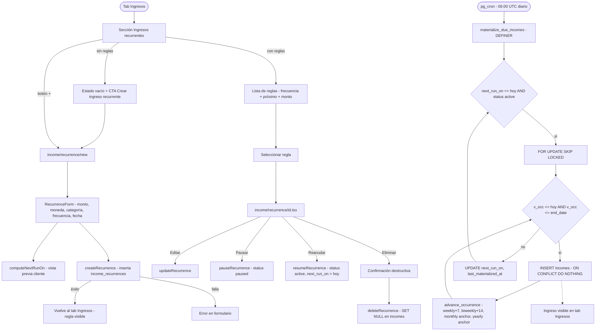

# HU-20 — Ingresos recurrentes

## 1. Identificación

| Campo            | Valor                                                                                                                                                                                                                                                                                                                     |
| ---------------- | ------------------------------------------------------------------------------------------------------------------------------------------------------------------------------------------------------------------------------------------------------------------------------------------------------------------------- |
| **ID**           | HU-20                                                                                                                                                                                                                                                                                                                     |
| **Historia**     | Ingresos recurrentes                                                                                                                                                                                                                                                                                                      |
| **Persona**      | El joven profesional (sueldo mensual, freelance periódico) · El independiente multi-moneda (honorarios recurrentes en ARS y USD)                                                                                                                                                                                          |
| **Estado**       | MVP                                                                                                                                                                                                                                                                                                                       |
| **Relevancia**   | Alta                                                                                                                                                                                                                                                                                                                      |
| **Complejidad**  | Media                                                                                                                                                                                                                                                                                                                     |
| **Release**      | Entrega 3                                                                                                                                                                                                                                                                                                                 |
| **Trazabilidad** | `feat/incomes` — migraciones `20260608143107`, `20260608143926`, `20260608144434`, `20260608144503`, `20260608144623`, `20260608145126`; `lib/income-recurrence.ts`, `lib/repositories/incomes.ts`, `components/incomes/recurrence-form.tsx`, `app/(protected)/(tabs)/incomes.tsx`, `app/(protected)/income/recurrence/*` |

---

## 2. Historia

> **Como** usuario con ingresos periódicos (sueldo, freelance, alquiler),
> **quiero** definir una regla de ingreso recurrente una vez,
> **para** que mis ingresos se registren automáticamente sin intervención manual.

---

## 3. Pre-condiciones

- El usuario está autenticado (JWT válido).
- Las tablas `income_recurrences` e `incomes` existen con RLS habilitado.
- La función `materialize_due_incomes()` SECURITY DEFINER está desplegada (REVOKE de todos los
  roles de cliente — Pattern 1).
- La función `advance_occurrence()` IMMUTABLE está desplegada (REVOKE de todos los roles de cliente).
- El job de pg_cron `'materialize-due-incomes'` está activo (`'0 6 * * *'`).
- La tabla `categories` tiene la columna `kind` con defaults de ingresos ya sembrados (migración
  `20260608143107`).
- El índice de idempotencia `(recurrence_id, occurred_date) WHERE recurrence_id IS NOT NULL`
  existe en `incomes`.

---

## 4. Post-condiciones

- **Regla creada exitosamente**: nueva fila en `income_recurrences` con `status='active'`,
  `next_run_on` apuntando a la primera ocurrencia futura (nunca en el pasado).
- **Ocurrencias materializadas**: el job de pg_cron inserta una fila en `incomes` por cada fecha
  de ocurrencia vencida (`next_run_on <= current_date`), con `source='recurrence'` y
  `occurred_date` seteado. El índice único garantiza que ejecuciones duplicadas no insertan nada.
- **Regla pausada**: `status='paused'`; el materializer la excluye — no se generan nuevas ocurrencias.
- **Regla retomada**: `status='active'`, `next_run_on` actualizado; el materializer retoma desde
  esa fecha.
- **Regla eliminada**: la fila en `income_recurrences` se borra; las filas en `incomes` con ese
  `recurrence_id` sobreviven con `recurrence_id=null` (FK `ON DELETE SET NULL`).
- **Cualquier fallo de persistencia**: la transacción revierte; no quedan filas huérfanas.

---

## 5. Flujo principal

Escenario: el joven profesional configura su sueldo mensual.

1. El usuario navega al tab **Ingresos** (cuarto tab, ícono `TrendingUp`).
2. Ve la sección **"Ingresos recurrentes"** con el estado vacío: "Crear ingreso recurrente".
3. Presiona el `+` junto al título de la sección (o el CTA del estado vacío).
   Navega a `income/recurrence/new`.
4. El `RecurrenceForm` muestra:
   - **Monto** (campo numérico, JetBrains Mono, placeholder `0,00`; requerido, > 0).
   - **Moneda** (ARS / USD, selector).
   - **Categoría** (selector de categorías con `kind='income'`; abre `CategorySelectorSheet`).
   - **Descripción** (texto opcional, ≤ 240 caracteres).
   - **Frecuencia** (selector: Semanal / Quincenal / Mensual / Anual).
   - **Fecha de inicio** (date picker; por defecto hoy).
   - **Fecha de fin** (opcional; date picker; debe ser ≥ fecha de inicio).
   - **Día del mes** (visible solo si frecuencia = Mensual; selector 1–31; por defecto el día de
     la fecha de inicio; ajustado al último día del mes si el mes no tiene ese día).
5. El usuario completa: `$ 350.000 ARS`, categoría "Sueldo", descripción "Trabajo full-time",
   frecuencia "Mensual", fecha de inicio 2026-06-15.
6. `next_run_on` se calcula en el cliente con `computeNextRunOn(start, frequency, today)` y se
   muestra en el formulario como vista previa ("Próxima ocurrencia: 2026-06-15").
7. El usuario presiona **"Crear regla"**. Se llama `createRecurrence(input, userId, today)` que
   inserta en `income_recurrences` con `next_run_on = computeNextRunOn(...)`.
8. La app navega de vuelta al tab Ingresos. La sección "Ingresos recurrentes" muestra la nueva
   regla: "Trabajo full-time · Mensual · Próximo: 2026-06-15 · $ 350.000 ARS".
9. Al llegar el día 2026-06-15 (o antes de las 06:00 UTC), el job de pg_cron ejecuta
   `materialize_due_incomes()`. Este detecta la regla (`next_run_on = 2026-06-15 <= current_date`),
   inserta la fila en `incomes` con `source='recurrence'`, `occurred_date = 2026-06-15`, y
   avanza `next_run_on` a `2026-07-15` (o el último día de julio si el 15 no existe).
10. El usuario abre el tab Ingresos: ve el ingreso "Trabajo full-time" en la lista del día
    2026-06-15 con `$ 350.000 ARS` en verde.

---

## 6. Flujos alternativos

### 6.a — Ingreso recurrente con fecha de fin

- El usuario completa la fecha de fin (p.ej. 2026-12-15) en `RecurrenceForm`.
- `end_date >= start_date` validado en el cliente (zod) y el servidor (DB constraint).
- El materializer inserta ocurrencias solo mientras `v_occ <= end_date`. La última ocurrencia
  se materializa y `next_run_on` avanza más allá de `end_date`; el materializer deja de
  seleccionar la regla en futuras corridas.
- La regla permanece `active` en la tabla (no se auto-archiva); el usuario puede editarla para
  extender el `end_date`.

### 6.b — Pausar y reanudar una regla

- El usuario abre la regla desde la sección "Ingresos recurrentes" (toca la fila).
- En la pantalla `income/recurrence/[id]`, toca **"Pausar"**. `pauseRecurrence(id)` actualiza
  `status='paused'`.
- La regla aparece con la etiqueta "Pausado" en la sección recurrentes.
- El materializer ignora reglas `paused` → no se generan ocurrencias mientras está pausada.
- El usuario toca **"Reanudar"**. `resumeRecurrence(id, today)` actualiza `status='active'` y
  `next_run_on = today`. El materializer retoma desde hoy en la próxima corrida.

### 6.c — Editar una regla existente

- El usuario abre la regla y toca **"Editar"**.
- Puede cambiar monto, moneda, categoría, descripción, frecuencia, start_date, end_date,
  day_of_month.
- `updateRecurrence(id, patch, today)` persiste los cambios y recalcula `next_run_on` según
  la nueva configuración (p.ej. si cambia la frecuencia de mensual a semanal).
- Las ocurrencias ya materializadas no se modifican (historial estable).

### 6.d — Eliminar una regla

- El usuario abre la regla y toca **"Eliminar"**.
- Confirmación destructiva: "¿Confirmás que querés eliminar esta regla? Los ingresos ya
  registrados no se eliminarán."
- `deleteRecurrence(id)` borra la fila en `income_recurrences`.
- Las filas en `incomes` con ese `recurrence_id` sobreviven con `recurrence_id=null`
  (FK `ON DELETE SET NULL`).

### 6.e — App inactiva por varios días (catch-up)

- El usuario no abre la app por 7 días. Tiene una regla semanal.
- El job de pg_cron ejecutó cada día. En cada corrida: si `next_run_on <= current_date`, el
  loop interno de `materialize_due_incomes` itera hacia adelante hasta cubrir todos los días
  vencidos.
- Resultado: todas las ocurrencias semanales faltantes quedan materializadas sin intervención
  del usuario.

### 6.f — Ejecución duplicada del job (re-run cron)

- El job se ejecuta dos veces en el mismo día (p.ej. reintento por timeout).
- El índice `UNIQUE (recurrence_id, occurred_date) WHERE recurrence_id IS NOT NULL` hace que
  el segundo `INSERT` entre en conflicto; `ON CONFLICT DO NOTHING` lo descarta.
- Resultado: cero filas duplicadas.

### 6.g — Frecuencia mensual en el 31 de un mes corto

- Regla mensual `start_date = 2026-01-31`, `day_of_month = 31`.
- `advance_occurrence` para febrero: `least(31, 28)` → 2026-02-28.
- Para marzo: `least(31, 31)` → 2026-03-31 (vuelve al día 31 original).
- El ancla siempre referencia `p_dom` o `day(p_start)`, no el día de la última ocurrencia
  (que podría ser el 28 clampeado).

### 6.h — Frecuencia anual con Feb 29 (año bisiesto → no bisiesto)

- Regla anual `start_date = 2024-02-29`.
- Ocurrencia 2025: `make_date(2025, 2, 29)` clampeado a `make_date(2025, 2, 28)`.
- Ocurrencia 2028 (año bisiesto): `make_date(2028, 2, 29)` → válido, sin clamp.

### 6.i — Formulario con monto inválido

- El usuario deja el campo monto en cero o vacío.
- Zod valida `amount > 0`; el botón "Crear regla" queda deshabilitado.
- El campo monto muestra borde rojo.

### 6.j — Ingreso recurrente de frecuencia semanal

- Regla `start_date = 2026-06-10`, `frequency = 'weekly'`.
- `next_run_on = 2026-06-10` (si es hoy o futuro).
- El materializer inserta 2026-06-10, luego avanza a 2026-06-17, luego 2026-06-24, etc.

---

## 7. Diagrama

---

## 8. Pantallas involucradas

| Pantalla / Componente                        | Rol en HU-20                                                        |
| -------------------------------------------- | ------------------------------------------------------------------- |
| `app/(protected)/(tabs)/incomes.tsx`         | Tab principal: totales + sección recurrentes + lista filtrable      |
| `app/(protected)/income/recurrence/new.tsx`  | Crear nueva regla de recurrencia                                    |
| `app/(protected)/income/recurrence/[id].tsx` | Editar / pausar / reanudar / eliminar regla                         |
| `components/incomes/recurrence-form.tsx`     | Formulario de regla: monto, moneda, categoría, frecuencia, fechas   |
| `lib/income-recurrence.ts`                   | `computeNextRunOn` — preview de `next_run_on` en el cliente         |
| `lib/repositories/incomes.ts`                | CRUD de `income_recurrences`; `pause/resumeRecurrence`              |
| `hooks/use-incomes.ts`                       | `useRecurrences`, `useCreateRecurrence`, `usePauseRecurrence`, etc. |

---

## 9. State matrix

| Estado                                 | Trigger                 | Visual                                                              |
| -------------------------------------- | ----------------------- | ------------------------------------------------------------------- |
| **Sección recurrentes vacía**          | Sin reglas              | Estado vacío + CTA "Crear ingreso recurrente".                      |
| **Regla activa**                       | `status='active'`       | Fila con frecuencia label + "Próximo: YYYY-MM-DD" + monto en verde. |
| **Regla pausada**                      | `status='paused'`       | Fila con etiqueta "Pausado" en ámbar; sin fecha próxima.            |
| **Formulario — monto inválido**        | `amount <= 0` o vacío   | Campo con borde rojo; botón deshabilitado.                          |
| **Formulario — fecha fin < inicio**    | `end_date < start_date` | Error de validación en campo fecha fin; botón deshabilitado.        |
| **Formulario — día del mes (mensual)** | `frequency = 'monthly'` | Campo "Día del mes" visible; oculto para otras frecuencias.         |
| **Confirmación de eliminación**        | Usuario toca "Eliminar" | Sheet destructiva con advertencia.                                  |
| **Error de persistencia**              | RPC falla               | "No se pudo guardar la regla. Intentá nuevamente."                  |

---

## 10. Criterios de aceptación

- [ ] `createRecurrence` inserta fila con `status='active'`, `next_run_on` en el futuro (≥ hoy).
- [ ] `materialize_due_incomes` inserta una fila en `incomes` por cada fecha vencida desde
      `next_run_on` hasta `current_date` (inclusive).
- [ ] Ejecución duplicada del job no genera filas duplicadas (`ON CONFLICT DO NOTHING`).
- [ ] Reglas `paused` son omitidas por el materializer.
- [ ] `advance_occurrence` con `frequency='monthly'` ancla al `day_of_month` en cada llamada;
      no deriva de un día previamente clampeado.
- [ ] `advance_occurrence` con `frequency='yearly'` clampea Feb-29 → Feb-28 en años no bisiestos.
- [ ] `advance_occurrence` con `p_dom = NULL` funciona correctamente para todas las frecuencias
      (no STRICT — no retorna NULL al recibir `p_dom = NULL`).
- [ ] `advance_occurrence` con `p_dom = NULL` en mensual hereda el día de `p_start`.
- [ ] Eliminar una regla deja las filas `incomes` intactas con `recurrence_id = null`.
- [ ] El loop de catch-up cubre todos los días vencidos si el job no se ejecutó por varios días.
- [ ] El safety guard (`exit inner_loop when v_next is null or v_next <= v_occ`) evita loops
      infinitos.
- [ ] `computeNextRunOn` en el cliente devuelve el mismo resultado que el materializer server-side
      para los cuatro frequencies.
- [ ] La sección "Ingresos recurrentes" en el tab muestra todas las reglas `active` y `paused`;
      excluye las eliminadas.
- [ ] El formulario `RecurrenceForm` valida monto > 0, descripción ≤ 240 chars, end_date ≥ start_date.
- [ ] El campo "Día del mes" solo aparece cuando `frequency = 'monthly'`.
- [ ] `pauseRecurrence` / `resumeRecurrence` actualizan `status` y (en resume) `next_run_on = today`.
- [ ] Gates verdes (format + lint + typecheck + 1276 tests, 82 suites).

---

## 11. Notas técnicas

### Tablas

- **`income_recurrences`**: `id`, `user_id` (FK `auth.users` CASCADE), `amount numeric(14,2) > 0`,
  `currency` (ARS/USD), `category_id` (FK `categories` SET NULL), `description ≤ 240`,
  `frequency` (weekly/biweekly/monthly/yearly), `start_date date`, `end_date date` nullable,
  `day_of_month smallint 1–31` nullable, `status` (active/paused), `next_run_on date`,
  `last_materialized_at timestamptz` nullable, `created_at`, `updated_at` (trigger
  `income_recurrences_set_updated_at`). Constraint `end_date >= start_date`.
- **`incomes`**: `id`, `user_id`, `amount > 0`, `currency`, `category_id`, `description`,
  `occurred_at timestamptz`, `occurred_date date` nullable, `source` (manual/recurrence),
  `recurrence_id` (FK `income_recurrences` SET NULL), `created_at`, `updated_at`.
  Idempotencia: `UNIQUE (recurrence_id, occurred_date) WHERE recurrence_id IS NOT NULL`.

### Funciones DB

- `materialize_due_incomes()`: SECURITY DEFINER, REVOKE from anon/authenticated/public.
  Pattern 1 — AGENTS.md §7. El advisor no la marca porque nunca es callable por el cliente.
- `advance_occurrence(date, text, smallint, date)`: IMMUTABLE SQL, NOT STRICT, REVOKE from
  anon/authenticated/public. Pattern 1.
- `get_income_totals(p_from, p_to)`: SECURITY INVOKER. Sin escalamiento de privilegios.
  Mirrors `get_personal_totals` pero sin splits.

### categories.kind

La migración `20260608143107` extiende `categories` con `kind text DEFAULT 'expense'`.
El índice de unicidad cambia de `(user_id, slug)` a `(user_id, kind, slug)`. Los 7 defaults
de ingresos se siembran en `seed_default_categories` y se aplican a usuarios existentes en la
misma migración. Los filtros de categorías de gastos (`kind='expense'`) siguen funcionando sin
cambios.

### pg_cron

- Extensión habilitada en migración `20260608144503`.
- Job name: `'materialize-due-incomes'`, schedule `'0 6 * * *'`.
- La migración tiene guarda idempotente (unschedule-if-exists).
- En desarrollo local sin `supabase start` + pg_cron: ejecutar manualmente
  `select public.materialize_due_incomes();` vía Supabase MCP.

### Migraciones

| Archivo                                                                         | Contenido                                                          |
| ------------------------------------------------------------------------------- | ------------------------------------------------------------------ |
| `supabase/migrations/20260608143107_add_income_categories_kind.sql`             | `categories.kind` + índice `(user_id, kind, slug)` + seed ingresos |
| `supabase/migrations/20260608143926_create_incomes_tables.sql`                  | `income_recurrences` + `incomes` + RLS + índices                   |
| `supabase/migrations/20260608144434_income_recurrence_functions.sql`            | `advance_occurrence` + `materialize_due_incomes`                   |
| `supabase/migrations/20260608144503_income_recurrence_cron.sql`                 | pg_cron extension + job scheduling                                 |
| `supabase/migrations/20260608144623_income_recurrence_functions_fix_strict.sql` | Fix: `advance_occurrence` sin STRICT                               |
| `supabase/migrations/20260608145126_get_income_totals.sql`                      | `get_income_totals` INVOKER                                        |

### Tests

- `lib/__tests__/income-recurrence.test.ts` — `computeNextRunOn`: cuatro frecuencias, clamp mensual, clamp feb-29.
- `lib/repositories/__tests__/incomes.test.ts` — CRUD, pause/resume, sumIncomesByCurrency.
- `components/incomes/__tests__/recurrence-form.test.tsx` — validaciones, campo day_of_month condicional.
- `app/(protected)/income/recurrence/__tests__/new.test.tsx` + `[id].test.tsx` — pantallas.
- Baseline: **1276 tests, 82 suites**.
