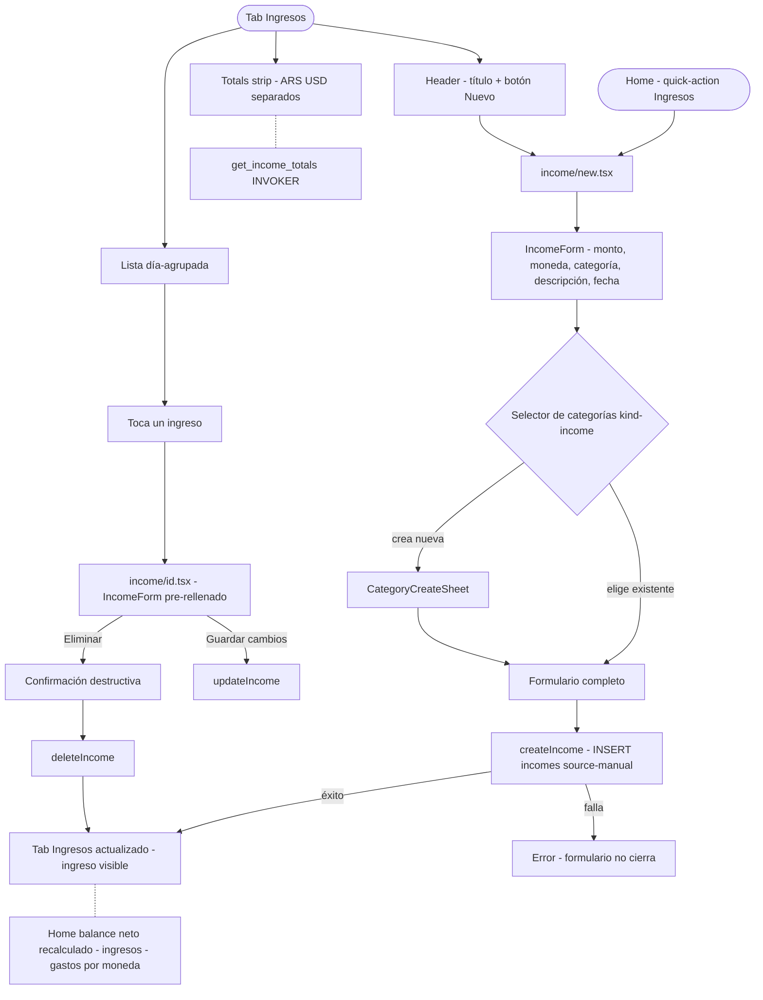

# HU-21 — Ingresos ocasionales

## 1. Identificación

| Campo            | Valor                                                                                                                                                                                                                                                             |
| ---------------- | ----------------------------------------------------------------------------------------------------------------------------------------------------------------------------------------------------------------------------------------------------------------- |
| **ID**           | HU-21                                                                                                                                                                                                                                                             |
| **Historia**     | Ingresos ocasionales                                                                                                                                                                                                                                              |
| **Persona**      | El joven profesional (reintegro, bono, regalo) · El independiente multi-moneda (cobro puntual en USD, dividendo)                                                                                                                                                  |
| **Estado**       | MVP                                                                                                                                                                                                                                                               |
| **Relevancia**   | Alta                                                                                                                                                                                                                                                              |
| **Complejidad**  | Baja                                                                                                                                                                                                                                                              |
| **Release**      | Entrega 3                                                                                                                                                                                                                                                         |
| **Trazabilidad** | `feat/incomes` — migraciones `20260608143107`, `20260608143926`, `20260608145126`; `lib/repositories/incomes.ts`, `components/incomes/income-form.tsx`, `app/(protected)/(tabs)/incomes.tsx`, `app/(protected)/income/new.tsx`, `app/(protected)/income/[id].tsx` |

---

## 2. Historia

> **Como** usuario que recibe ingresos puntuales (reintegros, bonos, regalos, dividendos),
> **quiero** registrarlos manualmente con monto, moneda, categoría y fecha,
> **para** que el balance neto del dashboard refleje mi situación financiera real.

---

## 3. Pre-condiciones

- El usuario está autenticado (JWT válido).
- La tabla `incomes` existe con RLS habilitado y `source DEFAULT 'manual'`.
- La tabla `categories` tiene la columna `kind` con las 7 categorías de ingresos sembradas
  (migración `20260608143107`).
- El RPC `get_income_totals` está desplegado (migración `20260608145126`).

---

## 4. Post-condiciones

- **Ingreso registrado exitosamente**: nueva fila en `incomes` con `source='manual'`,
  `recurrence_id = NULL`, `occurred_date = NULL`, `occurred_at` con la fecha/hora elegida.
- **Ingreso editado**: la fila en `incomes` refleja los nuevos valores.
- **Ingreso eliminado**: la fila se borra de `incomes`.
- **Totales actualizados**: `get_income_totals` devuelve el nuevo total por moneda.
- **Balance neto en Home actualizado**: la diferencia ingreso − gasto refleja el nuevo ingreso.
- **Cualquier fallo de persistencia**: la operación revierte; la UI muestra el error.

---

## 5. Flujo principal

Escenario: el joven profesional recibe un reintegro de obra social.

1. El usuario navega al tab **Ingresos** (cuarto tab, ícono `TrendingUp`).
2. Presiona el botón **"Nuevo"** (esquina superior derecha). Navega a `income/new`.
   También puede usar el quick-action "Ingresos" del Home.
3. El `IncomeForm` muestra:
   - **Monto** (campo numérico, JetBrains Mono, placeholder `0,00`; requerido, > 0).
   - **Moneda** (ARS / USD, selector; default ARS).
   - **Categoría** (selector de categorías con `kind='income'`; abre `CategorySelectorSheet`
     filtrado a ingresos).
   - **Descripción** (texto opcional, ≤ 240 caracteres).
   - **Fecha** (`DateField`; por defecto hoy).
4. El usuario completa: `$ 18.500 ARS`, categoría "Reintegro", descripción "OSDE junio 2026".
5. Presiona **"Registrar ingreso"**. `createIncome(input)` inserta en `incomes` con
   `source='manual'`, `occurred_at = fecha elegida`, `occurred_date = NULL`.
6. La app navega de vuelta al tab Ingresos. El nuevo ingreso aparece en la lista del día
   correspondiente con el ícono `Undo2` y `$ 18.500 ARS` en verde.
7. Los totales del tab y el balance neto del Home se actualizan (TanStack Query invalida
   `incomeKeys.all`).

---

## 6. Flujos alternativos

### 6.a — Registrar ingreso desde el quick-action del Home

- El usuario está en el Home.
- Toca el quick-action **"Ingresos"** (ícono `TrendingUp`).
- Navega directamente a `income/new`.
- El flujo a partir del paso 3 del flujo principal es idéntico.

### 6.b — Editar un ingreso ocasional

- El usuario toca un ingreso en la lista del tab Ingresos.
- Navega a `income/[id].tsx`.
- El `IncomeForm` se pre-rellena con los valores existentes.
- El usuario modifica el monto o la descripción y presiona **"Guardar cambios"**.
- `updateIncome(id, input)` persiste el parche; TanStack Query invalida `incomeKeys.all`.

### 6.c — Eliminar un ingreso ocasional

- El usuario está en `income/[id].tsx`.
- Toca el botón destructivo **"Eliminar ingreso"**.
- Confirmación: "¿Confirmás que querés eliminar este ingreso?"
- `deleteIncome(id)` borra la fila; TanStack Query invalida `incomeKeys.all` y remueve el
  detalle del caché.
- La app navega de vuelta al tab Ingresos.

### 6.d — Ingreso en USD

- El usuario elige "USD" como moneda.
- El campo monto muestra el prefijo `US$` y formatea en dólares (`US$ 85,00`).
- La fila en `incomes` se guarda con `currency='USD'`.
- En el tab Ingresos, el totals strip muestra el total USD por separado del total ARS.
- En el Home, el balance neto aparece como dos filas: `ARS` y `USD`. Nunca convertidos.

### 6.e — Categoría no listada (nueva categoría inline)

- El usuario abre `CategorySelectorSheet` con `kind='income'`.
- No encuentra la categoría que necesita.
- Toca **"Agregar categoría"** (o equivalente) para abrir el `CategoryCreateSheet`.
- Crea la categoría con nombre, ícono y color.
- La nueva categoría aparece en el selector y queda seleccionada automáticamente.

### 6.f — Formulario con monto inválido

- El usuario deja el campo monto en cero o vacío.
- Zod valida `amount > 0`; botón "Registrar ingreso" queda deshabilitado.
- El campo monto muestra borde rojo.

### 6.g — Descripción excede 240 caracteres

- Zod valida `description.length <= 240`; botón deshabilitado.
- El campo descripción muestra un contador y borde rojo al superar el límite.

### 6.h — Error de red al guardar

- `createIncome` o `updateIncome` falla por timeout o error de red.
- La UI muestra: "No se pudo guardar el ingreso. Intentá nuevamente."
- El formulario no cierra; el usuario puede reintentar.

### 6.i — Búsqueda y filtros en la lista

- El usuario escribe en la barra de búsqueda del tab Ingresos.
- Los ingresos se filtran por `description ILIKE %search%` (vía `listIncomes`).
- El usuario puede combinar búsqueda con filtro de moneda y/o categoría.
- La búsqueda usa `useDeferredValue` para no saturar la red por keystroke.

### 6.j — Lista vacía (sin ingresos)

- El usuario no tiene ingresos registrados.
- Empty state: ícono `Inbox` + "No hay ingresos registrados" + "Aún no se registraron
  ingresos." + CTA "Registrar ingreso".

---

## 7. Diagrama

---

## 8. Pantallas involucradas

| Pantalla / Componente                | Rol en HU-21                                                                   |
| ------------------------------------ | ------------------------------------------------------------------------------ |
| `app/(protected)/(tabs)/incomes.tsx` | Tab: totales + lista filtrable + empty state                                   |
| `app/(protected)/income/new.tsx`     | Crear nuevo ingreso ocasional                                                  |
| `app/(protected)/income/[id].tsx`    | Editar / eliminar ingreso                                                      |
| `components/incomes/income-form.tsx` | Formulario reutilizable: monto, moneda, categoría, descripción, fecha          |
| `components/incomes/income-row.tsx`  | Fila de lista: ícono de categoría, descripción, fecha relativa, monto en verde |
| `app/(protected)/(tabs)/index.tsx`   | Balance neto en Home usando `useIncomeTotals`                                  |

---

## 9. State matrix

| Estado                             | Trigger                             | Visual                                                |
| ---------------------------------- | ----------------------------------- | ----------------------------------------------------- |
| **Tab Ingresos — vacío**           | Sin ingresos registrados            | Empty state: ícono `Inbox` + mensaje + CTA.           |
| **Tab Ingresos — con datos**       | Al menos un ingreso                 | Lista día-agrupada + totals strip con ARS/USD.        |
| **Formulario — monto inválido**    | `amount <= 0` o vacío               | Campo monto con borde rojo; botón deshabilitado.      |
| **Formulario — descripción larga** | `length > 240`                      | Contador en rojo; botón deshabilitado.                |
| **Ingreso en USD**                 | `currency = 'USD'`                  | Monto con prefijo `US$`; total USD en strip separado. |
| **Confirmación de eliminación**    | Usuario toca "Eliminar"             | Sheet destructiva con confirmación formal.            |
| **Error de guardado**              | RPC falla                           | "No se pudo guardar el ingreso. Intentá nuevamente."  |
| **Balance neto Home — positivo**   | `incomes > expenses` para la moneda | Monto en verde con etiqueta "Ingresos netos".         |
| **Balance neto Home — negativo**   | `expenses > incomes` para la moneda | Monto en rojo.                                        |

---

## 10. Criterios de aceptación

- [ ] `createIncome` inserta fila con `source='manual'`, `recurrence_id=null`, `occurred_date=null`.
- [ ] `updateIncome` modifica solo los campos presentes en `p_patch`; historial no se altera.
- [ ] `deleteIncome` borra la fila; los totales y el balance neto del Home se actualizan al
      invalidar `incomeKeys.all`.
- [ ] `get_income_totals` devuelve una fila por moneda con `total` y `count` correctos para el
      rango de fechas dado.
- [ ] `IncomeForm` valida monto > 0, descripción ≤ 240 caracteres.
- [ ] El selector de categorías en `IncomeForm` muestra solo categorías con `kind='income'`.
- [ ] El balance neto del Home (`incomes − expenses`) se calcula por moneda; ARS y USD nunca
      se mezclan.
- [ ] El quick-action "Ingresos" del Home navega a `income/new`.
- [ ] La lista del tab Ingresos está agrupada por día en orden descendente (`occurred_at DESC`).
- [ ] Filtros de búsqueda, moneda y categoría funcionan combinados.
- [ ] El empty state muestra el CTA "Registrar ingreso" que navega a `income/new`.
- [ ] Todo el microcopy está en español rioplatense formal y sin emoji.
- [ ] Gates verdes (format + lint + typecheck + 1276 tests, 82 suites).

---

## 11. Notas técnicas

### Tabla `incomes` (campos relevantes para HU-21)

- `source = 'manual'` (default del schema; no requiere envío explícito en `createIncome`).
- `recurrence_id = NULL` y `occurred_date = NULL` para entradas manuales.
- `occurred_at`: fecha y hora elegida por el usuario (default `now()`). Configura la posición
  del ingreso en la lista día-agrupada.
- La restricción única `(recurrence_id, occurred_date) WHERE recurrence_id IS NOT NULL` no
  aplica a filas con `recurrence_id = NULL` — múltiples ingresos manuales el mismo día son
  válidos.

### RPC

- `get_income_totals(p_from timestamptz default null, p_to timestamptz default null)`:
  SECURITY INVOKER. Filtra `i.user_id = auth.uid()` vía RLS. Devuelve
  `(currency, total numeric, count bigint)`. `p_from`/`p_to = null` → sin filtro de fechas.

### Hooks / TanStack Query

- `useIncomes(filter)` — lista paginada/filtrada; query key `incomeKeys.list(filter)`.
- `useIncomeTotals(range)` — totales por moneda; query key `incomeKeys.totals(range)`.
- Mutaciones `useCreateIncome`, `useUpdateIncome`, `useDeleteIncome` invalidan
  `incomeKeys.all` en `onSuccess`.

### Categories kind

- `CategorySelectorSheet` acepta una prop `kind: 'expense' | 'income'` para filtrar las
  categorías mostradas. En `IncomeForm` se pasa `kind='income'`.

### Migraciones requeridas para HU-21

| Archivo                                         | Por qué importa para HU-21                                   |
| ----------------------------------------------- | ------------------------------------------------------------ |
| `20260608143107_add_income_categories_kind.sql` | Agrega `kind` a `categories`; siembra categorías de ingresos |
| `20260608143926_create_incomes_tables.sql`      | Crea la tabla `incomes` con RLS                              |
| `20260608145126_get_income_totals.sql`          | RPC para los totales del tab y el balance neto del Home      |

### Tests

- `components/incomes/__tests__/income-form.test.tsx` — validaciones monto, descripción, moneda.
- `components/incomes/__tests__/income-row.test.tsx` — render de monto, categoría, fecha.
- `app/(protected)/(tabs)/__tests__/incomes.test.tsx` — tab completo: vacío, con datos, filtros.
- `app/(protected)/income/__tests__/new.test.tsx` + `edit.test.tsx` — pantallas create/edit.
- Baseline: **1276 tests, 82 suites**.
