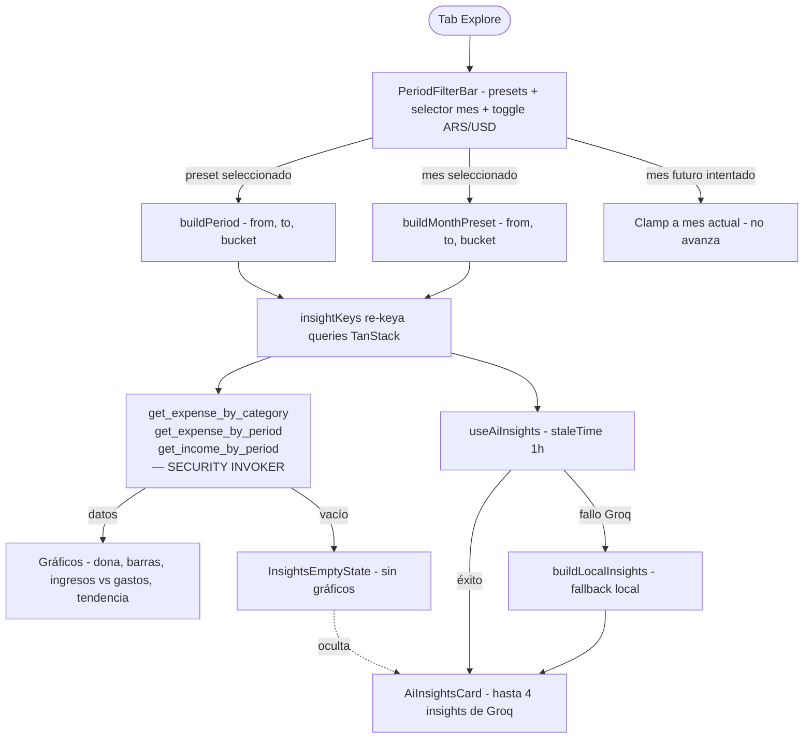

# HU-23 — Filtros temporales en Insights

## 1. Identificación

| Campo            | Valor                                                                                                                                                                                                                                                                               |
| ---------------- | ----------------------------------------------------------------------------------------------------------------------------------------------------------------------------------------------------------------------------------------------------------------------------------- |
| **ID**           | HU-23                                                                                                                                                                                                                                                                               |
| **Historia**     | Filtros temporales en Insights                                                                                                                                                                                                                                                      |
| **Persona**      | El joven profesional (28) — quiere entender patrones de gasto por período · El independiente multi-moneda (32) — necesita ver ARS y USD por separado sin mezcla                                                                                                                     |
| **Estado**       | MVP                                                                                                                                                                                                                                                                                 |
| **Relevancia**   | Alta                                                                                                                                                                                                                                                                                |
| **Complejidad**  | Media                                                                                                                                                                                                                                                                               |
| **Release**      | Entrega 4                                                                                                                                                                                                                                                                           |
| **Trazabilidad** | `feat/insights` — migraciones `20260620222455`, `20260620222511`, `20260620222530`; `lib/insights/{types,periods,heuristics,client}.ts`, `lib/repositories/insights.ts`, `hooks/use-insights.ts`, `components/insights/period-filter-bar.tsx`, `app/(protected)/(tabs)/explore.tsx` |

---

## 2. Historia

> **Como** usuario que quiere entender mis hábitos de gasto,
> **quiero** filtrar la sección Insights por período (presets o mes específico) y moneda,
> **para** analizar únicamente el rango de tiempo que me interesa sin mezclar datos.

---

## 3. Pre-condiciones

- El usuario está autenticado (JWT válido).
- Existen filas en `expenses` y/o `incomes` para el usuario en al menos un período.
- Las tres RPCs SECURITY INVOKER están desplegadas:
  `get_expense_by_category`, `get_expense_by_period`, `get_income_by_period`.
- `components/insights/period-filter-bar.tsx` está montado en `explore.tsx`.
- `lib/insights/periods.ts` exporta `PRESETS` y `buildMonthPreset`.

---

## 4. Post-condiciones

- **Preset seleccionado**: todas las llamadas a los RPCs usan el rango `(p_from, p_to)`
  correspondiente al preset activo; los gráficos y la tarjeta de IA se re-renderizan.
- **Mes seleccionado**: las queries usan el primer y último día del mes elegido.
- **Moneda cambiada**: todas las queries incluyen el nuevo valor de `p_currency`; los
  importes de la moneda anterior no son visibles.
- **Mes futuro bloqueado**: el selector no avanza más allá del mes actual.
- **Período sin movimientos**: se muestra `InsightsEmptyState`; los gráficos no se renderizan.

---

## 5. Flujo principal

Escenario: el joven profesional quiere ver cuánto gastó los últimos 3 meses en ARS.

1. El usuario navega al tab **Explore** (ícono `BarChart2`).
2. La pantalla carga `explore.tsx`. El filtro activo por defecto es **"Este mes"** en
   **ARS**.
3. Las tres RPCs se llaman con el rango del mes actual. Los gráficos se renderizan:
   - Dona de categorías con los gastos del mes.
   - Barras de gastos por semana.
   - Comparación ingresos vs gastos (mensual).
   - Tendencia mensual (un solo punto si el rango es un mes).
   - Tarjeta de IA con hasta 4 recomendaciones en español.
4. El usuario toca el preset **"Últimos 3 meses"** en `PeriodFilterBar`.
5. El período activo cambia a `(inicio-del-mes-hace-3-meses, hoy)` con `p_bucket='month'`.
6. TanStack re-keya todas las queries (`insightKeys.*`). Los RPCs se vuelven a llamar.
7. Los gráficos se actualizan mostrando datos de los 3 meses. Las barras de gastos muestran
   una barra por mes. La tendencia muestra 3 puntos.
8. El usuario toca el toggle **USD**. El período no cambia; `p_currency='USD'` reemplaza
   `'ARS'`. Las queries se re-keyan de nuevo.
9. Si no hay movimientos en USD en ese período, se muestra `InsightsEmptyState` en lugar
   de los gráficos.
10. El usuario vuelve al toggle **ARS**. Los gráficos en ARS se restauran desde la caché
    de TanStack (sin nueva llamada a red si `staleTime` no expiró).

---

## 6. Flujos alternativos

### 6.a — Selector de mes

- El usuario presiona el ícono de calendario (o desliza) para abrir el selector de mes.
- Aparece un navegador de meses con flechas anterior / siguiente.
- El usuario toca la flecha "anterior" varias veces hasta llegar a marzo de 2026.
- El período activo cambia a `(2026-03-01, 2026-03-31)` con `p_bucket='week'`.
- Los gráficos muestran datos de ese mes específico.
- Los presets quedan deseleccionados mientras el selector de mes está activo.

### 6.b — Intentar navegar a un mes futuro

- El usuario está en el mes actual (por ejemplo, junio de 2026).
- Presiona la flecha "siguiente" en el selector de mes.
- La flecha está deshabilitada o no produce efecto: el mes no avanza.
- El selector permanece en el mes actual (clamp a `today`).

### 6.c — Período sin movimientos

- El usuario selecciona "Mes pasado" y no tiene gastos ni ingresos registrados en ese período.
- Las tres RPCs devuelven arrays vacíos.
- `explore.tsx` renderiza `InsightsEmptyState` con un texto del tipo:
  "No hay movimientos en este período. ¡Empezá a registrar tus gastos!"
- La tarjeta de IA no se muestra (lista de insights vacía).

### 6.d — AI card: Groq no disponible (fallback local)

- El usuario selecciona "Este mes" en ARS. Los gráficos cargan normalmente.
- La edge function `generate-insights` falla (timeout, sin cuota, JSON inválido).
- `useAiInsights` captura el error en su `queryFn` y llama `buildLocalInsights(payload)`.
- La tarjeta de IA muestra hasta 4 recomendaciones generadas localmente (en español).
- El usuario no ve ningún mensaje de error; la experiencia es transparente.

### 6.e — Vuelta a período cacheado

- El usuario tiene activo "Este año" y navega a "Mes pasado" y luego vuelve a "Este año".
- Si `staleTime` no expiró para `(currency, 'Este año')`, las queries no se re-emiten.
- Los gráficos de "Este año" se restauran de caché instantáneamente.

### 6.f — Toggle de moneda sin datos en el período

- El usuario cambia el toggle a USD. El período activo es "Este mes".
- Las RPCs devuelven arrays vacíos para USD.
- Los gráficos muestran barras/segmentos vacíos o el `InsightsEmptyState`.
- El toggle sigue disponible para volver a ARS.

---

## 7. Diagrama



---

## 8. Pantallas involucradas

| Pantalla / Componente                           | Rol en HU-23                                                                   |
| ----------------------------------------------- | ------------------------------------------------------------------------------ |
| `app/(protected)/(tabs)/explore.tsx`            | Pantalla principal Insights; monta FilterBar, gráficos, empty state, AI card   |
| `components/insights/period-filter-bar.tsx`     | Presets (4 botones) + selector de mes + toggle ARS/USD                         |
| `components/insights/insights-empty-state.tsx`  | Estado ilustrado para períodos sin movimientos                                 |
| `components/insights/ai-insights-card.tsx`      | Tarjeta con hasta 4 recomendaciones; oculta cuando insights `[]`               |
| `lib/insights/periods.ts`                       | `PRESETS`, `buildMonthPreset`, `getDateRange`; clamp de mes futuro             |
| `hooks/use-insights.ts`                         | `useAiInsights` (`staleTime` 1h, fallback heurísticas); `insightKeys` factory  |
| `lib/insights/heuristics.ts`                    | `buildLocalInsights` — fallback sin red                                        |
| `lib/insights/client.ts`                        | `generateInsights` — llama edge function `generate-insights`                   |
| `supabase/functions/generate-insights/index.ts` | Edge function Groq `llama-4-scout-17b`; Bearer JWT; normaliza + cap 4 insights |

---

## 9. State matrix

| Estado                                      | Trigger                                       | Visual                                                                                      |
| ------------------------------------------- | --------------------------------------------- | ------------------------------------------------------------------------------------------- |
| **Cargando queries**                        | Preset/mes/moneda cambiados; queries en vuelo | Skeleton loaders en lugar de cada gráfico.                                                  |
| **Datos cargados — ARS / período con data** | RPCs devuelven filas                          | Cuatro gráficos + AI card visibles.                                                         |
| **Datos cargados — período sin data**       | RPCs devuelven arrays vacíos                  | `InsightsEmptyState` ilustrado; sin gráficos; sin AI card.                                  |
| **Preset activo**                           | Usuario toca uno de los 4 presets             | Botón del preset con fondo activo (brand primary `#0077B6`); selector de mes sin selección. |
| **Mes seleccionado**                        | Usuario navega con flechas o toca un mes      | Nombre del mes visible en la barra; presets sin selección activa.                           |
| **Mes futuro (intento)**                    | Flecha "siguiente" en mes actual              | Flecha deshabilitada (`text-disabled #4B566B`); sin cambio de período.                      |
| **Toggle ARS activo**                       | Estado por defecto o usuario elige ARS        | Chip ARS con fondo primario.                                                                |
| **Toggle USD activo**                       | Usuario elige USD                             | Chip USD con fondo ámbar `#F59E0B`; gráficos en USD.                                        |
| **AI card — insights de Groq**              | `useAiInsights` resuelve desde edge fn        | Tarjeta visible con 2–4 bullets en español.                                                 |
| **AI card — heurísticas locales**           | Groq falla; `buildLocalInsights` activo       | Tarjeta visible con insights locales; sin indicador de fallback.                            |
| **AI card oculta**                          | Período sin movimientos                       | Tarjeta no renderizada.                                                                     |
| **Error de red (RPCs)**                     | Supabase no responde                          | Mensaje "No se pudieron cargar los datos. Intentá nuevamente." sin crashear.                |

---

## 10. Criterios de aceptación

- [ ] Al seleccionar "Este mes", los RPCs reciben `p_from = primer día del mes actual`,
      `p_to = hoy`.
- [ ] Al seleccionar "Mes pasado", los RPCs reciben el primer y último día del mes anterior.
- [ ] Al seleccionar "Últimos 3 meses", `p_bucket = 'month'`; cada barra representa un mes.
- [ ] Al seleccionar "Este año", `p_from = 1 de enero del año actual`.
- [ ] El selector de mes no avanza más allá del mes actual (clamp).
- [ ] Cambiar el toggle a USD re-keya todas las queries; los importes en pantalla son en USD.
- [ ] No se mezclan importes ARS y USD en ningún gráfico ni en la AI card.
- [ ] Período sin movimientos muestra `InsightsEmptyState`; la AI card no aparece.
- [ ] Groq falla → `useAiInsights` devuelve `buildLocalInsights(payload)`; no hay error visible.
- [ ] Groq responde → AI card muestra 2–4 insights en español con `title ≤ 48` y `body ≤ 160` chars.
- [ ] Volver a un período/moneda ya consultado dentro del `staleTime` (1 h) no emite nueva query de IA.
- [ ] `staleTime` de 1 h para IA; queries de gráficos usan el default de TanStack.
- [ ] Gates verdes (format + lint + typecheck + 1668 tests, 102 suites).

---

## 11. Notas técnicas

### RPCs

Las tres RPCs son SECURITY INVOKER — corren bajo el RLS del caller y nunca devuelven datos
de otro usuario. No requieren REVOKE/GRANT especial. Ver
[ADR: Insights aggregation RPCs](../decisions/2026-06-20-insights-aggregation-rpcs.md).

```sql
-- Filtro canónico en occurred_at (indexado); p_bucket ∈ {day, week, month}
WHERE e.currency = p_currency
  AND e.user_id = auth.uid()
  AND e.occurred_at BETWEEN p_from AND p_to
```

### Períodos y clamp

`lib/insights/periods.ts` exporta `PRESETS` (array de 4 objetos `{label, getRange}`) y
`buildMonthPreset(year, month)`. El componente `PeriodFilterBar` mantiene un `monthOffset`
en estado local; el offset nunca supera 0 (mes actual = offset 0).

### Cache TanStack

`insightKeys.ai(currency, period.label)` es la key para `useAiInsights`. Las queries de
gráficos usan `insightKeys.category(currency, from, to)`, `insightKeys.period(currency, bucket, from, to)`,
`insightKeys.income(currency, bucket, from, to)`.

### Edge function

`supabase/functions/generate-insights/index.ts` recibe un `InsightInput` con los agregados
computados (ya filtrados por RLS). No consulta la DB. Retorna
`{ data: { insights: InsightItem[] } }`. Ver sección AI de
[`docs/features/insights.md`](../features/insights.md).

### Migraciones

| Archivo                                                          | Contenido                             |
| ---------------------------------------------------------------- | ------------------------------------- |
| `supabase/migrations/20260620222455_get_expense_by_category.sql` | `get_expense_by_category` INVOKER RPC |
| `supabase/migrations/20260620222511_get_expense_by_period.sql`   | `get_expense_by_period` INVOKER RPC   |
| `supabase/migrations/20260620222530_get_income_by_period.sql`    | `get_income_by_period` INVOKER RPC    |

### Tests

- `lib/insights/__tests__/periods.test.ts` — rangos de presets, clamp de mes futuro.
- `hooks/__tests__/use-insights.test.ts` — fallback path de `useAiInsights`; staleTime keying.
- `components/insights/__tests__/period-filter-bar.test.tsx` — preset activo, clamp.
- `app/(protected)/(tabs)/__tests__/explore.test.tsx` — render completo; cambio de preset/moneda.
- Baseline: **1668 tests, 102 suites**.
