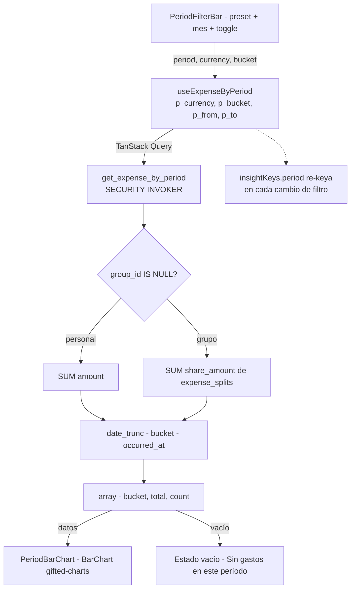

# HU-24 — Gráfico de barras de gastos por período

## 1. Identificación

| Campo            | Valor                                                                                                                                                                          |
| ---------------- | ------------------------------------------------------------------------------------------------------------------------------------------------------------------------------ |
| **ID**           | HU-24                                                                                                                                                                          |
| **Historia**     | Gráfico de barras de gastos según filtro y moneda                                                                                                                              |
| **Persona**      | El joven profesional (28) — quiere comparar cuánto gastó en distintos meses · El independiente multi-moneda (32) — quiere ver gastos en USD separados                          |
| **Estado**       | MVP                                                                                                                                                                            |
| **Relevancia**   | Alta                                                                                                                                                                           |
| **Complejidad**  | Media                                                                                                                                                                          |
| **Release**      | Entrega 4                                                                                                                                                                      |
| **Trazabilidad** | `feat/insights` — migración `20260620222511`; `hooks/use-insights.ts` (`useExpenseByPeriod`), `components/insights/period-bar-chart.tsx`, `app/(protected)/(tabs)/explore.tsx` |

---

## 2. Historia

> **Como** usuario que quiere comparar mis gastos entre períodos,
> **quiero** ver un gráfico de barras que muestre mis gastos agrupados por intervalo de tiempo,
> **para** identificar en qué períodos gasté más y ajustar mis hábitos.

---

## 3. Pre-condiciones

- El usuario está autenticado (JWT válido).
- Existen filas en `expenses` para el usuario en el período seleccionado.
- La RPC `get_expense_by_period(p_currency, p_bucket, p_from, p_to)` SECURITY INVOKER
  está desplegada (migración `20260620222511`).
- `react-native-gifted-charts` está instalado (`BarChart` disponible).
- El filtro temporal (HU-23) está activo y provee `(p_from, p_to, p_bucket, p_currency)`.

---

## 4. Post-condiciones

- **Gráfico renderizado**: `PeriodBarChart` muestra una barra por bucket del período, con
  altura proporcional al total de gastos share-aware del usuario en esa moneda.
- **Gráfico actualizado**: cualquier cambio de preset, mes o toggle de moneda causa una
  nueva query y el gráfico se re-renderiza.
- **Bucket correcto**: el `p_bucket` corresponde al preset activo:
  `day` o `week` para rangos de un mes, `month` para rangos de varios meses.
- **Gastos de grupo**: cada barra cuenta solo el `share_amount` del usuario (share-aware),
  nunca el total del grupo.
- **Sin datos**: cuando `get_expense_by_period` devuelve un array vacío, el gráfico muestra
  un estado vacío (sin barras).

---

## 5. Flujo principal

Escenario: el joven profesional quiere comparar sus gastos semana a semana en junio de 2026.

1. El usuario está en el tab **Explore** con el preset "Este mes" activo en ARS.
2. `useExpenseByPeriod('ARS', 'week', fromDate, toDate)` se llama con las fechas del mes
   actual y `p_bucket = 'week'`.
3. La RPC `get_expense_by_period` ejecuta `date_trunc('week', occurred_at)` sobre los
   gastos del usuario, agrupa por semana, suma `share_amount` o `amount`.
4. `PeriodBarChart` recibe el array `[{ bucket: '2026-06-01', total: 45000, count: 3 }, ...]`.
5. El gráfico renderiza una barra por semana del mes. La barra más alta es la semana de mayor
   gasto. Los valores en el eje Y están en ARS con `tabular-nums`.
6. El usuario toca el preset **"Últimos 3 meses"**.
7. El período cambia; `p_bucket` pasa a `'month'`. Se llama `useExpenseByPeriod` con el
   nuevo rango.
8. El gráfico muestra ahora una barra por mes (3 barras en total). El usuario puede comparar
   cuánto gastó en abril, mayo y junio.
9. El usuario cambia el toggle a **USD**.
10. `useExpenseByPeriod` se re-keya con `p_currency = 'USD'`. Si hay gastos en USD en esos
    3 meses, aparecen barras en USD. Si no los hay, el gráfico queda sin barras.

---

## 6. Flujos alternativos

### 6.a — Período sin gastos (gráfico vacío)

- El usuario selecciona "Mes pasado" y no tiene gastos en ese período.
- `get_expense_by_period` devuelve `[]`.
- `PeriodBarChart` renderiza un estado vacío: sin barras y un texto "Sin gastos en este período."
- Los otros gráficos (dona, tendencia) también quedan vacíos.
- Si `get_income_by_period` también devuelve `[]`, se muestra `InsightsEmptyState` a nivel
  de pantalla.

### 6.b — Un solo gasto en el período

- El usuario tiene un único gasto en "Este mes".
- La RPC devuelve un array con un solo bucket.
- El gráfico muestra una barra. Los demás buckets del período aparecen con altura cero o
  sin renderizarse.

### 6.c — Gasto de grupo en el gráfico

- El usuario tiene un gasto de grupo de `$ 90.000 ARS` en el que su split es `$ 30.000 ARS`.
- `get_expense_by_period` aplica el CASE share-aware: suma `30.000`, no `90.000`.
- La barra del bucket correspondiente refleja `30.000` — consistente con `get_personal_totals`.

### 6.d — Granularidad automática según el preset

- "Este mes" → `p_bucket = 'week'` → barras semanales.
- "Mes pasado" → `p_bucket = 'week'` → barras semanales del mes anterior.
- "Últimos 3 meses" → `p_bucket = 'month'` → 3 barras mensuales.
- "Este año" → `p_bucket = 'month'` → hasta 12 barras (una por mes transcurrido).
- "Mes específico (selector)" → `p_bucket = 'week'` → barras semanales del mes elegido.

### 6.e — Carga del gráfico

- El usuario cambia de preset mientras el gráfico está cargando.
- TanStack cancela la query anterior y emite la nueva (last-write-wins).
- Se muestra un skeleton loader durante la carga.
- Si la query anterior ya resolvió antes de ser cancelada, TanStack descarta su resultado
  porque la key cambió.

---

## 7. Diagrama



---

## 8. Pantallas involucradas

| Pantalla / Componente                                          | Rol en HU-24                                                                  |
| -------------------------------------------------------------- | ----------------------------------------------------------------------------- |
| `app/(protected)/(tabs)/explore.tsx`                           | Monta `PeriodBarChart` con `period` y `currency` del filtro activo            |
| `components/insights/period-bar-chart.tsx`                     | Renderiza `BarChart` de gifted-charts; recibe array `{bucket, total, count}`  |
| `hooks/use-insights.ts` (`useExpenseByPeriod`)                 | TanStack Query; key `insightKeys.period(currency, bucket, from, to)`          |
| `lib/repositories/insights.ts`                                 | `fetchExpenseByPeriod` — llama RPC, convierte `total` con `Number(row.total)` |
| `supabase/migrations/20260620222511_get_expense_by_period.sql` | RPC SECURITY INVOKER; CASE share-aware; `date_trunc` por bucket               |

---

## 9. State matrix

| Estado                                    | Trigger                                  | Visual                                                                              |
| ----------------------------------------- | ---------------------------------------- | ----------------------------------------------------------------------------------- |
| **Cargando**                              | Preset/mes/moneda cambió; query en vuelo | Skeleton de barras en lugar del gráfico.                                            |
| **Gráfico con datos**                     | RPC devuelve filas                       | Barras proporcionales al total de cada bucket; eje Y en ARS o USD con tabular-nums. |
| **Gráfico vacío (sin gastos en período)** | RPC devuelve `[]`                        | Mensaje "Sin gastos en este período." sin barras.                                   |
| **Un solo bucket con datos**              | Solo un intervalo con gastos             | Una barra visible; resto de buckets sin barra o con altura cero.                    |
| **Moneda sin datos (USD)**                | Toggle USD; sin gastos en USD            | Gráfico vacío; otros gráficos (ARS) no visibles.                                    |
| **Error de red**                          | RPC falla                                | Mensaje de error genérico; retry disponible.                                        |

---

## 10. Criterios de aceptación

- [ ] Con preset "Este mes", el gráfico muestra barras por semana del mes actual.
- [ ] Con preset "Últimos 3 meses", el gráfico muestra una barra por mes (3 barras).
- [ ] Con preset "Este año", el gráfico muestra una barra por mes transcurrido (hasta 12).
- [ ] El total de cada barra coincide con la suma de `get_personal_totals` para el mismo
      rango cuando solo hay gastos personales (sin splits de grupo).
- [ ] Un gasto de grupo contribuye solo `share_amount` a la barra del período correspondiente.
- [ ] Cambiar el toggle a USD re-keya la query; las barras muestran solo gastos en USD.
- [ ] ARS y USD nunca aparecen mezclados en el mismo gráfico.
- [ ] El selector de período vacío (sin gastos) renderiza el estado vacío del gráfico.
- [ ] El gráfico muestra un skeleton loader mientras la query está en vuelo.
- [ ] `p_bucket` coincide con la granularidad esperada para cada preset.
- [ ] Gates verdes (format + lint + typecheck + 1668 tests, 102 suites).

---

## 11. Notas técnicas

### RPC `get_expense_by_period`

```sql
-- Firma
get_expense_by_period(
  p_currency text,
  p_bucket   text,   -- 'day' | 'week' | 'month'
  p_from     timestamptz,
  p_to       timestamptz
) RETURNS TABLE(bucket date, total numeric, count bigint)
LANGUAGE sql SECURITY INVOKER
```

El CASE share-aware es idéntico al de `get_expense_by_category` y `get_personal_totals`.
Filtra en `occurred_at` (indexado con `(user_id, occurred_at DESC)`) en lugar de `occurred_date`
(que solo existe para la idempotencia de recurrencias).

### Granularidad de bucket por preset

`lib/insights/periods.ts` incluye el campo `bucket` en cada definición de preset:

```typescript
{ label: 'Este mes',        ..., bucket: 'week'  }
{ label: 'Mes pasado',      ..., bucket: 'week'  }
{ label: 'Últimos 3 meses', ..., bucket: 'month' }
{ label: 'Este año',        ..., bucket: 'month' }
// Selector de mes:           bucket: 'week'
```

### Librería de gráficos

`react-native-gifted-charts` (`BarChart`) — pure JS sobre `react-native-svg` 15.12.1
(ya instalado). No requiere dev client. En tests Jest se mockea con
`jest.mock('react-native-gifted-charts')` (patrón existente en el proyecto).

### Migraciones

| Archivo                                                        | Contenido                           |
| -------------------------------------------------------------- | ----------------------------------- |
| `supabase/migrations/20260620222511_get_expense_by_period.sql` | `get_expense_by_period` INVOKER RPC |

### Tests

- `components/insights/__tests__/period-bar-chart.test.tsx` — render con datos, estado vacío.
- `hooks/__tests__/use-insights.test.ts` — `useExpenseByPeriod` key incluye `bucket`.
- Baseline: **1668 tests, 102 suites**.
