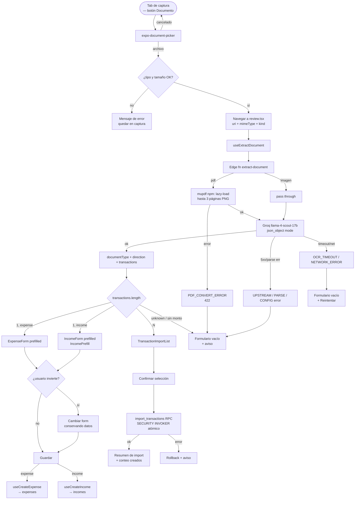

# HU-25 — Adjuntar comprobantes (document capture & classification)

## 1. Identificación

| Campo            | Valor                                                                                     |
| ---------------- | ----------------------------------------------------------------------------------------- |
| **ID**           | HU-25                                                                                     |
| **Historia**     | Adjuntar comprobantes — documento con clasificación automática                            |
| **Persona**      | Cualquier usuario autenticado                                                             |
| **Estado**       | MVP                                                                                       |
| **Relevancia**   | Alta                                                                                      |
| **Release**      | Entrega 4                                                                                 |
| **Trazabilidad** | `feat/document-capture-classify` — edge fn `extract-document` + `import_transactions` RPC |

## 2. Historia

> **Como** usuario autenticado,
> **quiero** adjuntar un archivo (PDF o imagen) de un comprobante, transferencia o resumen de tarjeta,
> **para** que la app lo clasifique automáticamente y genere el registro de gasto o ingreso correcto
> sin tener que ingresar los datos a mano.

## 3. Pre-condiciones

- El usuario está autenticado (JWT válido en el cliente).
- La app está en el tab de captura (`camera.tsx`).
- La edge function `extract-document` está desplegada en el proyecto Supabase `miiorhmqxdqsowqxnpii`.
- El secret `GROQ_API_KEY` está configurado en los secrets de Supabase.
- El archivo seleccionado es PDF o imagen (jpg/jpeg/png/heic/webp) y no supera ~10 MB.

## 4. Post-condiciones

- **Éxito (una transacción)**: el review screen muestra `ExpenseForm` o `IncomeForm` precargado
  con los datos detectados. El usuario edita y guarda → un registro queda en `expenses` o `incomes`.
- **Éxito (múltiples transacciones)**: el review screen muestra la lista de import. El usuario
  selecciona filas y confirma → el RPC `import_transactions` crea sólo los registros elegidos de
  forma atómica.
- **Cualquier fallo**: la app muestra el formulario vacío editable con un aviso en español.
  En ningún caso la app crashea ni se crea un registro a medias.

## 5. Flujo principal — documento de una transacción

1. El usuario toca el botón **"Documento"** en el tab de captura.
2. Se abre `expo-document-picker` aceptando PDF e imágenes.
3. El usuario selecciona un archivo.
4. La app valida tipo (`application/pdf` o imagen soportada) y tamaño (≤ 10 MB).
   Si la validación falla → ver flujo 6.d / 6.e.
5. La app navega a `expense/review.tsx` pasando `{ uri, mimeType, name, kind }`.
6. El review screen dispara `useExtractDocument(file)`:
   a. Si `kind === 'image'`: comprime con `compressForOcr` (igual que el flujo de foto).
   b. Si `kind === 'pdf'`: pasa los bytes en base64 sin compresión.
7. Se invoca `supabase.functions.invoke('extract-document', { body: { fileBase64, mimeType, fileName } })`.
8. La edge function (Deno) ejecuta:
   a. Verifica el JWT. Sin token válido → `401`.
   b. Si `mimeType === 'application/pdf'`: carga mupdf (lazy, `npm:mupdf@1.26.4`) y rasteriza hasta 3 páginas a PNG.
   c. Arma un mensaje Groq con todas las imágenes de página.
   d. Llama a Groq (`llama-4-scout-17b`, `response_format: json_object`, 20 s timeout).
   e. Normaliza y valida la respuesta; devuelve `{ data: DocumentOcrResult }`.
9. `extractDocument()` valida la respuesta con `documentOcrResultSchema` (Zod).
10. `useExtractDocument` devuelve `{ data: DocumentOcrResult, isLoading, error }`.
11. El review screen lee `data.transactions[0]`:
    - `direction === 'expense'` → muestra `ExpenseForm` prefilled + badge del tipo de documento.
    - `direction === 'income'` → muestra `IncomeForm` prefilled + badge.
12. El usuario revisa los campos, opcionalmente cambia la dirección con el toggle.
13. El usuario guarda → `useCreateExpense` o `useCreateIncome` persiste el registro.
14. La app navega al listado de gastos / ingresos.

## 6. Flujos alternativos

### 6.a — PDF multi-página rasterizado (2–3 páginas)

- El archivo es un PDF con 2 o 3 páginas.
- La edge function rasteriza las 3 páginas (o las que haya), las envía en un único mensaje Groq.
- Si el resultado tiene **1 transacción** → flujo principal desde el paso 11.
- Si el resultado tiene **N transacciones** → ver flujo 6.b (resumen de tarjeta).
- El campo `truncated` es `false` (no se descartó ninguna página).

### 6.b — Resumen de tarjeta (múltiples transacciones)

- `extract-document` devuelve `documentType = 'card_statement'` y `transactions` con N filas.
- El review screen muestra `TransactionImportList` (no un formulario individual):
  - Cada fila: checkbox, monto con formato tabular, moneda, fecha, comercio, categoría editable,
    toggle gasto/ingreso.
  - Botón "Seleccionar todo".
- El usuario revisa las filas, edita categorías si hace falta, desmarca las que no quiere importar.
- Toca **"Importar X registros"** (deshabilitado si ninguna fila está seleccionada).
- Se invoca `useImportTransactions` → `supabase.rpc('import_transactions', { p_rows: [...] })`.
- El RPC es transaccional: crea filas de gasto en `expenses` y de ingreso en `incomes`,
  todas bajo el `user_id` autenticado (SECURITY INVOKER, RLS).
- La app navega al resumen con el conteo de registros creados.

### 6.c — Transferencia recibida → ingreso automático

- El comprobante es una transferencia donde el usuario figura como destinatario.
- La edge function infiere `direction = 'income'` para la transacción.
- El review screen precarga `IncomeForm` con monto, moneda, fecha y contraparte.
- Badge muestra "Transferencia recibida".
- El usuario confirma → registro en `incomes`.

### 6.d — Usuario invierte la dirección detectada

- El review screen muestra el formulario con la dirección inferida por el modelo.
- El usuario toca el toggle ingreso/gasto.
- El formulario cambia (`ExpenseForm` ↔ `IncomeForm`) conservando todos los campos ya extraídos.
- El usuario guarda la versión corregida.

### 6.e — Tipo desconocido o documento sin monto

- La edge function devuelve `documentType = 'unknown'` y/o la transacción tiene `amount === null`.
- El review screen muestra el formulario vacío + aviso:
  `"No detectamos datos. Completá manualmente."`
- No se bloquea la acción del usuario; puede completar el formulario a mano.

### 6.f — Confianza baja

- La edge function devuelve `confidence < 0.5`.
- El review screen muestra el formulario prefilled (si hay datos) pero agrega un banner de
  advertencia: `"Verificá los datos detectados antes de guardar."`.
- No bloquea al usuario.

### 6.g — PDF corrupto / no convertible

- mupdf falla al rasterizar el PDF (archivo inválido, cifrado, etc.).
- La edge function responde `{ code: 'PDF_CONVERT_ERROR' }` (HTTP 422).
- El review screen muestra:
  `"No pudimos leer el PDF. Probá con una captura de pantalla del comprobante."`
- El formulario queda vacío y editable. No hay crash.
- El flujo de imagen (cámara/galería/documento imagen) no se ve afectado.

### 6.h — PDF de más de 3 páginas

- La edge function rasteriza sólo las primeras 3 páginas y devuelve `truncated: true`.
- El review screen muestra un banner informativo:
  `"El documento tiene más de 3 páginas. Sólo se procesaron las primeras 3."`
- Las transacciones detectadas se muestran normalmente; el usuario puede proceder con el import.

### 6.i — Timeout / error de Groq

- La llamada a Groq supera los 20 s o devuelve un error de red.
- `error.code` es `OCR_TIMEOUT` o `NETWORK_ERROR` → formulario vacío + botón **"Reintentar"**.
- Otros errores (`UPSTREAM_ERROR`, `OCR_PARSE_ERROR`, `OCR_CONFIG_ERROR`) → formulario vacío
  sin botón de reintentar (el servicio está caído o hay un error de configuración).

### 6.j — Archivo de tipo no soportado o demasiado grande

- La validación ocurre en `camera.tsx` antes de navegar a la pantalla de revisión.
- Tipo no soportado (p.ej. `.docx`) → `"Formato no soportado. Elegí un PDF o una imagen."`
- Tamaño > 10 MB → `"El archivo es muy grande. El límite es 10 MB."`
- La app permanece en el tab de captura; no inicia el OCR.

### 6.k — Importación atómica con fallo en una fila

- El RPC `import_transactions` detecta un error en alguna fila durante el insert.
- Toda la transacción se revierte; no queda ningún registro a medias.
- Se informa el error al usuario y se le permite reintentar.

## 7. Diagrama

## 8. Componentes / archivos

| Componente / archivo         | Ruta                                                         | Rol                                                                         |
| ---------------------------- | ------------------------------------------------------------ | --------------------------------------------------------------------------- |
| Tab de captura               | `app/(protected)/(tabs)/camera.tsx`                          | Botón "Documento", `expo-document-picker`, validación tipo/tamaño           |
| Review screen                | `app/(protected)/expense/review.tsx`                         | Orquesta compress/passthrough → OCR → ruteo → save (single y multi)         |
| Schema de documento          | `lib/schemas/document.ts`                                    | `documentOcrResultSchema` (Zod), `DocumentOcrResult`, `DocumentTransaction` |
| `extractDocument` / helpers  | `lib/ocr.ts`                                                 | Invoca la edge fn, mapea a prefill, helpers de dirección                    |
| `useExtractDocument`         | `hooks/use-extract-document.ts`                              | TanStack Query `useMutation`                                                |
| `IncomeForm` (extendido)     | `components/incomes/income-form.tsx`                         | Nuevo prop `prefill: IncomePrefill`                                         |
| `TransactionImportList`      | `components/expenses/transaction-import-list.tsx`            | Lista de selección con checkbox, edición, toggle, moneda por fila           |
| Repositorio de transacciones | `lib/repositories/transactions.ts`                           | `importTransactions(rows)` → `supabase.rpc('import_transactions')`          |
| `useImportTransactions`      | `hooks/use-import-transactions.ts`                           | TanStack Query `useMutation`, invalida queries de gastos e ingresos         |
| Edge function                | `supabase/functions/extract-document/index.ts`               | JWT verify, rasterización PDF (mupdf npm:), Groq vision, validate           |
| Migración RPC                | `supabase/migrations/20260621215215_import_transactions.sql` | `import_transactions` SECURITY INVOKER, atómico                             |

## 9. Matriz de estados

| Estado                  | Trigger                                                   | Visual en review screen                                               |
| ----------------------- | --------------------------------------------------------- | --------------------------------------------------------------------- |
| **Analizando**          | `isLoading === true`                                      | Spinner centrado + `"Analizando documento…"`. No se muestra form.     |
| **Single expense**      | 1 tx, `direction='expense'`                               | `ExpenseForm` prefilled + badge tipo de doc + toggle dirección        |
| **Single income**       | 1 tx, `direction='income'`                                | `IncomeForm` prefilled + badge tipo de doc + toggle dirección         |
| **Multi-import**        | `transactions.length > 1`                                 | `TransactionImportList` con checkboxes + botón "Importar N registros" |
| **Sin datos / unknown** | `documentType='unknown'` o `amount===null`                | Form vacío + `"No detectamos datos. Completá manualmente."`           |
| **Baja confianza**      | `confidence < 0.5`                                        | Form prefilled + banner de advertencia (no bloquea)                   |
| **PDF no convertible**  | `error.code === 'PDF_CONVERT_ERROR'`                      | Form vacío + `"No pudimos leer el PDF. Probá con una captura."`       |
| **PDF truncado**        | `truncated === true`                                      | Banner informativo + resultados disponibles visibles                  |
| **Error retryable**     | `OCR_TIMEOUT` / `NETWORK_ERROR`                           | Form vacío + botón **"Reintentar"**                                   |
| **Error fatal**         | `UPSTREAM_ERROR` / `OCR_PARSE_ERROR` / `OCR_CONFIG_ERROR` | Form vacío + aviso sin retry                                          |

## 10. Criterios de aceptación

- [ ] El tab de captura muestra la opción "Documento" junto a Cámara y Galería.
- [ ] `expo-document-picker` abre correctamente en iOS y Android aceptando PDF e imágenes.
- [ ] Archivos de tipo no soportado muestran un error en español y no navegan a la revisión.
- [ ] Archivos mayores a ~10 MB muestran un error en español y no inician el OCR.
- [ ] `extract-document` devuelve `documentType` ∈ `{receipt, transfer, card_statement, screenshot, unknown}`.
- [ ] Una transferencia enviada precarga `ExpenseForm`; una recibida precarga `IncomeForm`.
- [ ] El toggle de dirección cambia el formulario conservando los datos extraídos.
- [ ] Un PDF de 2–3 páginas es procesado correctamente.
- [ ] Un PDF con más de 3 páginas es truncado y se muestra un aviso; no crashea.
- [ ] Un PDF corrupto devuelve `PDF_CONVERT_ERROR` y muestra el mensaje correspondiente.
- [ ] Un resumen de tarjeta muestra la lista de import con checkboxes.
- [ ] Importar una selección parcial crea exactamente los registros seleccionados.
- [ ] Con 0 filas seleccionadas, el botón de importar está deshabilitado.
- [ ] Filas de gasto van a `expenses`; filas de ingreso van a `incomes`.
- [ ] Un fallo en el import revierte todos los registros (atomicidad).
- [ ] Todos los registros creados tienen `user_id = auth.uid()` (RLS verificado).
- [ ] `pnpm typecheck && pnpm lint && pnpm test` pasan en verde.

## 11. Notas técnicas

- **Groq modelo**: `meta-llama/llama-4-scout-17b-16e-instruct`. Vision-only; PDFs deben rasterizarse antes de enviarse.
- **mupdf lazy-load**: `const mupdf = await import('npm:mupdf@1.26.4')` dentro de `rasterisePdf`. El import top-level con esm.sh crasheó en el runtime de Supabase Edge (ver amendment `.claude-sk8/document-capture-classify/2026-06-21-1747-exec-amendments.md`). El `npm:` especifier usa el Node-compat layer del runtime.
- **Residual de PDF**: la rasterización en invocación (no sólo en boot) está validada por un spike de Node y el deploy OPTIONS 204. Un E2E autenticado con un PDF real queda como tarea pendiente.
- **`import_transactions` RPC**: SECURITY INVOKER. Inserta filas de expense con `occurred_date = NULL` (consistente con creación manual); filas de income con `occurred_date` seteado al valor extraído.
- **Moneda mixta**: `TransactionImportList` muestra la moneda (`ARS`/`USD`) por fila; el RPC las preserva sin conversión.
- **`extract-receipt` sin cambios**: el flujo de foto→ticket sigue usando `extract-receipt`. El nuevo review screen usa `extract-document` únicamente para el modo Documento.
- **Tests**:
  - `supabase/functions/extract-document/__tests__/` — JWT rechazado, GROQ_API_KEY unset, PDF_CONVERT_ERROR, Groq timeout, JSON inválido, respuesta válida single, respuesta válida multi.
  - `lib/__tests__/document.test.ts` — parsing schema, dirección por defecto, mapeo single y multi.
  - `hooks/__tests__/use-extract-document.test.tsx` — loading, success, error.
  - `hooks/__tests__/use-import-transactions.test.tsx` — success, rollback, sin filas.
  - `components/__tests__/transaction-import-list.test.tsx` — selección parcial, sin selección, filas mixtas.

## 12. Documentos relacionados

- [Feature doc](../features/document-capture-classify.md)
- [ADR: Document classification OCR](../decisions/2026-06-21-document-classification-ocr.md)
- [HU-05 — Extraer datos OCR](HU-05-extraer-datos-ocr.md) (baseline del flujo OCR anterior)
- [HU-06 — Validar datos detectados](HU-06-validar-datos-detectados.md)
- [Incomes feature](../features/incomes.md) (IncomeForm extendida)
- [ADR: OCR Groq edge function](../decisions/2026-05-31-ocr-groq-edge-function.md)
