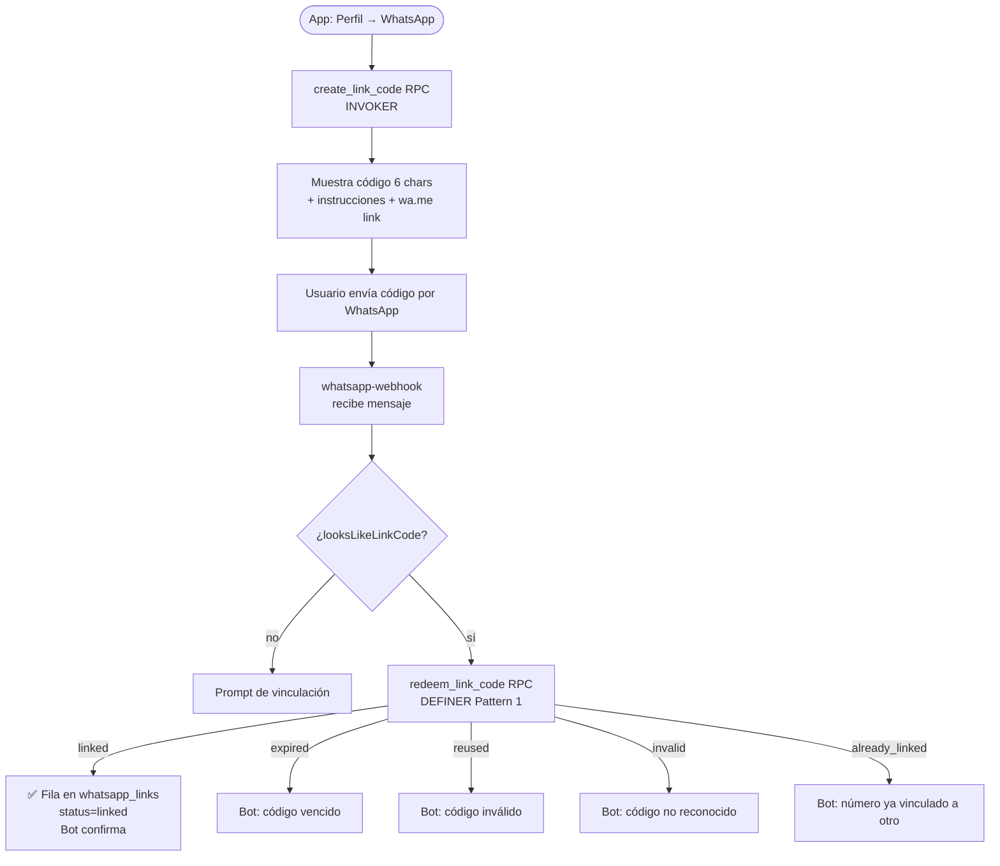

# HU-26 — Vincular WhatsApp al bot de RADAR

## 1. Identificación

| Campo            | Valor                                                                                       |
| ---------------- | ------------------------------------------------------------------------------------------- |
| **ID**           | HU-26                                                                                       |
| **Historia**     | Vincular número de WhatsApp al bot                                                          |
| **Persona**      | Cualquier usuario autenticado                                                               |
| **Estado**       | MVP                                                                                         |
| **Relevancia**   | Alta                                                                                        |
| **Release**      | Entrega 4                                                                                   |
| **Trazabilidad** | `feat/whatsapp-bot` — `create_link_code` / `redeem_link_code` RPCs + `profile/whatsapp.tsx` |

## 2. Historia

> **Como** usuario autenticado de RADAR,
> **quiero** vincular mi número de WhatsApp a mi cuenta,
> **para** poder registrar gastos e ingresos y consultar mis movimientos directamente desde WhatsApp.

## 3. Pre-condiciones

- El usuario está autenticado (JWT válido en el cliente).
- El edge function `whatsapp-webhook` está desplegado y los secrets de Meta están configurados.
- El número del bot de RADAR está disponible como prueba (hasta 5 destinatarios verificados).

## 4. Post-condiciones

- **Éxito**: `whatsapp_links` tiene una fila con `status='linked'` para el usuario. El bot reconoce mensajes del número vinculado.
- **Fallo / código inválido**: ninguna fila se crea; el bot informa el motivo específico.

## 5. Flujo principal — vincular desde la app

1. El usuario abre **Perfil → Vincular WhatsApp** (`app/(protected)/profile/whatsapp.tsx`).
2. Toca **"Generar código"**.
3. La app llama al RPC `create_link_code()` (SECURITY INVOKER):
   - Invalida los códigos previos no consumidos del usuario.
   - Genera un código de 6 caracteres (base32, sin 0/O/1/I/L).
   - Lo almacena en `whatsapp_link_codes` con `expires_at = now() + 10 minutos`.
4. La app muestra el código prominentemente y las instrucciones:
   1. Abrí WhatsApp
   2. Escribí al número del bot
   3. Mandá este código
5. Opcionalmente, el usuario toca **"Abrir WhatsApp"** (deep link `wa.me` con el código pre-cargado).
6. El usuario envía el código al bot.
7. El webhook recibe el mensaje del número no vinculado:
   - Detecta el patrón de código (`/^[A-HJ-KM-NP-Z2-9]{6}$/`).
   - Llama a `redeem_link_code(code, wa_number)` (SECURITY DEFINER, Pattern 1).
8. Resultado `linked`: se inserta una fila en `whatsapp_links` con `status='linked'`; el bot responde: _"Listo, vinculé este número a tu cuenta RADAR."_
9. El usuario puede volver a la pantalla de Perfil y ver el número enmascarado como vinculado.

## 6. Flujos alternativos

### 6.a — Código vencido

- `expires_at < now()` → resultado `expired`.
- Bot: _"Ese código venció. Generá uno nuevo en la app (Perfil → WhatsApp)."_

### 6.b — Código ya usado

- `consumed_at IS NOT NULL` → resultado `reused`.
- Bot: _"Ese código ya no es válido. Generá uno nuevo en la app."_

### 6.c — Código no existe

- Ninguna fila en `whatsapp_link_codes` → resultado `invalid`.
- Bot: _"No reconozco ese código. Copialo exactamente como aparece en la app."_

### 6.d — Número ya vinculado a otra cuenta

- El número ya tiene una fila `status='linked'` para un `user_id` diferente → resultado `already_linked`.
- Bot: _"Este número ya está vinculado a otra cuenta. Desvinculalo primero."_
- No se crea ninguna fila nueva.

### 6.e — Mismo usuario re-vincula con nuevo código

- El número ya tiene `status='linked'` para **el mismo** usuario → resultado idempotente `linked`.
- El código se marca consumido; no se crea una segunda fila.

### 6.f — Desvincular desde la app

1. El usuario toca **"Desvincular"**.
2. La app pide confirmación ("¿Seguro que querés desvincular?").
3. Confirma → llama a `unlinkWhatsapp()` del repositorio, que hace un UPDATE con la política RLS (`status = 'unlinked'`).
4. La pantalla vuelve al estado no vinculado.

### 6.g — Desvincular desde el bot

1. El usuario vinculado envía "desvinculame" (u otra frase de `unlink` intent).
2. El bot llama a `unlink_wa(userId)` (DEFINER, Pattern 1) → `status='unlinked'`.
3. Responde: _"Desvinculé este número. Podés volver a vincularlo desde la app cuando quieras."_
4. El número vuelve a quedar libre.

## 7. Diagrama

## 8. Componentes / archivos

| Componente / archivo   | Ruta                                              | Rol                                                   |
| ---------------------- | ------------------------------------------------- | ----------------------------------------------------- |
| Link screen            | `app/(protected)/profile/whatsapp.tsx`            | Estado vinculado/no vinculado, generar, desvincular   |
| Repositorio            | `lib/repositories/whatsapp.ts`                    | `createLinkCode`, `unlinkWhatsapp`, `getWhatsappLink` |
| Hooks                  | `hooks/use-whatsapp-link.ts`                      | TanStack Query mutations + query                      |
| Schema                 | `lib/schemas/whatsapp.ts`                         | Zod: `linkCodeSchema`, `whatsappLinkSchema`           |
| `create_link_code` RPC | `20260622005922_whatsapp_link_rpcs.sql`           | INVOKER; 6-char base32, 10-min TTL                    |
| `redeem_link_code` RPC | `20260622005922_whatsapp_link_rpcs.sql`           | DEFINER Pattern 1; outcomes discretos                 |
| `resolve_wa_user` RPC  | `20260622005922_whatsapp_link_rpcs.sql`           | DEFINER Pattern 1; lookup por número E.164            |
| `unlink_wa` RPC        | `20260622005922_whatsapp_link_rpcs.sql`           | DEFINER Pattern 1; webhook-side unlink                |
| Webhook dispatch       | `supabase/functions/whatsapp-webhook/dispatch.ts` | `looksLikeLinkCode`, routing hacia redeemLinkCode     |

## 9. Criterios de aceptación

- [ ] Un usuario autenticado puede generar un código desde **Perfil → WhatsApp**.
- [ ] Generar un nuevo código invalida los anteriores no consumidos.
- [ ] El código caduca en 10 minutos.
- [ ] Enviar el código al bot vincula el número (`status='linked'` en `whatsapp_links`).
- [ ] Los cinco outcomes de `redeem_link_code` producen las respuestas correctas en el bot.
- [ ] El número vinculado se muestra enmascarado en la pantalla de Perfil.
- [ ] Desvincular desde la app cambia `status='unlinked'` bajo RLS (no necesita el bot).
- [ ] Desvincular desde el bot llama a `unlink_wa`; el número queda libre.
- [ ] Los RPCs Pattern 1 no son ejecutables por `authenticated` (`get_advisors` sin lints nuevos).
- [ ] `pnpm typecheck && pnpm lint && pnpm test` pasan en verde.

## 10. Notas técnicas

- Normalización E.164: Meta entrega `wa_id` como dígitos sin `+` (ej. `5491122334455`). Los RPCs anteponen `+`: `'+' || regexp_replace(p_wa, '[^0-9]', '', 'g')`.
- El deep link `wa.me/<digits>?text=<code>` pre-carga el código en WhatsApp; `Linking.canOpenURL` verifica disponibilidad antes de abrir.
- El campo `confirmed_at` en la pantalla se puede derivar de `linked_at` en `whatsapp_links`.

## 11. Documentos relacionados

- [Feature doc](../features/whatsapp-bot.md)
- [ADR: schema y RPCs](../decisions/2026-06-21-whatsapp-bot-schema.md)
- [OpenSpec spec](../../openspec/changes/whatsapp-bot/specs/whatsapp-linking/spec.md)
