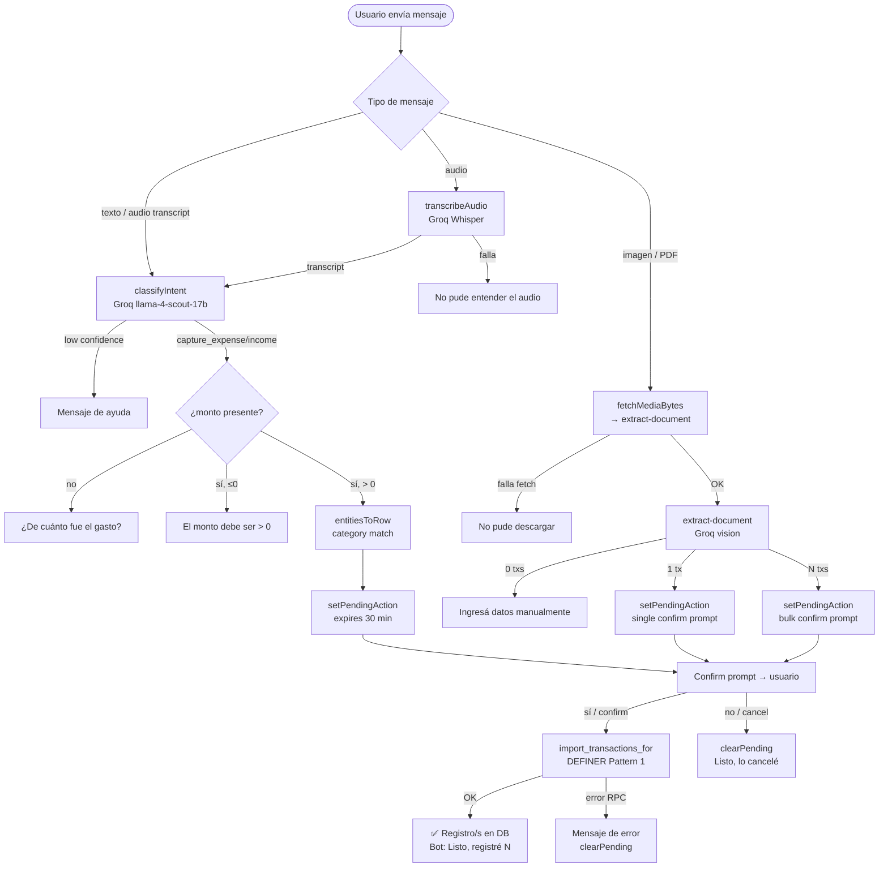

# HU-27 — Registrar gasto o ingreso por WhatsApp

## 1. Identificación

| Campo            | Valor                                                                                             |
| ---------------- | ------------------------------------------------------------------------------------------------- |
| **ID**           | HU-27                                                                                             |
| **Historia**     | Capturar gasto o ingreso por WhatsApp (texto, audio, imagen o PDF)                                |
| **Persona**      | Usuario con número vinculado                                                                      |
| **Estado**       | MVP                                                                                               |
| **Relevancia**   | Alta                                                                                              |
| **Release**      | Entrega 4                                                                                         |
| **Trazabilidad** | `feat/whatsapp-bot` — `classify.ts`, `capture.ts`, `transcribe.ts`, `import_transactions_for` RPC |

## 2. Historia

> **Como** usuario con número de WhatsApp vinculado,
> **quiero** enviar un texto, audio, imagen o PDF al bot,
> **para** registrar un gasto o ingreso sin abrir la app y verlo reflejado en mis movimientos.

## 3. Pre-condiciones

- El número del usuario está vinculado (`status='linked'` en `whatsapp_links`).
- No hay una acción pendiente expirada (si la hay, el bot la descarta).

## 4. Post-condiciones

- **Éxito (confirma)**: un registro aparece en `expenses` o `incomes` con `user_id` correcto, `source='manual'`, y la moneda/monto/dirección detectados.
- **Cancelación**: ningún registro se crea; `whatsapp_conversations` queda limpio.
- **Error**: ningún registro parcial queda en la base de datos.

## 5. Flujo principal — texto

1. El usuario envía un texto libre: _"gasté 4500 en el súper hoy"_.
2. El webhook clasifica la intención con Groq (`classifyIntent`):
   - Intent: `capture_expense`, entities: `{amount: 4500, description: "súper", occurredAt: "2026-06-21"}`.
   - Confidence ≥ 0.4.
3. Valida monto: presente y > 0.
4. Moneda: no explicitada → por defecto `ARS` (surfaceada en el confirm).
5. Categoría: `resolveCategoryId("Supermercado")` contra las categorías del usuario.
6. `setPendingAction` almacena la fila en `whatsapp_conversations` con `expires_at = now() + 30 min`.
7. Bot responde:
   > _"Registré un gasto:_
   >
   > - Monto: **ARS 4.500\***
   > - Descripción: súper\*
   >
   > _¿Confirmás? Respondé sí para guardar o no para cancelar."_
8. El usuario responde _"sí"_.
9. Bot llama a `import_transactions_for(userId, [row])` (DEFINER Pattern 1).
10. Limpia `whatsapp_conversations` para el usuario.
11. Bot responde: _"Listo, registré 1 movimiento."_
12. El registro aparece en la app.

## 6. Flujos alternativos

### 6.a — Audio

1. El usuario envía una nota de voz.
2. El webhook obtiene los bytes del audio via Graph API (`fetchMediaBytes`).
3. Transcribe con Groq Whisper (`whisper-large-v3`, multipart form-data, timeout 30 s).
4. El texto transcripto entra al pipeline del flujo principal desde el paso 2.

**Fallo de transcripción / transcript vacío:** bot → _"No pude entender el audio, escribime el gasto o mandá una foto."_ No se crea pending.

### 6.b — Imagen de comprobante

1. El usuario envía una foto de un ticket o transferencia.
2. El webhook obtiene los bytes via `fetchMediaBytes(image.id)`.
3. Llama a `extract-document` con `Authorization: Bearer <service_role_key>` (bypass interno).
4. `extract-document` clasifica el documento y devuelve `transactions[]`.
5. Una transacción → flujo de confirm para ese único registro (ver 5.6–5.11).
6. Bot muestra monto, dirección, descripción. Si `confidence < 0.5`, agrega _"No estoy seguro de estos datos, revisá antes de confirmar."_

### 6.c — PDF (resumen de tarjeta / múltiples transacciones)

1. El usuario envía un PDF de resumen de tarjeta.
2. `extract-document` devuelve `card_statement` con N transacciones.
3. Bot resume: _"Detecté **N movimientos** por ARS X.XXX._ ¿Los importo todos? Respondé sí para guardar o no para cancelar."\*
4. Usuario confirma → `import_transactions_for(userId, rows)` inserta todas las filas en un único RPC atómico.
5. Bot: _"Listo, registré N movimientos."_

### 6.d — Cancelación

- El usuario responde _"no"_, _"cancelá"_ u otra frase con intent `cancel`.
- Bot: _"Listo, lo cancelé."_
- `whatsapp_conversations` se limpia. Ningún registro escrito.

### 6.e — Monto faltante

- El intent es `capture_expense` pero `entities.amount` está ausente.
- Bot pregunta: _"¿De cuánto fue el gasto?"_
- Se almacena un pending de tipo "clarify" para mantener el contexto de la conversación.

### 6.f — Monto cero o negativo

- `entities.amount ≤ 0`.
- Bot: _"El monto tiene que ser mayor a cero."_
- No se crea pending.

### 6.g — USD explícito

- Mensaje: _"gasté 50 dólares en Netflix"_.
- `entities.currency = 'USD'` (detectado por Groq).
- Confirm: _"Monto: **USD 50,00**"_.

### 6.h — Falla de media (imagen/PDF no descargable)

- `fetchMediaBytes` lanza error (token expirado, media_id inválido).
- Bot: _"No pude descargar el archivo, reenvialo."_ No pending.

### 6.i — Pending expirado al confirmar

- El usuario confirma después de 30 minutos.
- Bot: _"Esa operación expiró, mandámela de nuevo."_
- `whatsapp_conversations` se limpia. Nada escrito.

### 6.j — Doble confirmación

- El usuario envía _"sí"_ dos veces.
- La primera consume y limpia el pending; la segunda no encuentra pending → no double-write.

### 6.k — Baja confianza del clasificador (< 0.4)

- El intent es `capture_expense` pero `confidence < 0.4`.
- Bot responde con `HELP_MESSAGE` en lugar de crear un pending.

## 7. Diagrama

## 8. Componentes / archivos

| Componente / archivo          | Ruta                                                | Rol                                                    |
| ----------------------------- | --------------------------------------------------- | ------------------------------------------------------ |
| Clasificador de intent        | `supabase/functions/whatsapp-webhook/classify.ts`   | Groq llama-4-scout-17b; 9 intents; never throws        |
| Captura de texto / confirm    | `supabase/functions/whatsapp-webhook/capture.ts`    | `handleCapture`, `handleConfirm`, `handleMediaCapture` |
| Transcripción de audio        | `supabase/functions/whatsapp-webhook/transcribe.ts` | Groq Whisper whisper-large-v3                          |
| Graph API                     | `supabase/functions/whatsapp-webhook/graph.ts`      | `fetchMediaBytes` (media-id → URL → bytes)             |
| Helpers de DB                 | `supabase/functions/whatsapp-webhook/db.ts`         | `setPendingAction`, `clearPending`, `getConversation`  |
| `import_transactions_for` RPC | `20260622010559_whatsapp_service_rpcs.sql`          | DEFINER Pattern 1; clone de `import_transactions`      |
| `extract-document` (reusado)  | `supabase/functions/extract-document/index.ts`      | Ahora acepta service-role bypass para s2s              |

## 9. Criterios de aceptación

- [ ] Texto libre con monto, moneda y descripción genera un pending y pide confirmación.
- [ ] Confirmar crea el registro en `expenses` o `incomes` con `user_id` correcto.
- [ ] Cancelar no escribe ningún registro.
- [ ] Audio transcripto entra al mismo pipeline que texto.
- [ ] Imagen / PDF con una transacción genera un pending individual.
- [ ] PDF con N transacciones genera un pending de import-all.
- [ ] Moneda por defecto ARS; USD sólo cuando es explícito.
- [ ] Monto faltante pide aclaración; monto ≤ 0 es rechazado.
- [ ] Pending expirado avisa y no escribe nada.
- [ ] Doble confirmación no produce double-write.
- [ ] Falla de media devuelve mensaje amigable sin crash.

## 10. Notas técnicas

- **`import_transactions_for`**: SECURITY DEFINER, Pattern 1. `expense` rows: `occurred_date = NULL` (consistente con creación manual). `income` rows: `occurred_date` seteado al valor extraído.
- **Moneda ambigua**: la moneda siempre se muestra en el confirm aunque sea ARS por defecto.
- **`extract-document` s2s**: el webhook envía `Authorization: Bearer <service_role_key>` + header `x-whatsapp-internal-secret` opcional para bypass del JWT gate.
- **Groq Whisper**: `whisper-large-v3`; timeout 30 s; multipart con extensión derivada del MIME type.

## 11. Documentos relacionados

- [Feature doc](../features/whatsapp-bot.md)
- [ADR: schema y RPCs](../decisions/2026-06-21-whatsapp-bot-schema.md)
- [OpenSpec spec](../../openspec/changes/whatsapp-bot/specs/whatsapp-capture/spec.md)
- [HU-25: adjuntar comprobantes](HU-25-adjuntar-comprobantes.md) (extract-document base)
